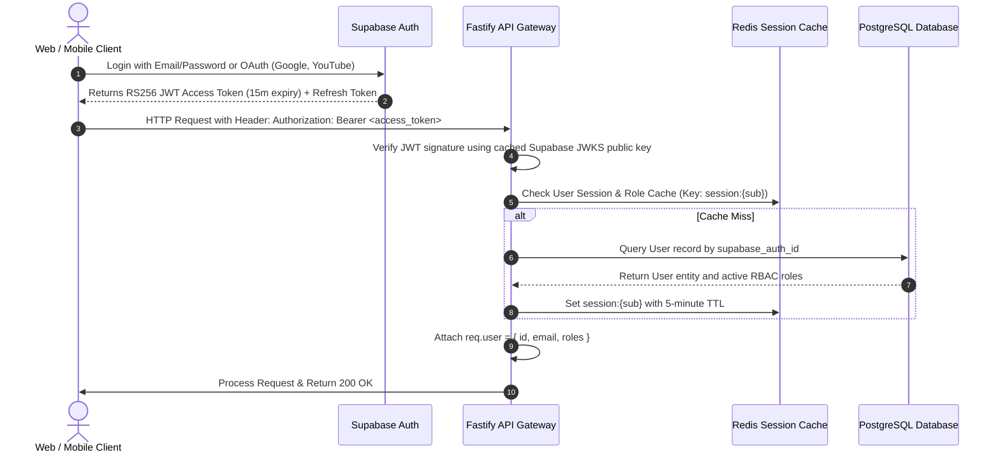
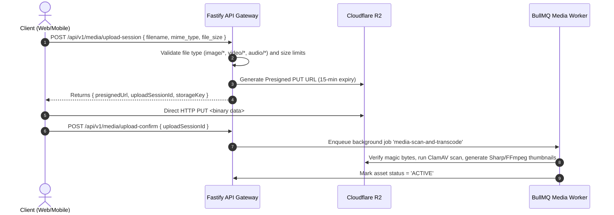
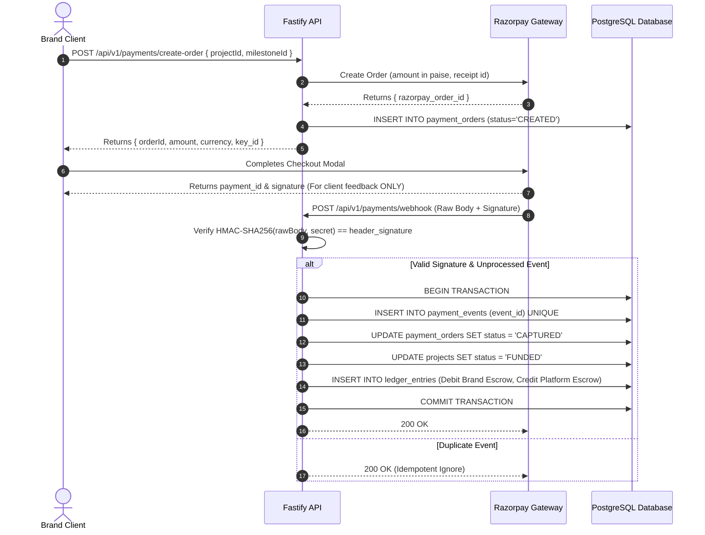

# CreatorConnect Backend — Authoritative Engineering & Integration Manual

> **CRITICAL ARCHITECTURAL MANDATE**:  
> The CreatorConnect Backend is the **single authoritative business and data layer** for the platform.  
> It serves **Web**, **Android**, **iOS**, and **Web Admin** clients uniformly.  
> Client applications (Web/Mobile) are API consumers and **MUST NOT** implement marketplace business logic, escrow state machines, pricing algorithms, or contract transitions independently.

---

## 1. Overview

The CreatorConnect backend powers a production-grade, multi-sided creator economy platform orchestrating five ecosystem participants:
1. **Creators / Influencers**
2. **Production Professionals** (Videographers, Editors, Audio Engineers, Thumbnail Artists)
3. **Brands & Companies**
4. **Podcasters** (Hosts, Producers, Sponsors)
5. **Platform Administrators** (Operations, Trust & Safety, Financial Auditors)

### Core Technologies & Runtimes:
- **Language / Runtime**: Node.js (v20 LTS) + TypeScript (v5.5+)
- **HTTP Framework**: Fastify v4.x (High throughput, native JSON Schema compilation)
- **Database**: PostgreSQL 16 managed with Prisma ORM
- **In-Memory Cache & Broker**: Redis 7
- **Asynchronous Task Queues**: BullMQ v5.x
- **Realtime Bidirectional Engine**: Socket.IO v4.x with `@socket.io/redis-adapter`
- **Identity Provider**: Supabase Auth (Managed OAuth, OTP, RS256 JWT tokens)
- **Object Storage**: Cloudflare R2 (S3-compatible API, $0 data egress)
- **Payment Gateway**: Razorpay (Idempotent webhooks, double-entry ledger)
- **Push & Email**: Firebase Cloud Messaging (FCM) + Resend (React Email)
- **API Standard**: OpenAPI 3.1 contract-first with TypeBox schemas

---

## 2. Backend Repository Structure

The backend is housed inside a high-performance Turborepo / pnpm monorepo:

```
f:\CreatorConnect/
├── apps/
│   ├── api/                     # Core Modular API Engine (Fastify REST Service)
│   │   ├── src/
│   │   │   ├── modules/         # Clean Architecture Domain Modules
│   │   │   │   ├── auth/        # Auth verification & session context
│   │   │   │   ├── users/       # User accounts & RBAC management
│   │   │   │   ├── profiles/    # Creator, Pro, Brand, Podcaster rate cards & bio
│   │   │   │   ├── campaigns/   # Briefs, requirements, budget boundaries
│   │   │   │   ├── applications/# Proposal submissions, shortlisting state machine
│   │   │   │   ├── projects/    # Milestones, deliverables, escrow locks
│   │   │   │   ├── payments/    # Razorpay orders, webhooks, ledger entries
│   │   │   │   ├── search/      # PostgreSQL tsvector FTS & rule matching
│   │   │   │   └── admin/       # Moderation, disputes, audit logs
│   │   │   ├── plugins/         # Fastify infrastructure plugins (CORS, Helmet, Rate-Limit, Swagger)
│   │   │   └── main.ts          # Server entry point & graceful shutdown
│   │   └── Dockerfile           # Multi-stage distroless production container
│   ├── realtime/                # Realtime Gateway (Fastify + Socket.IO Container)
│   │   ├── src/
│   │   │   ├── handlers/        # Chat messaging, typing indicators, presence rooms
│   │   │   └── main.ts          # Socket.IO listener on dedicated port
│   │   └── Dockerfile
│   └── worker/                  # BullMQ Background Processing Container
│       ├── src/
│       │   ├── queues/          # Media transcoding, FCM dispatch, Outbox relay
│       │   └── main.ts          # Worker supervisor process
│       └── Dockerfile
├── packages/
│   ├── contracts/               # OpenAPI 3.1 JSON and generated TypeScript models
│   ├── api-client/              # Generated TanStack Query hooks & Fetch client (Orval)
│   ├── auth/                    # Supabase JWT validator & CASL permission rules
│   ├── validation/              # Shared TypeBox & Zod validation schemas
│   ├── config/                  # Shared tsconfig, ESLint, and Prettier configurations
│   ├── utils/                   # Currency minor units, date-fns, text sanitizers
│   └── testing/                 # Testcontainers factories and Playwright fixtures
├── docs/                        # Authoritative architecture, API, and DB documentation
└── BACKEND.md                   # This file (Living Backend Integration Manual)
```

---

## 3. Service Directory

| Service | Repository Location | Primary Responsibility | Port | Status |
| :--- | :--- | :--- | :--- | :--- |
| **Core Modular API** | `apps/api/` | Stateless REST APIs, OpenAPI 3.1, RBAC, domain business rules, ACID transactions | `3000` | **PLANNED** (Phase 1 Scaffold) |
| **Realtime Gateway** | `apps/realtime/` | Stateful WebSockets, presence, typing indicators, direct chat routing via Redis | `3001` | **PLANNED** (Phase 9) |
| **Background Worker Tier** | `apps/worker/` | Outbox event polling, Sharp/FFmpeg media processing, FCM/Email dispatch, payouts | N/A | **PLANNED** (Phase 10) |

---

## 4. API Base URLs

| Environment | Core REST API Base URL | Realtime WebSocket Gateway URL | Status |
| :--- | :--- | :--- | :--- |
| **LOCAL** | `http://localhost:3000` | `ws://localhost:3001` | **NOT CONFIGURED** (Phase 1) |
| **DEVELOPMENT** | `https://dev-api.creatorconnect.com` | `wss://dev-realtime.creatorconnect.com` | **NOT CONFIGURED** (Phase 3) |
| **STAGING** | `https://staging-api.creatorconnect.com` | `wss://staging-realtime.creatorconnect.com` | **NOT CONFIGURED** (Phase 3) |
| **PRODUCTION** | `https://api.creatorconnect.com` | `wss://realtime.creatorconnect.com` | **NOT CONFIGURED** (Phase 14) |

---

## 5. API Versioning Strategy

All REST API endpoints are strictly versioned within the URI path:
```
/api/v1/<domain>/<resource>
```
### Versioning Rules:
- **Non-Breaking Changes**: Adding optional query parameters, new response fields, or new endpoints occurs under `/api/v1/` without bumping the version.
- **Breaking Changes**: Changing field types, removing fields, or altering state-machine transitions requires a new major version prefix (`/api/v2/`).
- **Deprecation Policy**: An older API version is supported for a minimum of **180 days** post-deprecation notice. Deprecated endpoints return the standard `Sunset` and `Deprecation` HTTP headers:
  ```http
  Deprecation: @1778900000
  Sunset: Wed, 11 Nov 2026 00:00:00 GMT
  ```

---

## 6. Authentication Architecture

CreatorConnect uses **Supabase Auth** as the managed Identity Provider (IdP) for user credential management, OAuth handshakes, and session token issuance.



### Authentication Rules for Clients:
- **Header Standard**: All authenticated requests MUST include:
  ```http
  Authorization: Bearer <access_token>
  ```
- **Token Refresh**: Access tokens expire in 15 minutes. Clients must automatically exchange refresh tokens with Supabase Auth upon receiving a `401 Unauthorized`.
- **Zero Secrets on Client**: Web and Mobile clients must NEVER store service-role keys, database passwords, or payment provider secrets. Only the public Supabase Anon key is permitted in client apps.

---

## 7. Authorization & Role-Based Access Control (RBAC)

Authentication verifies *who* the user is; the backend exclusively enforces *what* the user can do.

### 7.1 System Roles:
1. `CREATOR`: Access to creator rate cards, job board, proposal submission, milestone uploads, crew hiring.
2. `PROFESSIONAL`: Access to production gig board, equipment inventories, proposal submission, deliverable submissions.
3. `BRAND`: Access to campaign creation, talent discovery, applicant shortlisting, escrow funding, deliverable approval.
4. `PODCASTER`: Dual capabilities (sponsorship acquisition + hiring production crew).
5. `ADMIN`: Elevated operational access to KYC verification, dispute arbitration, financial ledger audits, and account bans.

### 7.2 Multi-Tier Authorization Enforcement:
- **Tier 1 (Role Guard)**: Fastify preHandler hook asserts `req.user.roles.includes('BRAND')`.
- **Tier 2 (Tenancy Guard)**: Validates that brand managers can only access campaigns belonging to their corporate entity. **Tenant context is derived strictly from the authenticated server session, NEVER trusted from client request parameters.**
- **Tier 3 (Resource Ownership Guard)**: Validates that a user attempting to view or submit a milestone deliverable is an explicit party (`client_user_id` or `talent_user_id`) to that project contract.

### 7.3 Database-Level Access Control (Defense in Depth)
Never assume API middleware alone protects data. Repositories must enforce ownership boundaries at query time:
- **PROHIBITED**: `prisma.project.findUnique({ where: { id } })`
- **MANDATORY**: `findOwnedProject(userId, projectId)` filtering by `OR: [{ client_user_id: userId }, { talent_user_id: userId }]`.

---

## 8. API Endpoint Catalog (Status: PLANNED — NOT IMPLEMENTED)

> All endpoints listed below represent the authoritative Phase 0 contract specification. Implementation begins in Phase 4.

### 8.1 Authentication & Identity (`/api/v1/auth`)
- `POST /api/v1/auth/sync`: Syncs Supabase user record to PostgreSQL database. *(PLANNED)*
- `POST /api/v1/auth/logout`: Revokes server-side session and invalidates Redis cache. *(PLANNED)*

### 8.2 Users & Accounts (`/api/v1/users`)
- `GET /api/v1/users/me`: Retrieves current authenticated user profile and roles. *(PLANNED)*
- `PATCH /api/v1/users/me`: Updates contact information and notification preferences. *(PLANNED)*
- `POST /api/v1/users/device-token`: Registers FCM push notification token. *(PLANNED)*

### 8.3 Profiles & Rate Cards (`/api/v1/profiles`)
- `GET /api/v1/profiles/creator/{id}`: Retrieves public creator rate card and stats. *(PLANNED)*
- `PUT /api/v1/profiles/creator/me`: Creates or updates creator rate cards and bio. *(PLANNED)*
- `GET /api/v1/profiles/pro/{id}`: Retrieves production freelancer portfolio and equipment list. *(PLANNED)*
- `PUT /api/v1/profiles/pro/me`: Updates production professional details. *(PLANNED)*
- `PUT /api/v1/profiles/brand/me`: Updates company registration and billing profile. *(PLANNED)*

### 8.4 Media & Portfolio (`/api/v1/media`, `/api/v1/portfolio`)
- `POST /api/v1/media/upload-session`: Issues presigned Cloudflare R2 direct PUT URL. *(PLANNED)*
- `POST /api/v1/media/upload-confirm`: Confirms client upload and enqueues background processing. *(PLANNED)*
- `GET /api/v1/portfolio/user/{userId}`: Lists verified portfolio items. *(PLANNED)*
- `POST /api/v1/portfolio/items`: Adds a new portfolio item with media attachments. *(PLANNED)*

### 8.5 Discovery & Matching (`/api/v1/discovery`, `/api/v1/matching`)
- `GET /api/v1/discovery/creators`: FTS search and filter across creator profiles. *(PLANNED)*
- `GET /api/v1/discovery/professionals`: FTS search for videographers, editors, sound designers. *(PLANNED)*
- `POST /api/v1/matching/recommendations`: Calculates explainable rule-based candidate match scores. *(PLANNED)*

### 8.6 Campaigns & Assignments (`/api/v1/campaigns`)
- `POST /api/v1/campaigns`: Brand creates a new campaign brief. *(PLANNED)*
- `GET /api/v1/campaigns`: Lists open campaigns with cursor pagination. *(PLANNED)*
- `GET /api/v1/campaigns/{id}`: Retrieves detailed campaign brief and milestone requirements. *(PLANNED)*
- `PATCH /api/v1/campaigns/{id}`: Updates campaign brief (allowed only before escrow funding). *(PLANNED)*

### 8.7 Applications & Proposals (`/api/v1/applications`)
- `POST /api/v1/campaigns/{id}/apply`: Talent submits proposal with custom rate. *(PLANNED)*
- `GET /api/v1/campaigns/{id}/applications`: Brand views applicant queue. *(PLANNED)*
- `PATCH /api/v1/applications/{id}/status`: Brand transitions application (SHORTLISTED, REJECTED). *(PLANNED)*

### 8.8 Projects & Deliverables (`/api/v1/projects`)
- `POST /api/v1/projects/hire`: Converts shortlisted application into a binding escrow contract. *(PLANNED)*
- `GET /api/v1/projects/{id}`: Retrieves project workspace and milestone timeline. *(PLANNED)*
- `POST /api/v1/projects/{id}/milestones/{milestoneId}/submit`: Submits deliverable for review. *(PLANNED)*
- `POST /api/v1/projects/{id}/milestones/{milestoneId}/approve`: Client approves deliverable; triggers escrow release. *(PLANNED)*
- `POST /api/v1/projects/{id}/milestones/{milestoneId}/request-revision`: Requests modifications. *(PLANNED)*

### 8.9 Payments & Financial Ledger (`/api/v1/payments`)
- `POST /api/v1/payments/create-order`: Initializes Razorpay payment order for project escrow. *(PLANNED)*
- `POST /api/v1/payments/webhook`: Authoritative Razorpay webhook consumer with HMAC verification. *(PLANNED)*
- `GET /api/v1/payments/ledger`: Retrieves user transaction history and pending payouts. *(PLANNED)*

### 8.10 Realtime Messaging (`/api/v1/conversations`)
- `GET /api/v1/conversations`: Lists user conversation threads with unread counts. *(PLANNED)*
- `GET /api/v1/conversations/{id}/messages`: Paginated chat message history. *(PLANNED)*

### 8.11 Reviews & Reputation (`/api/v1/reviews`)
- `POST /api/v1/projects/{id}/reviews`: Submits double-blind project rating. *(PLANNED)*
- `GET /api/v1/reviews/user/{userId}`: Lists revealed public reviews. *(PLANNED)*

### 8.12 Admin Operations (`/api/v1/admin`)
- `GET /api/v1/admin/verification-queue`: Lists pending creator verification requests. *(PLANNED)*
- `POST /api/v1/admin/verification/{id}/decision`: Approves or rejects verification with reason. *(PLANNED)*
- `POST /api/v1/admin/disputes/{id}/arbitrate`: Admin resolves escrow dispute. *(PLANNED)*
- `POST /api/v1/admin/users/{id}/suspend`: Suspends malicious account and terminates active sessions. *(PLANNED)*

---

## 9. API Endpoint Detail Specification (Canonical Example)

### `POST /api/v1/campaigns`
- **Purpose**: Brand creates a new campaign assignment with required milestones.
- **Authentication**: Required (`Bearer <JWT>`)
- **Required Role**: `BRAND`
- **Rate Limit**: Tier 4 (30 requests/minute per user)
- **Idempotency**: Supported via `Idempotency-Key` header.

#### Request Body Schema (`application/json`):
```json
{
  "title": "4K Tech Product Showcase Reel",
  "description": "Seeking an experienced tech videographer to produce a 60s Instagram Reel.",
  "category": "Tech",
  "budget_min": 5000000,
  "budget_max": 7500000,
  "currency": "INR",
  "deadline": "2026-10-31T18:30:00.000Z",
  "requirements": {
    "min_followers": 25000,
    "required_skills": ["DaVinci Resolve", "Cinematic Lighting", "4K Video"]
  },
  "milestones": [
    {
      "title": "Script & Storyboard Approval",
      "amount": 2000000,
      "due_date": "2026-10-15T18:30:00.000Z"
    },
    {
      "title": "Rough Cut Review",
      "amount": 3000000,
      "due_date": "2026-10-25T18:30:00.000Z"
    },
    {
      "title": "Final 4K Master Delivery",
      "amount": 2500000,
      "due_date": "2026-10-31T18:30:00.000Z"
    }
  ]
}
```

#### Success Response (`201 Created`):
```json
{
  "data": {
    "id": "cmp_01j7q6w8p9n4v1...",
    "brand_id": "usr_01j7q2...",
    "title": "4K Tech Product Showcase Reel",
    "status": "OPEN",
    "total_budget": 7500000,
    "currency": "INR",
    "created_at": "2026-09-13T21:45:00.000Z"
  }
}
```

#### Possible Error Responses:
- `400 Bad Request`: Payload validation failed (`INVALID_PAYLOAD`).
- `401 Unauthorized`: Missing or expired Bearer token.
- `403 Forbidden`: Authenticated user does not possess `BRAND` role.
- `409 Conflict`: Duplicate campaign creation detected via `Idempotency-Key`.
- `422 Unprocessable Entity`: Sum of milestone amounts exceeds `budget_max`.

---

## 10. OpenAPI Contract Source of Truth

The OpenAPI 3.1 JSON specification is compiled deterministically from backend Fastify route schemas:
- **Build Output**: `packages/contracts/openapi.json`
- **Interactive Documentation**: Available at `http://localhost:3000/docs` (rendered via Scalar).
- **Inspection**: Offline Bruno collections stored in `apps/api/bruno/`.

---

## 11. Client SDK Generation Pipeline

Clients never manually author API types or HTTP fetch calls.

```
[Fastify Route Schemas (TypeBox)]
        │
        ▼ (pnpm build in apps/api)
[packages/contracts/openapi.json]
        │
        ▼ (pnpm generate:api)
┌───────────────────────┬────────────────────────┐
▼                       ▼                        ▼
@creatorconnect/api-client   @creatorconnect/mobile-api   @creatorconnect/contracts
(TanStack Query Hooks for Web)  (Typed Fetch SDK for Mobile) (Full TypeScript DTO Types)
```

- **Generation Command**: `pnpm generate:api`
- **CI Validation**: GitHub Actions runs a contract check on every PR to verify zero drift between OpenAPI schemas and client packages.

---

## 12. Standard API Response Formats & Data Leak Prevention

> **CRITICAL SECURITY RULE**: Backend services must **NEVER** return raw database entities (`return user;`).  
> All responses must serialize through explicit **TypeBox DTO Allowlists**. Internal IDs, password hashes, moderation notes, and private metadata must never be exposed.

### 12.1 Standard Success Envelope
```json
{
  "data": { ... },
  "meta": {
    "requestId": "req_01j7q8w...",
    "timestamp": "2026-09-13T21:45:00.000Z"
  }
}
```

### 12.2 Standard RFC 7807 Error Envelope
All error responses (4xx, 5xx) strictly follow RFC 7807 Problem Details:
```json
{
  "type": "https://errors.creatorconnect.com/errors/VALIDATION_ERROR",
  "title": "Invalid Request Payload",
  "status": 400,
  "detail": "Field 'budget_min' cannot be greater than 'budget_max'.",
  "instance": "/api/v1/campaigns",
  "code": "BUDGET_BOUND_INVALID",
  "timestamp": "2026-09-13T21:45:00.000Z",
  "requestId": "req_01j7q8w...",
  "errors": [
    {
      "field": "budget_min",
      "message": "Must be less than or equal to budget_max"
    }
  ]
}
```
*Note: In production environments, 500 Internal Errors return a generic message ("An unexpected error occurred") with zero SQL details, Prisma internals, or stack traces.*

---

## 13. Cursor-Based Pagination Standard

All collection endpoints implement cursor pagination to eliminate offset degradation and duplicate records during infinite scrolls:

### Request Query Parameters:
- `limit`: Integer (default: 20, max: 100)
- `cursor`: Opaque base64-encoded string representing the timestamp/UUID of the last seen item.

### Response Format:
```json
{
  "data": [ ... ],
  "pagination": {
    "hasMore": true,
    "nextCursor": "ZXlKaGJHY2lPaUpTVXp...",
    "limit": 20
  }
}
```

---

## 14. File Upload Pipeline (Cloudflare R2 Direct Upload)



- **Public Assets**: Profile avatars, public portfolio thumbnails served via Cloudflare CDN edge caching.
- **Private Assets**: Project deliverable stems, contracts, identity verification files accessible ONLY via short-lived (15-minute) presigned download URLs generated after backend resource-ownership checks.

---

## 15. Realtime Collaboration (Socket.IO)

The Realtime Gateway runs as an isolated service on port `3001` with a persistent Redis Pub/Sub adapter.

### 15.1 Connection Lifecycle:
- **Handshake Authentication**: Client connects with `auth: { token: '<access_token>' }`. Gateway validates JWT against JWKS public key.
- **Room Subscriptions**: Clients automatically join their personal user room `user:{userId}` and active project/conversation rooms `conversation:{conversationId}` upon backend membership verification.

### 15.2 Confirmed Event Catalog:
| Direction | Event Name | Payload Description | Auth Required |
| :--- | :--- | :--- | :--- |
| **Client → Server** | `message:send` | `{ conversationId, content, attachmentKey }` | Yes (Room Member) |
| **Server → Client** | `message:new` | Full message object with sender metadata | Yes |
| **Client → Server** | `typing:start` | `{ conversationId }` (Broadcasts to room) | Yes |
| **Client → Server** | `typing:stop` | `{ conversationId }` | Yes |
| **Server → Client** | `presence:update`| `{ userId, status: 'online' | 'offline' }` | Yes |
| **Server → Client** | `notification:new`| User-targeted system alert (milestone approved, deal offered) | Yes |

---

## 16. Payment & Financial Architecture (Razorpay)

> **CRITICAL RULE**: The client application (Web or Mobile) **NEVER** marks an order or escrow contract as successful. Payment confirmation is driven strictly by backend webhook signature verification.



---

## 17. Notifications Engine

The notification engine is completely asynchronous. Triggers emit Outbox events consumed by BullMQ:
- **Push Notifications**: Routed via **Firebase Cloud Messaging (FCM)** to Android, iOS (via APNs), and Web.
- **Transactional Emails**: Delivered via **Resend** using compiled **React Email** templates.
- **User Preferences**: The worker checks `notification_preferences` before dispatching to respect user quiet hours and channel opt-outs.

---

## 18. Error Handling & Code Directory

| HTTP Status | Application Error Code | Meaning | Client Action |
| :--- | :--- | :--- | :--- |
| `400` | `VALIDATION_ERROR` | Request body, query, or path parameters failed schema check. | Highlight form fields. |
| `401` | `UNAUTHORIZED` | Bearer token missing, malformed, or expired. | Refresh token via Supabase Auth or redirect to login. |
| `403` | `FORBIDDEN` | Authenticated user lacks required role or resource ownership. | Display permission denied alert. |
| `404` | `NOT_FOUND` | Resource does not exist. | Display 404 empty state. |
| `409` | `CONFLICT` | Optimistic lock failure or unique constraint violation. | Refresh data and prompt user retry. |
| `422` | `UNPROCESSABLE_ENTITY` | Business rule violated (e.g. milestone amount exceeds budget). | Display inline business error. |
| `429` | `RATE_LIMITED` | Rate limit threshold exceeded. | Back off request and retry after `Retry-After` seconds. |
| `500` | `INTERNAL_ERROR` | Unexpected server defect (tracked in Sentry). | Display generic fallback alert. |

---

## 19. Rate Limiting Categories

| Tier | Endpoints Covered | Limit (Sliding Window) | Storage |
| :--- | :--- | :--- | :--- |
| **Tier 1 (Auth Operations)** | `/api/v1/auth/*`, login, OTP submission | 5 requests / minute per IP | Redis |
| **Tier 2 (Sensitive Ops)** | `/api/v1/payments/*`, `/api/v1/admin/*` | 10 requests / minute per user | Redis |
| **Tier 3 (Search & Discovery)**| `/api/v1/discovery/*`, `/api/v1/search/*` | 30 requests / minute per user | Redis |
| **Tier 4 (Standard Read/Write)**| `/api/v1/campaigns`, `/api/v1/projects` | 120 requests / minute per user | Redis |
| **Tier 5 (Messaging / Heartbeat)**| Socket.IO handshakes, message emits | 300 requests / minute per user | Redis |

---

## 20. Caching Strategy

### Allowed for Caching (Redis, TTL 300s to 3600s):
- User session & role mappings (`session:{sub}`) — TTL 300s.
- Public creator profile views & rate cards — TTL 600s (invalidated on profile edit).
- Standard category and skill taxonomies — TTL 86400s (24h).
- Supabase JWKS public keys — TTL 86400s.

### Strictly Prohibited from Caching:
- Financial ledger balances and pending payouts.
- Active escrow contract status queries.
- Deliverable review and approval state transitions.
- Raw webhook payloads or identity documents.

---

## 21. Background Job Queues (BullMQ)

| Queue Name | Primary Purpose | Producer | Consumer | Retries | Idempotency Key Pattern |
| :--- | :--- | :--- | :--- | :--- | :--- |
| `outbox-relay` | Polls `outbox_events` and enqueues domain jobs | Poller Daemon | Outbox Worker | 5 (Backoff) | `outbox:{eventId}` |
| `media-processing` | Sharp thumbnail generation, FFmpeg metadata | API Gateway | Media Worker | 3 (Backoff) | `media:{assetId}` |
| `notifications-fcm` | Dispatches push alerts via Firebase Admin SDK | Outbox Worker | Push Worker | 5 (Backoff) | `fcm:{notificationId}` |
| `notifications-email` | Dispatches transactional emails via Resend | Outbox Worker | Email Worker | 5 (Backoff) | `email:{notificationId}` |
| `payout-processing` | Executes bank disbursements for approved milestones| API Gateway | Finance Worker| 3 (Linear) | `payout:{payoutId}` |

---

## 22. Domain Events (Transactional Outbox)

The following events are emitted to the `outbox_events` table within database transactions:
- `UserRegistered` *(PLANNED)*
- `ProfileVerified` *(PLANNED)*
- `CampaignCreated` *(PLANNED)*
- `ApplicationSubmitted` *(PLANNED)*
- `CandidateShortlisted` *(PLANNED)*
- `ProjectHired` *(PLANNED)*
- `EscrowFunded` *(PLANNED)*
- `DeliverableSubmitted` *(PLANNED)*
- `DeliverableApproved` *(PLANNED)*
- `EscrowReleased` *(PLANNED)*
- `ReviewCreated` *(PLANNED)*
- `AccountSuspended` *(PLANNED)*

---

## 23. Database Infrastructure & Migrations

- **Database Engine**: PostgreSQL 16
- **Connection Management**: PgBouncer connection pooling configured with a maximum of 50 active pool connections.
- **Migration Engine**: `prisma migrate dev` (local) and `prisma migrate deploy` (CI/CD pipeline).
- **Zero Raw Credentials in Code**: Database URLs injected via environment secrets.

---

## 24. Environment Variable Names (Zero Real Secrets)

```bash
# Infrastructure
NODE_ENV=
PORT=
LOG_LEVEL=
DATABASE_URL=
REDIS_URL=

# Supabase Auth
SUPABASE_URL=
SUPABASE_JWT_ISSUER=
SUPABASE_JWKS_URL=

# Cloudflare R2
R2_ACCOUNT_ID=
R2_ACCESS_KEY_ID=
R2_SECRET_ACCESS_KEY=
R2_BUCKET_NAME=
R2_PUBLIC_DOMAIN=

# Razorpay
RAZORPAY_KEY_ID=
RAZORPAY_KEY_SECRET=
RAZORPAY_WEBHOOK_SECRET=

# Notifications
FIREBASE_PROJECT_ID=
FIREBASE_CLIENT_EMAIL=
FIREBASE_PRIVATE_KEY=
RESEND_API_KEY=

# Observability
SENTRY_DSN=
```

---

## 25. Automated Testing Verification

```bash
# Execute unit tests across all packages
pnpm test:unit

# Execute integration tests with ephemeral Testcontainers (Postgres + Redis)
pnpm test:integration

# Validate OpenAPI 3.1 contracts against Fastify routes
pnpm test:contract

# Execute Playwright E2E customer journeys
pnpm test:e2e
```

---

## 26. CI/CD Pipeline Summary

Every Pull Request executes:
1. `pnpm typecheck` (`tsc --noEmit`)
2. `pnpm lint` (ESLint with clean-architecture boundaries)
3. `pnpm test:unit` (Vitest)
4. `pnpm test:integration` (Testcontainers)
5. `pnpm test:contract` (OpenAPI schema diff)
6. Security Scanners: Gitleaks, Semgrep, Trivy container scan.
7. Automated Staging Deployment → Full 21-Journey Playwright Suite.

---

## 27. Observability & Telemetry

- **Structured Logging**: All logs emitted as JSON via **Pino**, enriched with `requestId` and `correlationId`. Sensitive fields automatically redacted.
- **Error Tracking**: Exceptions tracked in **Sentry** with user context, query breadcrumbs, and release tags.
- **Metrics**: Standard Prometheus `/metrics` endpoint exposed for scraping HTTP latency, DB query duration, and queue backlog depth.

---

## 28. Backend Changelog

| Phase | Date | Changes Summary | API Changes | Database Changes | Breaking Changes | Client Impact |
| :--- | :--- | :--- | :--- | :--- | :--- | :--- |
| **Phase 0** | 2026-09-13 | Initial Architecture & Contract Lock | Complete OpenAPI 3.1 & endpoint catalog defined. | 42 canonical entities & ledger designed. | None (Greenfield baseline). | Establishes authoritative integration contract for Web, Android, iOS, and Admin. |
