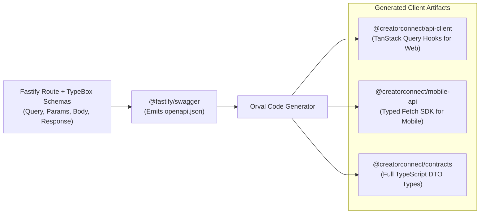

# CreatorConnect — API Architecture Specification

## 1. Core API Philosophy: Contract-First & Unified Tooling

The CreatorConnect API is the authoritative contract connecting all client platforms:

- Web Microfrontends
- Mobile Apps (Android & iOS)
- Web Admin Dashboard
- External Webhook Consumers & Enterprise Integrations

To prevent divergence, manual type duplication, and runtime integration bugs, CreatorConnect strictly enforces an **API-First Architecture** driven by **OpenAPI 3.1**.

---

## 2. API Tooling Stack Evaluation & Final Recommendation

| Component                          | Evaluated Alternatives                    | Selected Tool                                | Justification & Architectural Fit                                                                                                                                               |
| :--------------------------------- | :---------------------------------------- | :------------------------------------------- | :------------------------------------------------------------------------------------------------------------------------------------------------------------------------------ |
| **API Specification Standard**     | Swagger 2.0, OpenAPI 3.0, OpenAPI 3.1     | **OpenAPI 3.1**                              | Full JSON Schema Draft 2020-12 alignment, native support for webhooks, polymorphism (`oneOf`), and nullability.                                                                 |
| **Route Schema & Validator**       | Zod, Joi, TypeBox                         | **TypeBox (`@sinclair/typebox`)**            | Compiles schemas into plain JSON Schema objects at zero runtime parsing overhead; natively integrated with Fastify; 5x-10x faster than Zod for high-throughput HTTP validation. |
| **API Spec Generation**            | Hand-crafted YAML, tRPC, Fastify Swagger  | **`@fastify/swagger`**                       | Generates an accurate OpenAPI 3.1 JSON document directly from Fastify TypeBox route schemas during build/runtime.                                                               |
| **Interactive API Documentation**  | Swagger UI, Redoc, Scalar                 | **Scalar (`@scalar/fastify-api-reference`)** | Modern, beautiful, ultra-fast API reference interface with built-in interactive testing console, search, and dark mode.                                                         |
| **Client Code Generation**         | Swagger Codegen, openapi-generator, Orval | **Orval + `openapi-typescript`**             | Generates fully typed TanStack Query hooks, TypeScript models, and Fetch clients directly from the OpenAPI 3.1 spec into `@creatorconnect/api-client`.                          |
| **Local API Testing & Inspection** | Postman, Insomnia, Bruno                  | **Bruno (`.bru` files)**                     | Git-friendly, text-based request collections stored in the monorepo; zero proprietary cloud sync; team-wide version control.                                                    |

---

## 3. End-to-End Type Safety Workflow



**Zero Manual Typing**: Developers never write TypeScript interfaces for API requests or responses manually. Modifying a TypeBox route schema automatically updates the client hooks across all apps.

---

## 4. API Conventions & Standards

### 4.1 URL Versioning & Route Structure

All API routes are prefixed with the major version identifier:

```
https://api.creatorconnect.com/api/v1/<domain>/<resource>
```

Examples:

- `POST /api/v1/campaigns`
- `GET /api/v1/creators/{id}/portfolio`
- `POST /api/v1/projects/{id}/milestones/{milestoneId}/submit`

### 4.2 Standard Cursor-Based Pagination

For high-performance, consistent list responses without offset drift:

**Request Parameters:**

- `limit`: Integer (default: 20, max: 100)
- `cursor`: String (opaque base64-encoded pointer containing timestamp/ID)
- `direction`: `next` | `prev` (default: `next`)

**Response Envelope:**

```json
{
  "data": [{ "id": "01j7q6...", "title": "4K Video Editing", "amount": 25000 }],
  "pagination": {
    "hasMore": true,
    "nextCursor": "ZXlKaGJHY2lPaUpTVXp...",
    "prevCursor": null,
    "limit": 20
  }
}
```

### 4.3 Error Handling (RFC 7807 Problem Details)

All 4xx and 5xx responses emit a standardized RFC 7807 JSON payload:

```json
{
  "type": "https://errors.creatorconnect.com/errors/VALIDATION_ERROR",
  "title": "Invalid Request Payload",
  "status": 400,
  "detail": "Field 'budget_min' must be greater than 0.",
  "instance": "/api/v1/campaigns",
  "code": "PAYLOAD_VALIDATION_FAILED",
  "timestamp": "2026-09-13T21:30:00Z",
  "requestId": "req_01j7q9k2...",
  "errors": [
    {
      "field": "budget_min",
      "message": "Expected integer greater than 0, received -500"
    }
  ]
}
```

### 4.4 Standard HTTP Status Codes

- `200 OK`: Successful read or update.
- `201 Created`: Resource successfully created (with `Location` header).
- `204 No Content`: Successful deletion or action with no return payload.
- `400 Bad Request`: Schema validation failure.
- `401 Unauthorized`: Missing or invalid Bearer JWT.
- `403 Forbidden`: Authenticated, but lacks role or resource ownership.
- `404 Not Found`: Resource does not exist.
- `409 Conflict`: Business rule violation or optimistic concurrency collision.
- `422 Unprocessable Entity`: Semantic domain failure (e.g. insufficient escrow balance).
- `429 Too Many Requests`: Rate limit threshold exceeded.
- `500 Internal Server Error`: Unhandled server defect (alert sent to Sentry).
