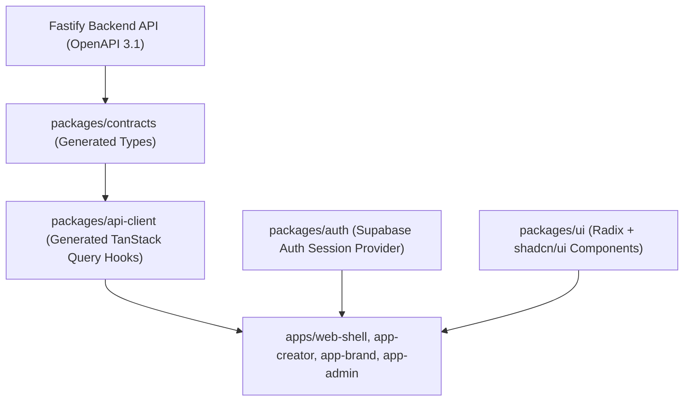

# CreatorConnect — Web Frontend Integration Manual

## 1. Architectural Role: Web as a Typed Microfrontend Consumer

This manual is the authoritative integration guide for Web engineers building the CreatorConnect web applications (`web-shell`, `app-creator`, `app-pro`, `app-brand`, and `app-admin`).

> **CRITICAL ARCHITECTURAL MANDATE**:  
> Web frontend applications are pure presentation and UX layers.  
> **NO business logic, escrow state calculations, pricing formulas, or permission decisions may reside inside Next.js Server Actions or React components.**  
> The Fastify Backend is the sole authoritative source of truth.

---

## 2. Shared Packages & Client Architecture

Web applications consume the backend through shared monorepo packages:



### 2.1 Zero Hand-Written Fetch Logic
Web developers **MUST NOT** author raw `fetch()` or Axios requests. All queries and mutations are executed using auto-generated TanStack Query hooks from `@creatorconnect/api-client`:
```typescript
import { useGetCampaignById, useSubmitProposal } from '@creatorconnect/api-client';

export function CampaignDetail({ campaignId }: { campaignId: string }) {
  const { data, isLoading, error } = useGetCampaignById(campaignId);
  const { mutate: apply, isPending } = useSubmitProposal();

  if (isLoading) return <CampaignSkeleton />;
  if (error) return <ErrorAlert error={error} />;

  return (
    <div>
      <h1>{data.data.title}</h1>
      <button onClick={() => apply({ campaignId, proposedRate: 50000 })}>
        {isPending ? 'Submitting...' : 'Apply'}
      </button>
    </div>
  );
}
```

---

## 3. Web Client Integration Checklist

### 3.1 Authentication & Session Handling
- Wrap domain applications in `<AuthProvider>` from `@creatorconnect/auth`.
- Session tokens are stored in secure HTTP-only cookies partitioned at the root domain (`.creatorconnect.com`).
- The `@creatorconnect/api-client` automatically attaches `Authorization: Bearer <access_token>` to all requests and handles transparent token refresh upon receiving `401 Unauthorized`.

### 3.2 Server State vs. Client State
- **Server State (90%)**: Managed strictly by **TanStack Query**. Query keys must follow the factory pattern (`['campaigns', 'detail', id]`).
- **Client State (10%)**: Ephemeral UI state (modals, drawer open/close, active audio player) managed via lightweight **Zustand** stores.
- **Form State**: Managed via **React Hook Form** paired with `@hookform/resolvers/zod` using shared validation schemas from `@creatorconnect/validation`.

### 3.3 UX "Smoothness" Requirements
All web pages must handle the complete lifecycle of UX states:
- **Skeleton States**: Render layout-preserving skeleton screens during initial data fetch.
- **Empty States**: Render informative illustrations and clear CTAs when query lists return empty (`data.length === 0`).
- **Optimistic Updates**: For social interactions (typing, liking, messaging), update local UI immediately and roll back gracefully on mutation failure.
- **Error States**: Catch errors using standard RFC 7807 problem envelopes; display field-level validation messages and actionable banners.

### 3.4 Direct Media Upload Pipeline
1. Form component requests upload session via `useCreateUploadSession()`.
2. Component uploads binary directly to Cloudflare R2 using `XMLHttpRequest` (to provide an accurate upload percentage progress bar).
3. Upon upload completion, component calls `useConfirmUpload()`.

### 3.5 Realtime WebSocket Integration
- Connect to Realtime Gateway (`wss://realtime.creatorconnect.com`) using `useSocket()` hook from `@creatorconnect/auth`.
- Hook automatically synchronizes unread badge counters and listens to project milestone status updates.

### 3.6 Payment Integration (Razorpay Checkout.js)
1. Invoke `useCreatePaymentOrder()` to acquire `orderId` and `key_id`.
2. Open Razorpay Checkout modal in browser.
3. Upon modal dismissal or success handler, transition UI to a "Verifying Escrow..." polling state.
4. Escrow status is confirmed **only** when backend updates project status to `FUNDED` via webhook.
