# CreatorConnect — Authoritative Architecture Diagrams Catalog

This document compiles the 14 core Mermaid architectural diagrams defining the CreatorConnect platform.

---

## 1. System Context Diagram (C4 Level 1)

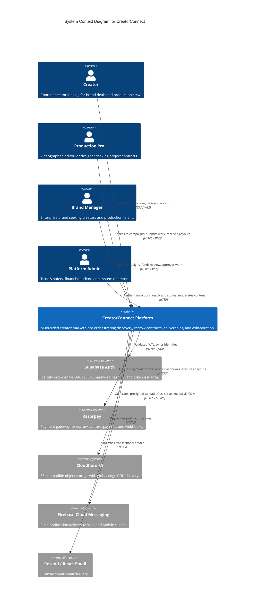

---

## 2. High-Level System Architecture (C4 Level 2)

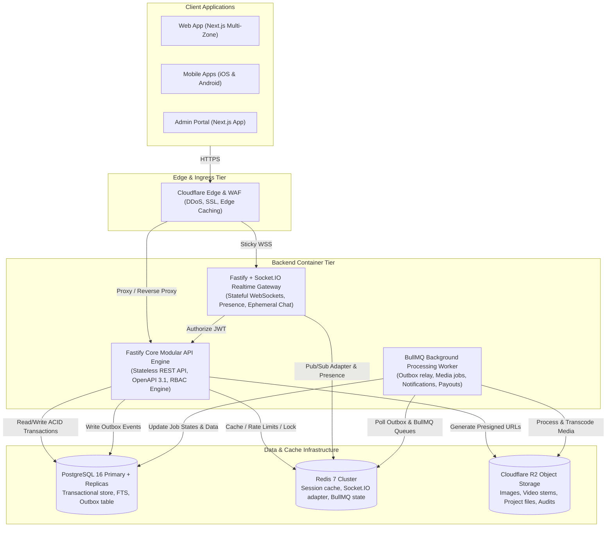

---

## 3. Microservice / Physical Service Topology

```mermaid
graph TD
    subgraph Target1 ["1. Core Modular API (Fastify REST Service)"]
        D1[Identity & Users]
        D2[Profiles & Portfolios]
        D3[Campaigns & Applications]
        D4[Projects, Deliverables & Escrow]
        D5[Reviews, Disputes & Admin]
        D6[PostgreSQL FTS Search & Rule Matcher]
    end

    subgraph Target2 ["2. Realtime Gateway (Fastify + Socket.IO Service)"]
        D7[WebSocket Handshake & Heartbeats]
        D8[Ephemeral Presence & Typing Indicators]
        D9[Direct Chat Messaging Delivery]
        D10[Redis Adapter Backplane]
    end

    subgraph Target3 ["3. Background Processing (BullMQ Worker Tier)"]
        D11[Outbox Event Publisher Daemon]
        D12[Media Processing & Video Thumbnails (Sharp/FFmpeg)]
        D13[Multi-Channel Notification Dispatcher (FCM/Resend)]
        D14[Payment Webhook Reconciliation & Payouts]
    end
```

---

## 4. Microfrontend & Shared Package Architecture

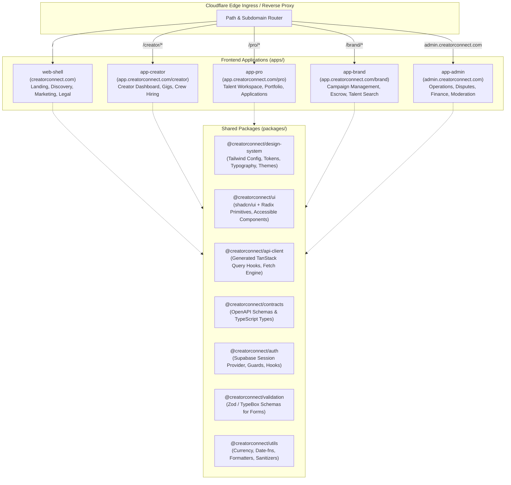

---

## 5. Authentication Flow (Supabase Auth Decoupling)

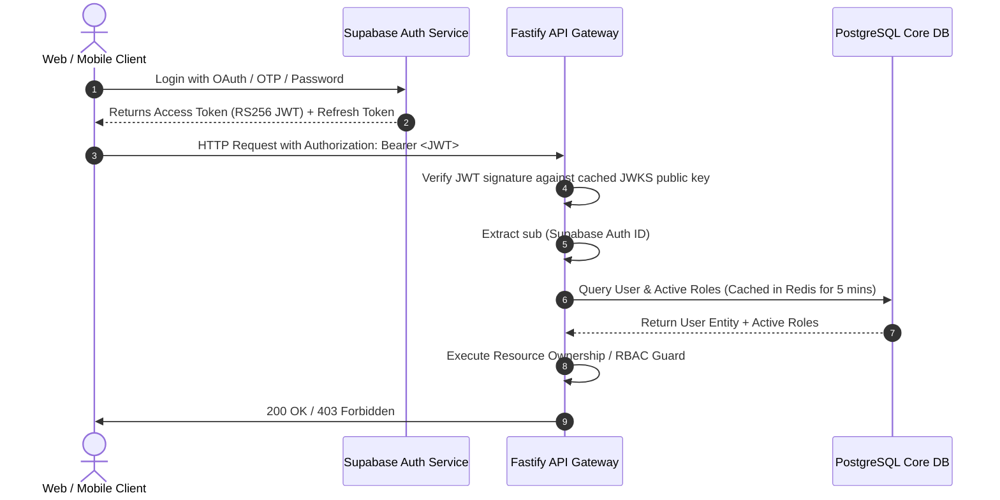

---

## 6. End-to-End API Flow & Code Generation

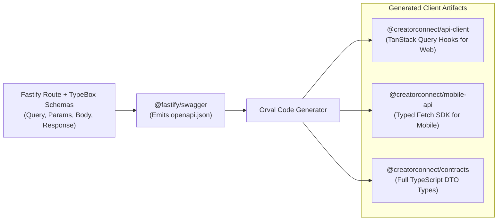

---

## 7. Event-Driven Architecture (Transactional Outbox Pattern)

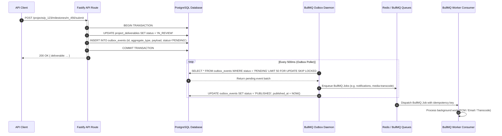

---

## 8. Payment Flow (Escrow & Webhook Signature Verification)

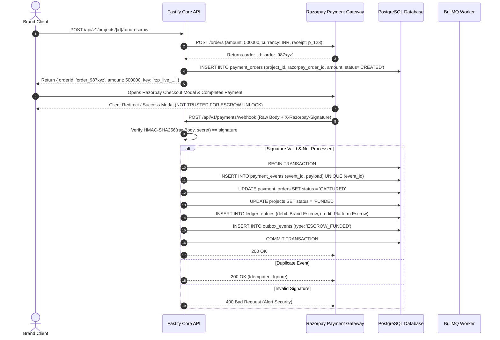

---

## 9. Notification Flow (Multi-Channel Asynchronous Dispatch)

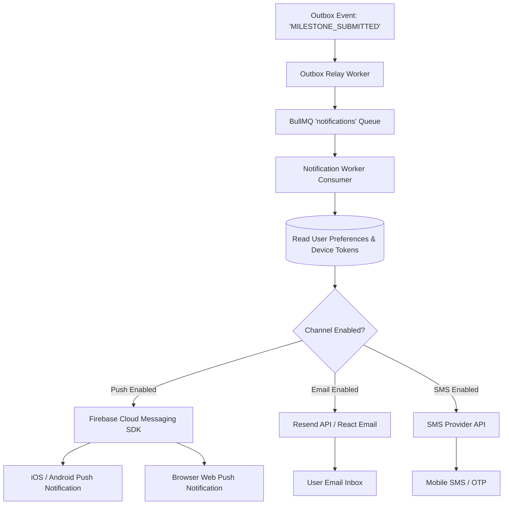

---

## 10. Direct Media Upload Flow (Cloudflare R2 + Quarantined Scanning)

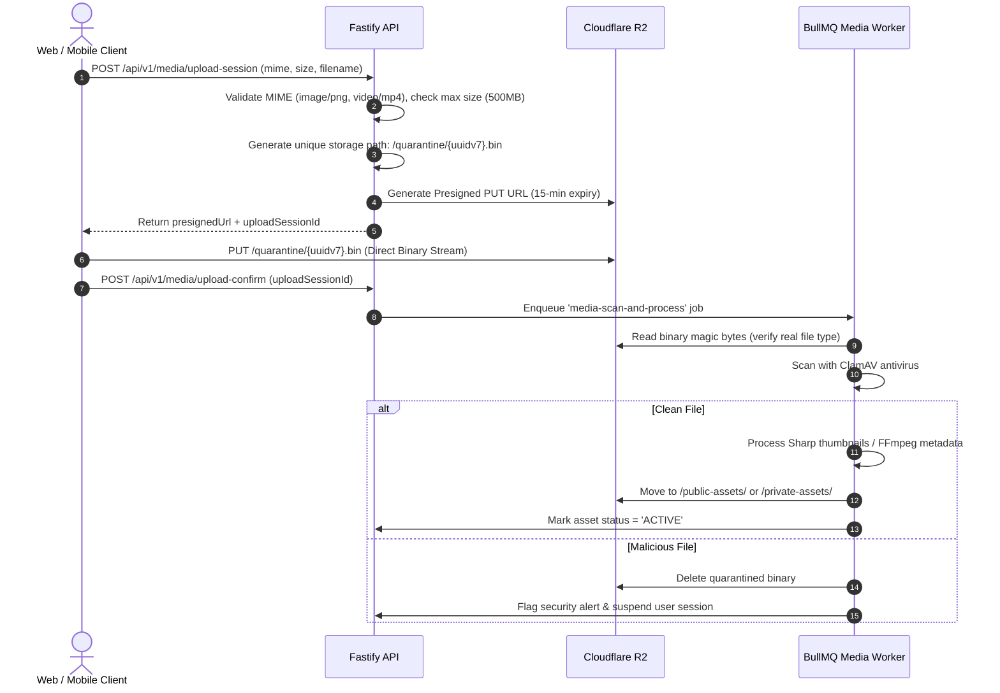

---

## 11. Realtime Messaging Flow (Socket.IO + Redis Backplane)

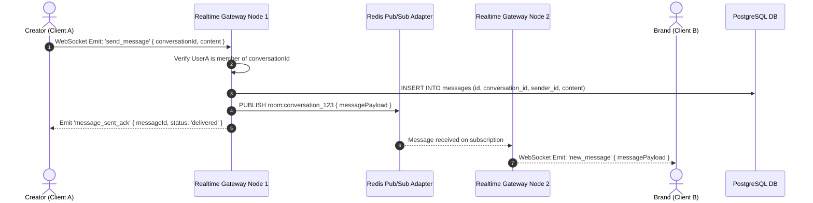

---

## 12. Continuous Integration / Continuous Deployment Pipeline

```mermaid
flowchart TD
    subgraph PR_Pipeline ["Pull Request Validation Pipeline (Automated on PR)"]
        direction TB
        PR1[Checkout & Cache Restore]
        PR2[Typecheck - tsc --noEmit]
        PR3[Lint & Format - ESLint / Prettier]
        PR4[Unit Tests - Vitest]
        PR5[Integration Tests - Testcontainers Postgres/Redis]
        PR6[OpenAPI Contract Validation - Fastify Swagger Diff]
        PR7[Security Scanners - Gitleaks, Semgrep, CodeQL]
        PR8[Docker Multi-Stage Build & Trivy Vulnerability Scan]
        PR1 --> PR2 --> PR3 --> PR4 --> PR5 --> PR6 --> PR7 --> PR8
    end

    subgraph Staging_Pipeline ["Staging Pipeline (Automated on Merge to main)"]
        direction TB
        ST1[Database Migration Rehearsal & Validation]
        ST2[Deploy to Staging ECS / Fargate Cluster]
        ST3[Run Full Playwright E2E Suite (21 Journeys)]
        ST4[Run k6 Load Test Baseline]
        ST5[Run OWASP ZAP DAST Security Scan]
        ST1 --> ST2 --> ST3 --> ST4 --> ST5
    end

    subgraph Production_Pipeline ["Production Pipeline (Gated by Approval)"]
        direction TB
        PD1[Manual Human Approval Gate - Tech Lead / Release Mgr]
        PD2[Zero-Downtime Blue/Green Deploy & Backward Migration]
        PD3[Automated Smoke Tests & Health Check Polling]
        PD4{Health Check Passed?}
        PD5[Promote Traffic 100% to Green]
        PD6[AUTOMATIC ROLLBACK to Blue & Alert PagerDuty]
        PD1 --> PD2 --> PD3 --> PD4
        PD4 -- Yes --> PD5
        PD4 -- No --> PD6
    end

    PR8 -->|Merge PR to main| Staging_Pipeline
    ST5 -->|Staging Tests Green| Production_Pipeline
```

---

## 13. Production Deployment Topology (AWS + Cloudflare Multi-AZ)

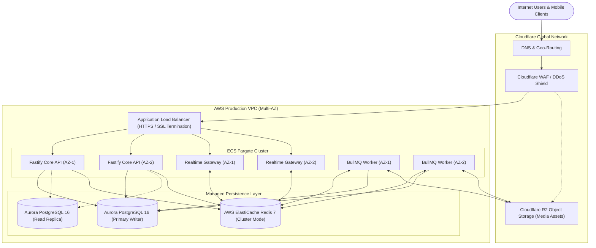

---

## 14. Testing Pyramid & Quality Architecture

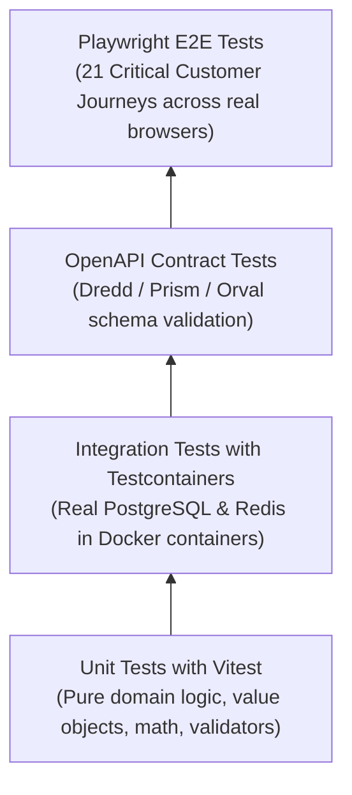
