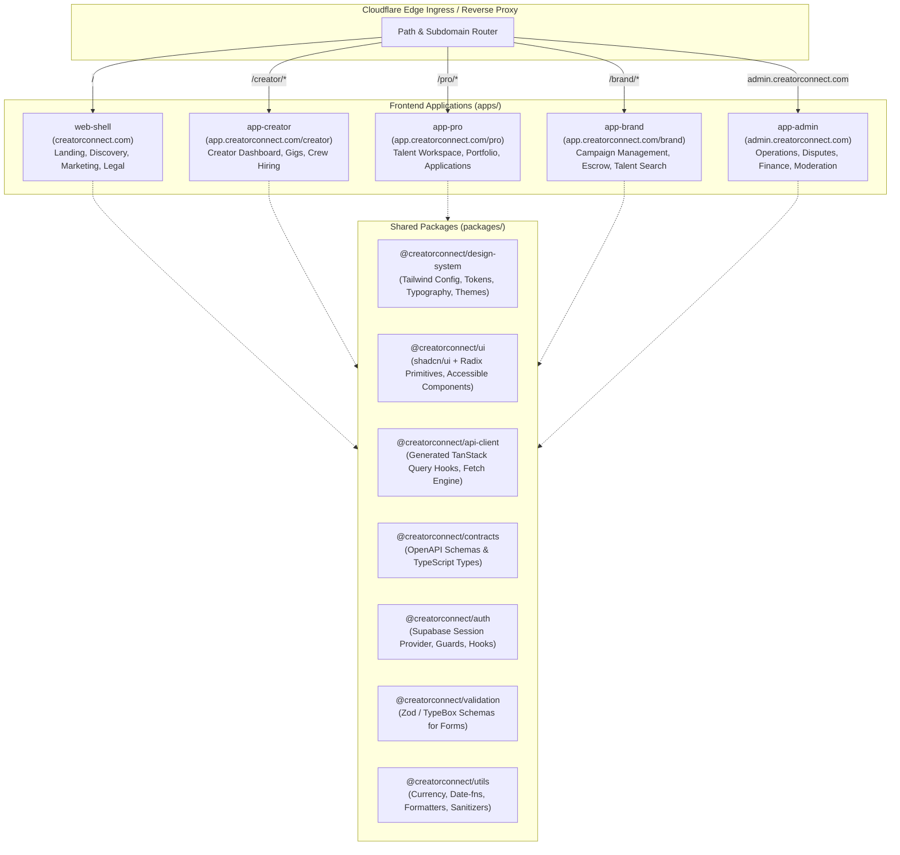
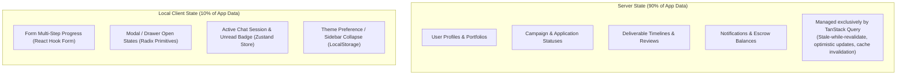

# CreatorConnect — Microfrontend & Frontend Architecture Specification

## 1. Architectural Philosophy: Unified Monorepo with Domain Workspaces

CreatorConnect adopts a **Vertical Domain Microfrontend Architecture** managed within a Turborepo/pnpm monorepo.

Rather than running complex runtime Module Federation that introduces fragile browser-level dependency negotiations and version drift, CreatorConnect employs:

1. **Next.js Multi-Zones / Domain Apps**: Each high-level persona workspace operates as an independently deployable Next.js application behind a Cloudflare Edge Router, sharing a strict set of compile-time shared libraries.
2. **Shared Package Ecosystem**: Zero duplicate UI components, form validation schemas, or API clients across domains.

---

## 2. Microfrontend Domain Breakdown



### Domain Application Boundaries:

- **`web-shell`**: Public discovery, landing pages, creator showcase directory, blog, terms, and authentication entry point (`/login`, `/register`).
- **`app-creator`**: Focused workflow for content creators: incoming brand deals, post-production job briefs, crew hiring, milestone reviews.
- **`app-pro`**: Tailored for freelancers/crew: application tracker, deliverable upload center, rate card manager, portfolio editor.
- **`app-brand`**: Tailored for enterprise brands & agencies: multi-creator campaign orchestrator, escrow deposits, deliverable review/revision workflow.
- **`app-admin`**: Isolated operational cockpit: KYC/verification queues, escrow releases, dispute arbitration, moderation flags, system logs.

---

## 3. Shared Packages Architecture

To strictly enforce DRY and eliminate duplicate code:

```
packages/
├── design-system/       # CSS tokens, color palettes, spacing, typography, Tailwind base
├── ui/                  # shadcn/ui primitives, Radix UI components, compound modals, tables
├── api-client/          # Auto-generated TanStack Query hooks and typed HTTP client
├── contracts/           # OpenAPI 3.1 contract definitions and derived TypeScript types
├── auth/                # Supabase Auth client, session token refreshers, AuthProvider
├── validation/          # Reusable Zod / TypeBox schemas shared with backend routes
├── config/              # Shared ESLint, Prettier, PostCSS, and TypeScript tsconfig bases
├── utils/               # DateTime (date-fns), currency minor units, text truncation
└── testing/             # Shared Vitest helpers, Mock Service Worker (MSW) handlers
```

### Strict Architectural Rules for Packages:

1. **No Circular Dependencies**: `ui` depends on `design-system`; `api-client` depends on `contracts`; `validation` depends on nothing.
2. **Zero Direct Fetch Calls in Apps**: All data fetching must use `@creatorconnect/api-client`.
3. **Zero Custom Color Hex Codes in Apps**: All UI styling must use semantic tokens from `@creatorconnect/design-system`.

---

## 4. State Management Strategy: Server State vs. Client State

CreatorConnect prevents client state bloat by maintaining a strict boundary:



- **Server State**: Managed strictly through **TanStack Query**. Automatic background refetching, query key factories, optimistic mutations for messaging and status toggles.
- **Client State**: Minimal. Ephemeral form states use **React Hook Form**. Cross-component ephemeral UI state (e.g., active audio player, chat drawer minimize) uses a lightweight **Zustand** store.

---

## 5. Microfrontend Routing & Deployment Strategy

- **Routing via Multi-Zones**:
  - `creatorconnect.com/` → Served by `web-shell`
  - `creatorconnect.com/creator/*` → Rewritten by Cloudflare Edge to `app-creator`
  - `creatorconnect.com/pro/*` → Rewritten by Cloudflare Edge to `app-pro`
  - `creatorconnect.com/brand/*` → Rewritten by Cloudflare Edge to `app-brand`
  - `admin.creatorconnect.com/*` → Isolated DNS subdomain routed to `app-admin`
- **Zero-Downtime Deployment**: Each microfrontend application builds into an independent Docker container or Vercel/Cloudflare deployment. Updating the `app-brand` experience requires zero rebuilds or downtime for `app-creator` or `web-shell`.
- **Shared Session Cookie**: Authentication session cookies are set at `.creatorconnect.com` domain level, allowing seamless cross-application transitions without re-authenticating.
