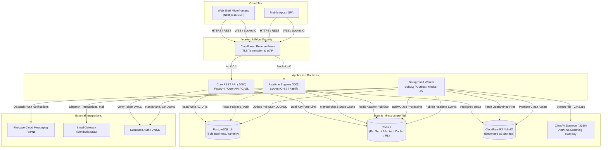
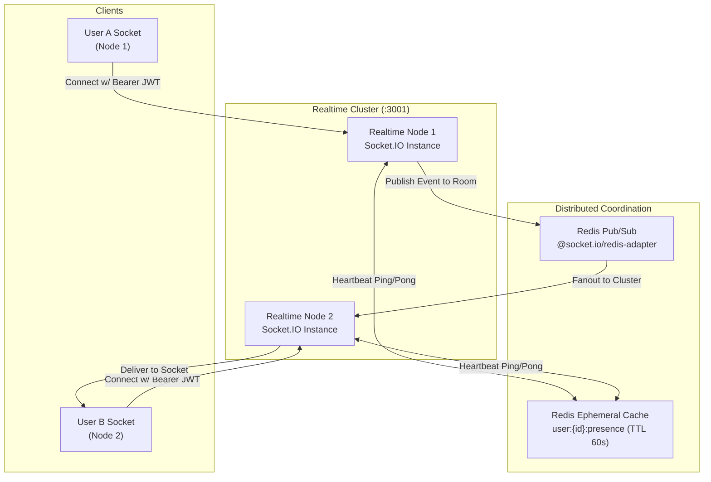
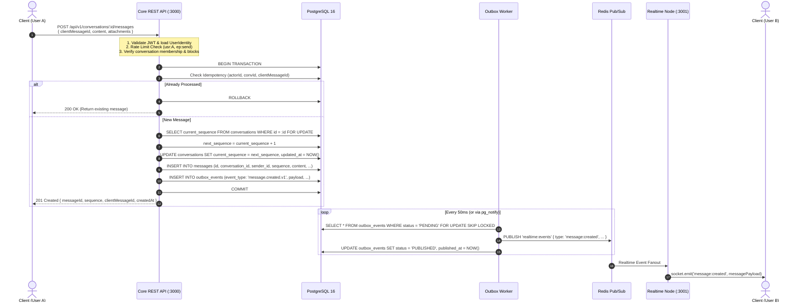
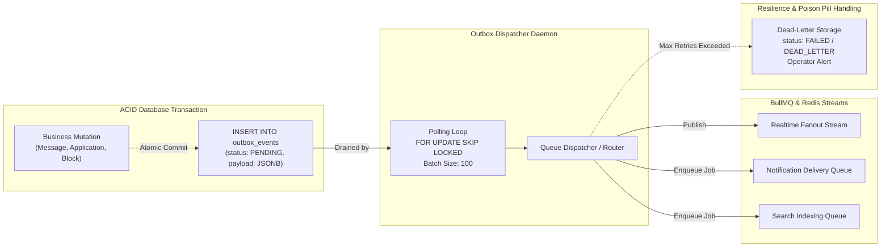
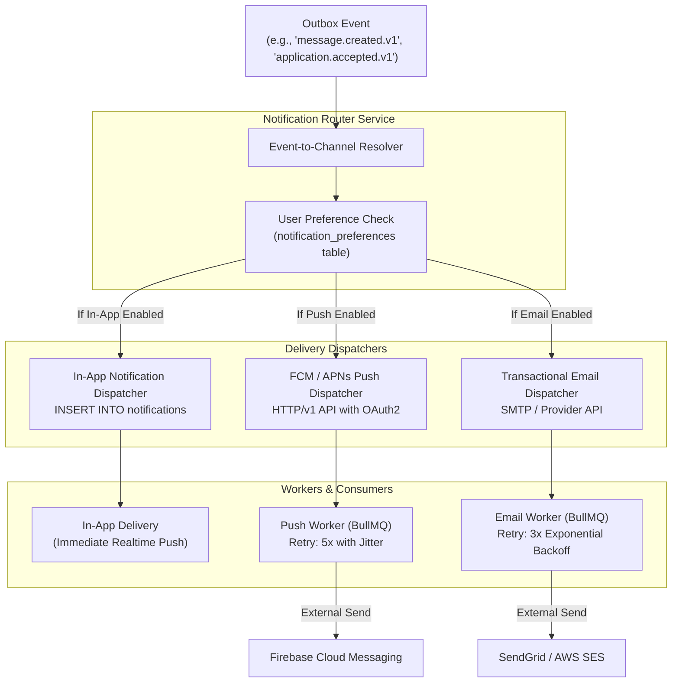
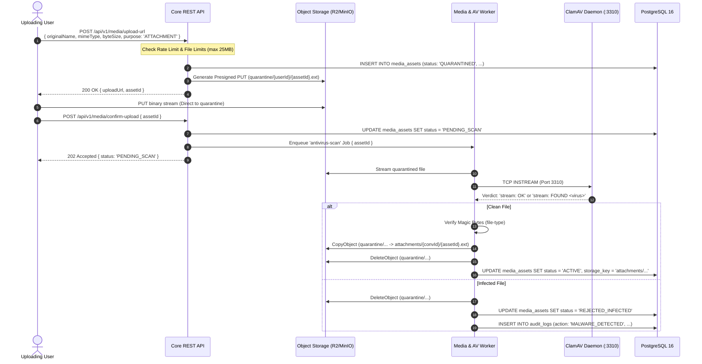
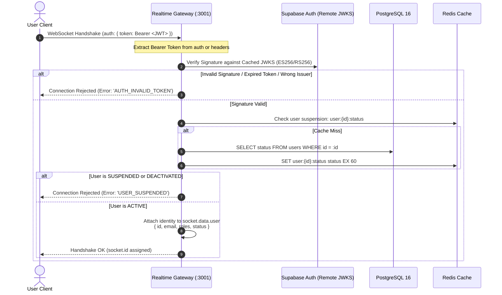
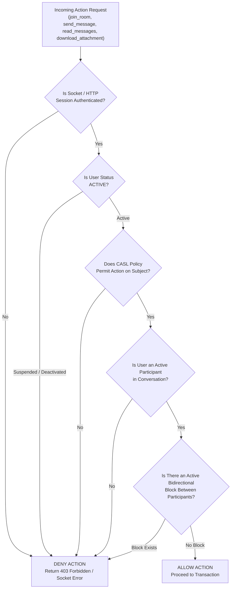
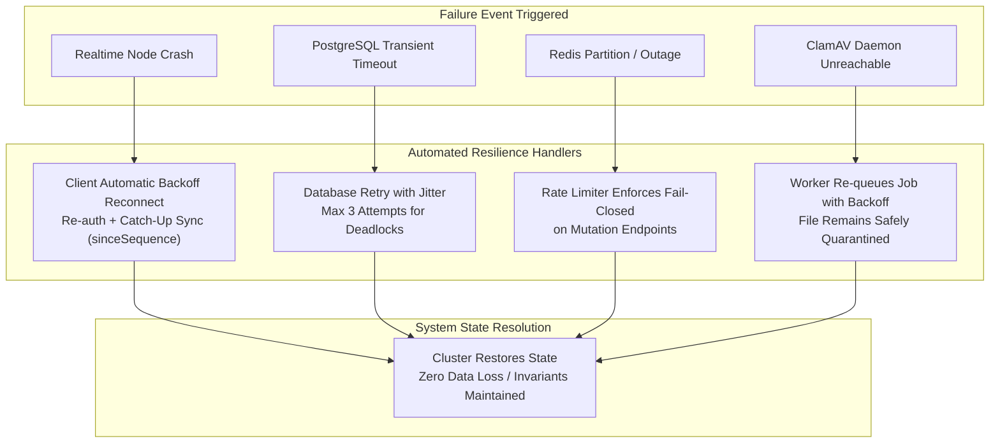

# CreatorConnect — Phase 5 System Architecture Blueprint

## 1. Architectural Philosophy & Strategy

Phase 5 introduces **Direct Messaging, Realtime Infrastructure, Transactional Outbox, Notifications Foundation, Media Security & Moderation** to the CreatorConnect platform.

To maintain the architectural integrity established in Phases 0 through 4.5, Phase 5 adheres strictly to:

1. **Modular Monolith Core with Specialist Runtimes**: The core business domains (Conversations, Messages, Moderation, Notifications) reside within the modular monolith (`apps/api`). Physically isolated runtimes are maintained strictly where justified:
   - `apps/realtime`: Specialist runtime managing persistent WebSocket / Socket.IO connections and distributed fanout.
   - `apps/worker`: Specialist runtime executing CPU-intensive background tasks (malware scanning, image processing, outbox publishing, notification delivery).
2. **PostgreSQL as Sole Business Authority**: All transactional state, sequence numbers, conversation memberships, block lists, and outbox events are committed to PostgreSQL 16.
3. **Redis as Ephemeral Infrastructure**: Redis 7 is strictly utilized for the Socket.IO distributed adapter, ephemeral presence keys, dual-key rate limiting counters, and BullMQ queue coordination. Redis is **never** authoritative for business truth.
4. **Reliability via Transactional Outbox**: The database dual-write anomaly is eliminated. Any domain mutation committing to PostgreSQL atomically writes an event to `outbox_events`. Asynchronous workers read and deliver these events to Redis/BullMQ/Realtime.
5. **Fail-Closed Security**: Every ingress vector (REST and WebSocket) enforces server-derived identity, CASL authorization, and strict schema validation. Missing authorization or unverified states fail closed (DENY).

---

## 2. Comprehensive System Architecture (Diagram 1)



---

## 3. Realtime Engine Architecture (Diagram 2)

The Realtime runtime is scaled horizontally across multiple stateless nodes backed by `@socket.io/redis-adapter`.



---

## 4. Message Send Flow (Diagram 3)

The message send lifecycle is strictly ordered, deterministic, and idempotent.



---

## 5. Transactional Outbox Pipeline (Diagram 4)

Guarantees at-least-once delivery from PostgreSQL to asynchronous event consumers without distributed transactions.



---

## 6. Notification Pipeline (Diagram 5)

Decoupled multi-channel notification architecture with user preference enforcement and per-channel backoff retries.



---

## 7. Attachment Security Pipeline (Diagram 6)

Zero-trust file ingestion: uploads enter isolated quarantine, are inspected by the ClamAV antivirus gateway, and only promoted if clean.



---

## 8. Authentication Flow (Diagram 7)



---

## 9. Authorization Flow (Diagram 8)

Enforces strict CASL authorization, conversation membership, and active blocking checks before any room join or message read.



---

## 10. Failure & Recovery Flow (Diagram 9)



---

## 11. Deployment Architecture (Diagram 10)

```mermaid
flowchart TB
    subgraph IngressTier["Cloud Ingress & Security"]
        CDN["Cloudflare CDN & WAF"]
        ALB["Application Load Balancer / NGINX Ingress"]
    end

    subgraph ContainerCluster["Container Orchestration (Docker / Kubernetes)"]
        subgraph APIGroup["Core API Pods / Containers"]
            API1["API Instance 1 (:3000)"]
            API2["API Instance 2 (:3000)"]
        end

        subgraph RTGroup["Realtime Pods / Containers"]
            RT1["Realtime Instance 1 (:3001)"]
            RT2["Realtime Instance 2 (:3001)"]
        end

        subgraph WorkerGroup["Asynchronous Worker Pods"]
            W1["Worker Instance 1 (BullMQ + Outbox)"]
            W2["Worker Instance 2 (Media + Antivirus)"]
        end

        subgraph SecurityGroup["Security Daemon Pods"]
            ClamAVDaemon["ClamAV Daemon Container (:3310)"]
        end
    end

    subgraph DataTier["Managed Infrastructure Tier"]
        PostgresPrimary[("PostgreSQL 16 Primary")]
        PostgresReplica[("PostgreSQL 16 Read Replica")]
        RedisMaster[("Redis 7 Primary (AOF Enabled)")]
        R2Bucket[("Cloudflare R2 Object Store")]
    end

    CDN --> ALB
    ALB -->|/api/*| APIGroup
    ALB -->|/socket.io/* (WSS)| RTGroup

    APIGroup --> PostgresPrimary
    APIGroup --> RedisMaster
    APIGroup --> R2Bucket

    RTGroup --> RedisMaster

    WorkerGroup --> PostgresPrimary
    WorkerGroup --> RedisMaster
    WorkerGroup --> R2Bucket
    WorkerGroup --> ClamAVDaemon

    PostgresPrimary -.->|Streaming Replication| PostgresReplica
```
