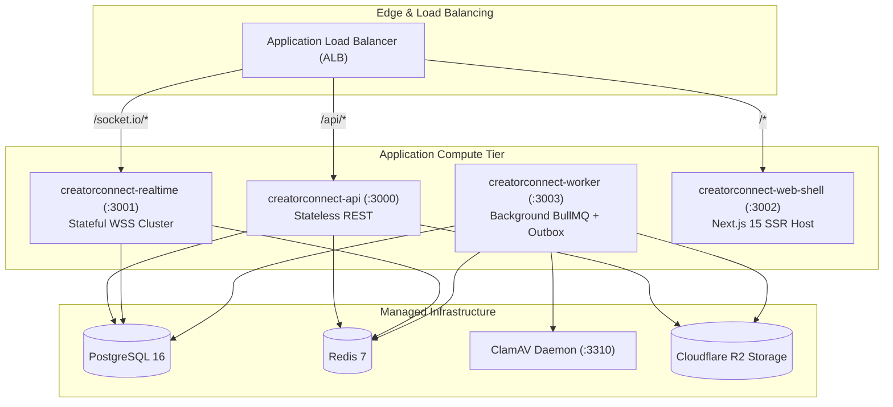

# CreatorConnect — Phase 5 Deployment & Container Orchestration

## 1. Deployment Topology

Phase 5 runs across four containerized application runtimes plus supporting backing services:



---

## 2. Health, Liveness & Readiness Probes

Every runtime exposes standardized HTTP probes:

| Service          | Probe Route       | Verification Logic                                                    | Probe Type           |
| :--------------- | :---------------- | :-------------------------------------------------------------------- | :------------------- |
| `apps/api`       | `GET /health`     | Checks PostgreSQL query ping and Redis ping.                          | Liveness / Readiness |
| `apps/realtime`  | `GET /health`     | Verifies Redis adapter connectivity and active client count.          | Liveness / Readiness |
| `apps/worker`    | `GET /health`     | Verifies BullMQ supervisor running state and ClamAV TCP reachability. | Liveness / Readiness |
| `apps/web-shell` | `GET /api/health` | Verifies Next.js SSR server responding.                               | Liveness / Readiness |

---

## 3. Graceful Shutdown & Drain Lifecycle

To guarantee zero dropped requests and zero corrupted transactions during container re-deployments, all processes implement the standard **SIGTERM Drain Sequence**:

```mermaid
sequenceDiagram
    autonumber
    participant Orchestrator as Kubernetes / Docker
    participant Svc as Service Instance (API/Realtime/Worker)
    participant Backing as PostgreSQL / Redis

    Orchestrator->>Svc: Send SIGTERM signal
    Note over Svc: 1. Flag service as SHUTTING_DOWN (Probes return 503)
    Note over Svc: 2. Stop accepting new HTTP requests / WebSocket connections

    alt Realtime Service
        Note over Svc: Emit 'server:restarting' to connected sockets<br/>Close client sockets with reconnect advice
    else Worker Service
        Note over Svc: Pause BullMQ queues; wait up to 25s for active jobs to complete
    end

    Note over Svc: 3. Drain in-flight HTTP requests (timeout: 10s)
    Svc->>Backing: 4. Close database connection pool (prisma.$disconnect())
    Svc->>Backing: 5. Disconnect Redis clients (redis.quit())
    Svc-->>Orchestrator: Exit cleanly with status 0
```

---

## 4. Container Hardening & Supply Chain Security

In alignment with Phase 4.5 security standards:

1. **Non-Root Execution**: All containers execute under the unprivileged `USER node` (UID 1000). Root execution is forbidden in production Dockerfiles.
2. **Immutable Base Images**: Built on pinned, verified alpine base images (e.g. `node:20-alpine`, `postgres:16-alpine`, `redis:7-alpine`).
3. **Multi-Stage Builds**: Development dependencies, source code, and build caches are purged; final runtime images contain only compiled JavaScript and production `node_modules`.
4. **Read-Only Root Filesystems**: Temporary file writes are restricted to explicit `/tmp` tmpfs volumes.
