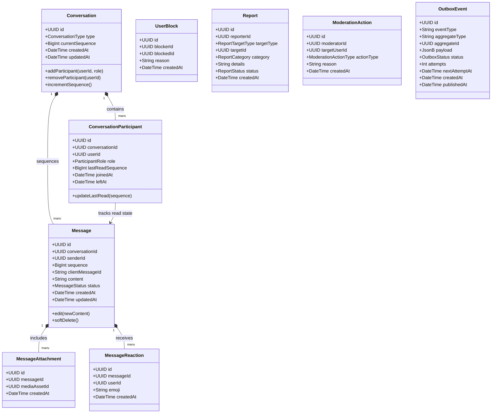
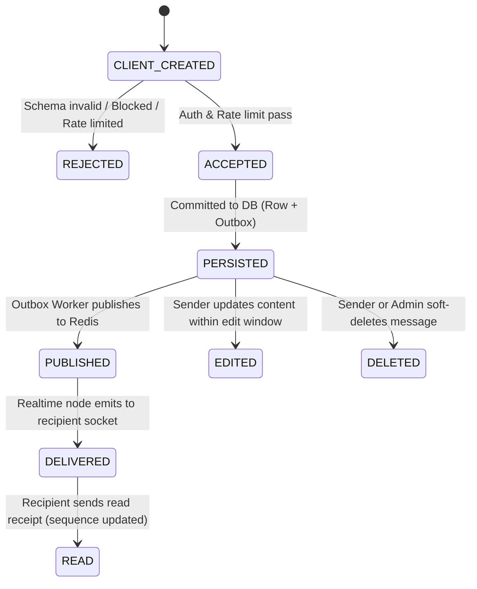

# CreatorConnect — Phase 5 Domain Model Specification

## 1. Bounded Contexts & Aggregate Roots

Phase 5 organizes real-time communication, messaging, outbox publishing, notifications, and moderation into clean, cohesive domain modules inside the modular monolith, accompanied by specialist runtimes where physically justified.

---

## 2. Architectural Topology: Modular Monolith vs Microservices

In strict accordance with ADR-001 and ADR-020 (Microservice Extraction Triggers), Phase 5 rejects the premature creation of separate microservices (such as a distinct "message-service", "presence-service", or "notification-service").

### 2.1 The Two Physical Separations

The architecture maintains exactly two physically separated runtimes alongside the core API:

1. **Realtime Runtime (`apps/realtime`)**: Physically isolated because long-lived persistent WebSocket connections exhibit completely different memory, event-loop, and scaling profiles than stateless HTTP request-response cycles.
2. **Asynchronous Worker Runtime (`apps/worker`)**: Physically isolated because ClamAV antivirus streaming, image manipulation (Sharp), and polling-based outbox dispatching are CPU- and memory-intensive and must never starve the HTTP or WebSocket event loops.

### 2.2 Microservice Extraction Questionnaire (9 Mandatory Inquiries)

| Inquiry                             | Realtime Runtime (`apps/realtime`)                                                                                                                                                                                           | Worker Runtime (`apps/worker`)                                                                                                                                                                                     |
| :---------------------------------- | :--------------------------------------------------------------------------------------------------------------------------------------------------------------------------------------------------------------------------- | :----------------------------------------------------------------------------------------------------------------------------------------------------------------------------------------------------------------- |
| **1. Why separate?**                | WebSockets hold persistent TCP file descriptors and keep connections open for hours. HTTP scaling requires rapid auto-scaling on request queue depth. Co-locating them destabilizes HTTP throughput during reconnect storms. | Background workers run heavy CPU tasks (Sharp image resizing, ClamAV antivirus TCP streams, PDF inspection). Co-locating worker processes in the API event loop causes event-loop lag and spikes HTTP p99 latency. |
| **2. What state does it own?**      | Ephemeral socket connections, client-to-room mappings, and ephemeral presence TTL keys in Redis. No authoritative business state.                                                                                            | BullMQ queue state in Redis; temporary scan buffers. No authoritative business state.                                                                                                                              |
| **3. What API does it expose?**     | Socket.IO protocol over WSS (`/socket.io/`), plus internal health probe (`GET /health`).                                                                                                                                     | No public HTTP API. Exposes an internal health probe (`GET /health`) on port 3003.                                                                                                                                 |
| **4. What events does it consume?** | Consumes Redis pub/sub channels (`realtime:events`) emitted by the Outbox Worker to fan out to connected WebSockets.                                                                                                         | Consumes `outbox_events` table via SQL `FOR UPDATE SKIP LOCKED` and BullMQ jobs (`media-processing`, `notifications`).                                                                                             |
| **5. What events does it publish?** | Emits Socket.IO events to connected clients (`message:created`, `message:read`, `typing:start`, etc.).                                                                                                                       | Publishes events to Redis pub/sub for Realtime fanout, and pushes to external services (FCM, SES).                                                                                                                 |
| **6. How does it fail?**            | If a node crashes, connected clients disconnect and immediately trigger automatic reconnect with backoff to surviving nodes. Zero data loss.                                                                                 | If a worker crashes, unacknowledged BullMQ jobs or locked outbox events timeout and are safely reclaimed by surviving workers.                                                                                     |
| **7. How is it deployed?**          | Stateless container deployed horizontally behind ALB/NLB with session affinity (sticky cookies) for initial Socket.IO polling upgrade.                                                                                       | Headless worker container deployed horizontally; auto-scales on BullMQ queue depth and outbox lag.                                                                                                                 |
| **8. How is it tested?**            | Tested with Vitest client socket mocks and Playwright multi-page browser sessions.                                                                                                                                           | Tested with Vitest integration suites against real Redis and PostgreSQL test containers.                                                                                                                           |
| **9. Why can't API handle it?**     | API is optimized for sub-50ms REST transactions. Persistent WebSocket memory overhead and broadcast fanouts degrade API throughput.                                                                                          | API request threads must never block on long-running virus scans or outbound email dispatching.                                                                                                                    |

---

## 3. Domain Invariants & Rules

### 3.1 Conversation & Membership Invariants

1. **Uniqueness**: A user cannot be added to a conversation more than once. Enforced by `UNIQUE(conversationId, userId)`.
2. **Direct Conversation Cardinality**: A direct (one-to-one) conversation between user $A$ and user $B$ is unique. No two direct conversations may exist for the same pair.
3. **Active Membership Requirement**: A user can only post messages to a conversation if their membership status is `ACTIVE` and they have not left or been removed.
4. **Auditable Membership Mutations**: Adding, removing, or changing the role of a participant must write an audit record to `application_status_history` / `audit_logs` and generate an outbox event.

### 3.2 Message Invariants

1. **Strict Monotonic Ordering**: Within any conversation $C$, each message $M$ has an integer sequence number such that:
   $$\text{sequence}(M_{n+1}) = \text{sequence}(M_n) + 1$$
   This is enforced atomically using `SELECT current_sequence FROM conversations WHERE id = :id FOR UPDATE`.
2. **Client Idempotency Invariant**: Any retry of a message creation request sharing the tuple:
   $$(\text{actorId}, \text{conversationId}, \text{clientMessageId})$$
   must return the identical persisted message record without creating a duplicate row or advancing the sequence number.
3. **Sender Derivation Invariant**: The sender identity of a message is strictly derived from the authenticated server context (`actorId = session.user.id`). Client-provided `senderId` values are rejected or ignored.

### 3.3 Block & Safety Invariants

1. **Bidirectional Message Barrier**: If user $A$ has blocked user $B$ (or $B$ has blocked $A$):
   - $B$ cannot send any message to $A$ in any direct conversation.
   - $B$ cannot initiate a new conversation with $A$.
   - $B$ cannot invite $A$ to a group conversation.
   - Presence broadcasts between $A$ and $B$ are suppressed.
2. **Immutability of Historical Context**: Blocking a user does **not** retroactively delete existing message history, but prevents any further real-time or persistent interaction.

### 3.4 Attachment Authorization Invariants

1. **Parent Visibility Inheritance**: A `MessageAttachment` cannot be downloaded by user $U$ unless $U$ is an active participant in the parent `Conversation` holding the message.
2. **Zero-Trust File Activation**: No attachment may be referenced in a message or served to a peer until its status in `media_assets` has transitioned to `ACTIVE` following a verified `CLEAN` verdict from the ClamAV gateway.

---

## 4. Message State Machine

Every message follows an explicit, deterministic state machine.

### Transition Validation Matrix

| Current State    | Target State | Permitted Actor         | Authorization Rule                                                  | Emitted Outbox Event           |
| :--------------- | :----------- | :---------------------- | :------------------------------------------------------------------ | :----------------------------- |
| `CLIENT_CREATED` | `ACCEPTED`   | System / API            | Valid JWT, sender is active participant, not blocked, rate limit ok | None (In-memory transition)    |
| `ACCEPTED`       | `PERSISTED`  | System / DB             | Database transaction commits row + outbox event                     | `message.created.v1`           |
| `CLIENT_CREATED` | `REJECTED`   | System / API            | Invalid schema, rate limit tripped, or block violation              | None (Returns 4xx / error ACK) |
| `PERSISTED`      | `PUBLISHED`  | Outbox Worker           | Worker claims outbox event via `SKIP LOCKED`                        | `realtime.message.dispatched`  |
| `PUBLISHED`      | `DELIVERED`  | Recipient / Realtime    | Recipient socket acknowledges receipt                               | `message.delivered.v1`         |
| `DELIVERED`      | `READ`       | Recipient / Client      | Recipient marks conversation read up to sequence $S$                | `message.read.v1`              |
| `PERSISTED`      | `EDITED`     | Message Sender          | Must be original sender; within 15m of creation; not soft-deleted   | `message.updated.v1`           |
| `PERSISTED`      | `DELETED`    | Message Sender or Admin | Sender can delete own; Admin can delete any                         | `message.deleted.v1`           |
