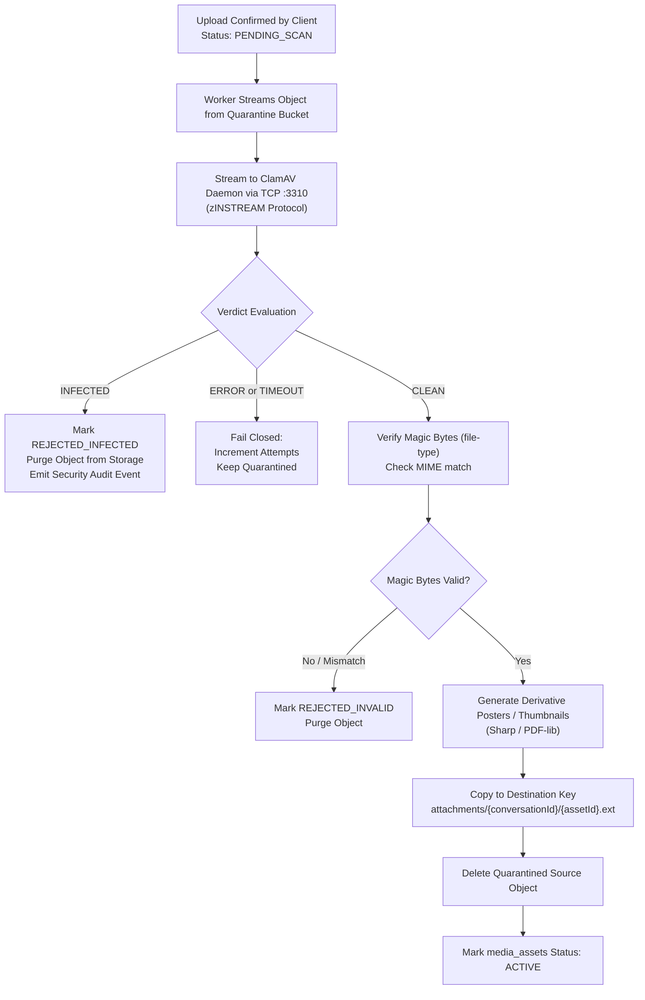
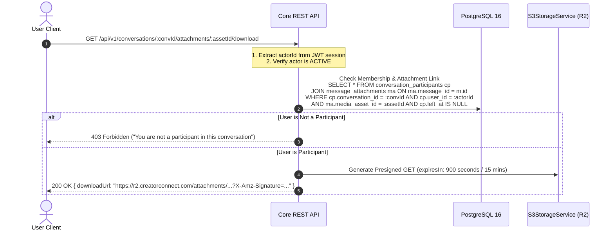

# CreatorConnect — Phase 5 Media & Attachment Security Specification

## 1. Zero-Trust Media Philosophy

CreatorConnect enforces a strict **Zero-Trust Media Ingestion Policy**. All uploaded user assets—including messaging attachments, contracts, and portfolio items—are treated as hostile until cryptographically and heuristically proven clean.

### Core Security Tenets

1. **Quarantine First**: Direct-to-storage uploads land in an isolated quarantine directory (`quarantine/{userId}/{assetId}.ext`).
2. **Mandatory Antivirus Scanning**: Magic-byte checking alone is **insufficient**. All attachments must undergo full malware scanning via a containerized **ClamAV daemon** before activation.
3. **Fail-Closed Gate**: If the ClamAV daemon is unreachable, times out, or throws an error, the asset remains quarantined and cannot be accessed.
4. **No Public URLs for Private Media**: Message attachments and private documents **never** receive public CDN URLs. Access requires dynamic conversation participant authorization and short-lived (15-minute) presigned URLs.
5. **Byte Immutability**: Once an asset reaches `ACTIVE` status, its bytes cannot be overwritten in place.

---

## 2. Antivirus Scanner Gateway Specification

### 2.1 Scanner Interface Contract

```typescript
export type ScanVerdict = 'CLEAN' | 'INFECTED' | 'ERROR' | 'TIMEOUT';

export interface ScanResult {
  verdict: ScanVerdict;
  virusName?: string | undefined;
  details?: string | undefined;
}

export interface IMalwareScanner {
  scanStream(stream: NodeJS.ReadableStream): Promise<ScanResult>;
}
```

### 2.2 ClamAV Daemon TCP Client Implementation

The worker connects to the ClamAV daemon container via TCP port 3310 using the standard `zINSTREAM` command:

```typescript
import net from 'node:net';

export class ClamAvDaemonScanner implements IMalwareScanner {
  constructor(
    private host = process.env.CLAMAV_HOST || 'clamav',
    private port = Number(process.env.CLAMAV_PORT) || 3310,
    private timeoutMs = 30000,
  ) {}

  async scanStream(stream: NodeJS.ReadableStream): Promise<ScanResult> {
    return new Promise((resolve) => {
      const socket = net.createConnection({ host: this.host, port: this.port });
      let response = '';

      socket.setTimeout(this.timeoutMs);

      socket.on('connect', () => {
        socket.write('zINSTREAM\0');

        stream.on('data', (chunk: Buffer) => {
          const length = Buffer.alloc(4);
          length.writeUInt32BE(chunk.length, 0);
          socket.write(length);
          socket.write(chunk);
        });

        stream.on('end', () => {
          const zero = Buffer.alloc(4);
          zero.writeUInt32BE(0, 0);
          socket.write(zero);
        });
      });

      socket.on('data', (data) => {
        response += data.toString('utf-8');
      });

      socket.on('end', () => {
        if (response.includes('OK')) {
          resolve({ verdict: 'CLEAN' });
        } else if (response.includes('FOUND')) {
          const match = response.match(/stream: (.+) FOUND/);
          resolve({ verdict: 'INFECTED', virusName: match ? match[1] : 'Unknown Malware' });
        } else {
          resolve({ verdict: 'ERROR', details: response.trim() });
        }
      });

      socket.on('timeout', () => {
        socket.destroy();
        resolve({ verdict: 'TIMEOUT', details: 'ClamAV daemon scan timed out' });
      });

      socket.on('error', (err) => {
        resolve({ verdict: 'ERROR', details: err.message });
      });
    });
  }
}
```

---

## 3. Full Asset Processing Pipeline



---

## 4. Parent Authorization for Attachment Access

Clients requesting to view or download a message attachment cannot hit Cloudflare R2 directly.


