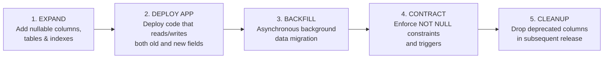

# CreatorConnect — Phase 5 Zero-Downtime Migration Strategy

## 1. Migration Governance: The Expand-and-Contract Pattern

In accordance with Platform Standards, database migrations must never introduce breaking schema changes that crash older running instances during a rolling deployment.

Phase 5 strictly adheres to the 5-stage **Expand-and-Contract** lifecycle:



---

## 2. Phase 5 Specific Migration Sequence

The Phase 5 schema introduces new tables (`conversations`, `conversation_participants`, `messages`, `outbox_events`, `user_blocks`, `reports`, `notifications`) that are purely additive to the Phase 4 database:

1. **Step 1 (Pure Expansion)**:
   - Run `pnpm --filter @creatorconnect/database db:migrate`.
   - Creates all Phase 5 tables, foreign keys, and indexes.
   - Because no Phase 4 tables are altered or dropped, existing Phase 4 running containers (`api`, `worker`, `web-shell`) remain 100% unaffected.
2. **Step 2 (Runtime Deployment)**:
   - Deploy Phase 5 `api` containers rolling (one replica at a time).
   - Deploy Phase 5 `realtime` containers.
   - Deploy Phase 5 `worker` containers.
3. **Step 3 (Post-Deployment Verification)**:
   - Execute smoke tests and integration probes.
   - Validate that outbox worker drains pending rows cleanly.

---

## 3. Rollback Strategy & Recovery Invariants

If a critical flaw is detected in Phase 5 runtime code immediately after deployment:

### 3.1 Software Rollback

- Re-deploy Phase 4 container images (`20f86e4`).
- Because Phase 5 database additions are non-destructive, Phase 4 code runs without errors alongside the new tables.

### 3.2 Database Reversibility

- Prisma migrations are tracked via migration SQL files.
- Each migration includes a corresponding rollback script in `packages/database/prisma/migrations/down/` to cleanly drop newly created tables without impacting Phase 4 user or assignment records:
  ```sql
  DROP TABLE IF EXISTS processed_events CASCADE;
  DROP TABLE IF EXISTS outbox_events CASCADE;
  DROP TABLE IF EXISTS notifications CASCADE;
  DROP TABLE IF EXISTS notification_preferences CASCADE;
  DROP TABLE IF EXISTS moderation_actions CASCADE;
  DROP TABLE IF EXISTS reports CASCADE;
  DROP TABLE IF EXISTS user_blocks CASCADE;
  DROP TABLE IF EXISTS message_reactions CASCADE;
  DROP TABLE IF EXISTS message_attachments CASCADE;
  DROP TABLE IF EXISTS messages CASCADE;
  DROP TABLE IF EXISTS conversation_participants CASCADE;
  DROP TABLE IF EXISTS conversations CASCADE;
  ```
