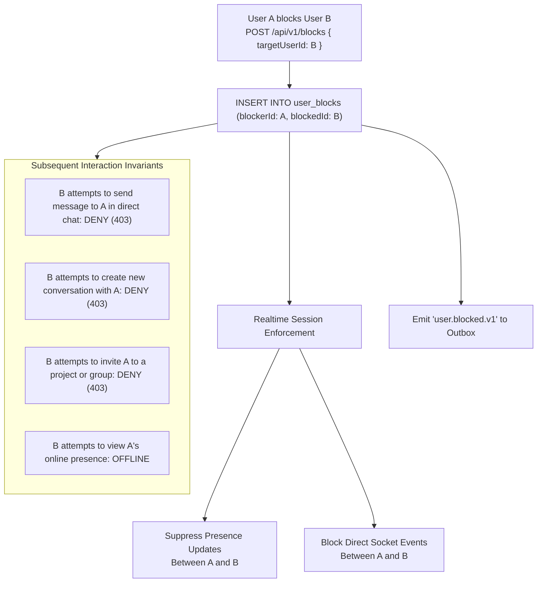
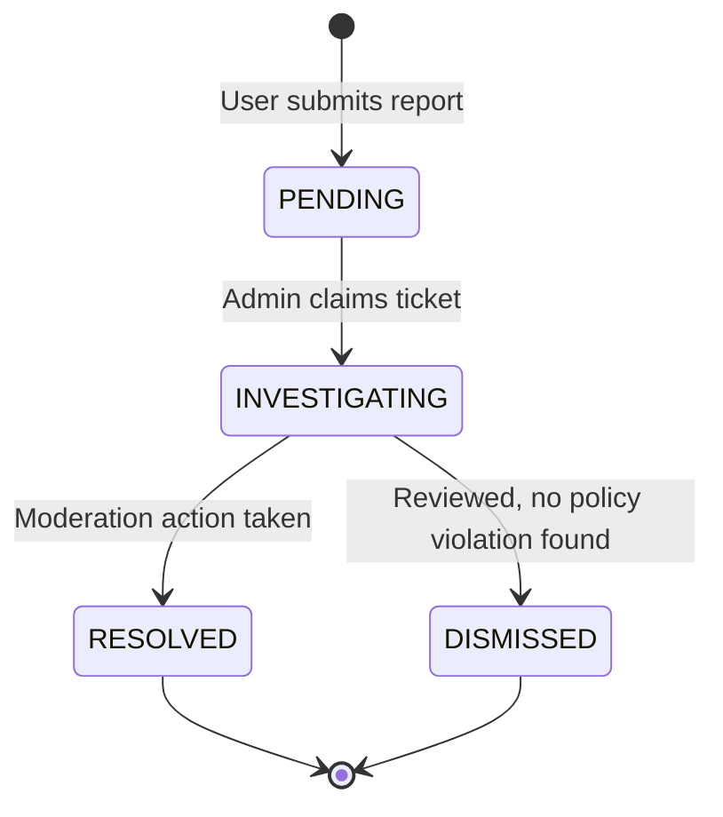

# CreatorConnect — Phase 5 Moderation & Trust & Safety Specification

## 1. Trust & Safety Architecture

CreatorConnect enforces proactive platform safety through three interconnected subsystems:

1. **Bidirectional User Blocking (`user_blocks`)**: Empowering users to immediately terminate interactions with malicious or unwanted peers.
2. **Abuse Reporting (`reports`)**: Enabling users to submit detailed abuse, scam, harassment, and malware reports against peers, messages, or assignments.
3. **Audited Moderation Workflows (`moderation_actions`)**: Providing administrators with non-destructive, auditable intervention mechanisms.

---

## 2. User Block Rules & System Behavior



### Behavioral Nuances

- **Historical Conversations**: Pre-existing message history remains readable for evidentiary and context reasons, but the conversation input is locked ("You cannot send messages to this user").
- **Unblocking**: Unblocking removes the row from `user_blocks`. Interactions are restored prospectively; missed messages during the blocked window are **not** retroactively delivered.
- **Asymmetric Transparency**: User $B$ is not given explicit UI notices that they were blocked, to prevent retaliatory harassment across external channels. Instead, actions fail with generic authorization error messages.

---

## 3. Abuse Reporting Subsystem

### 3.1 Report Categories

- `SPAM`: Unsolicited commercial advertising or bulk automated messages.
- `HARASSMENT`: Bullying, intimidation, hate speech, or stalking.
- `ABUSE`: Exploitation, threats of violence, or predatory behavior.
- `SCAM`: Fraudulent payment requests, phishing links, or fee avoidance.
- `INAPPROPRIATE_CONTENT`: Explicit adult material or copyright infringement.
- `MALICIOUS_FILE`: Trojan, spyware, or executable disguised as media.
- `OTHER`: Policy violations not covered by other categories.

### 3.2 Report Lifecycle State Machine



---

## 4. Auditable Moderation Actions

Every administrative intervention is captured in the database with strict auditability. Permanent, untracked deletions of user data are forbidden.

```sql
CREATE TABLE moderation_actions (
    id UUID PRIMARY KEY,
    moderator_id UUID NOT NULL REFERENCES users(id) ON DELETE RESTRICT,
    target_user_id UUID NOT NULL REFERENCES users(id) ON DELETE CASCADE,
    action_type VARCHAR(32) NOT NULL, -- WARN, MUTE, SUSPEND, BAN, CONTENT_REMOVED
    reason TEXT NOT NULL,
    expires_at TIMESTAMPTZ,
    created_at TIMESTAMPTZ NOT NULL DEFAULT NOW()
);
```

### Action Types & System Impacts

- `WARN`: Sends an authoritative in-app and email warning notice to the user.
- `MUTE`: Temporarily prevents user from creating messages or sending applications for $N$ hours.
- `SUSPEND`: Sets `users.status = 'SUSPENDED'`. Forces immediate socket disconnect, revokes active refresh tokens, and blocks all API access.
- `BAN`: Permanent account termination; sets `users.status = 'DEACTIVATED'`.
- `CONTENT_REMOVED`: Replaces offending message content with `[This message was removed by platform moderation]` and soft-deletes associated attachments.
