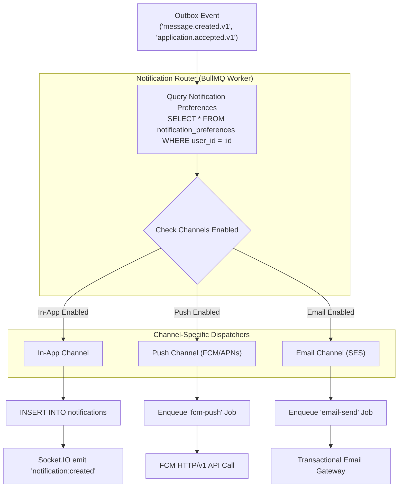

# CreatorConnect — Phase 5 Notification Pipeline Specification

## 1. Notification Architecture Principles

The notification system in CreatorConnect delivers alerts across three distinct channels:

1. **In-App Realtime Notifications**: Stored in PostgreSQL `notifications` and pushed immediately via Socket.IO to connected web and mobile sessions.
2. **Push Notifications (Mobile & Web)**: Delivered via Firebase Cloud Messaging (FCM) / Apple Push Notification Service (APNs).
3. **Transactional Email**: Delivered via transactional mail gateways (AWS SES / SendGrid).

### Critical Design Constraints

- **Zero Transactional Blocking**: No database transaction in `apps/api` ever awaits FCM, APNs, or SMTP network calls.
- **Outbox Triggered**: The notification worker consumes events published by the Transactional Outbox.
- **Privacy-Safe Payloads**: External push notifications strictly omit confidential message contents, contracts, and PII.
- **User Preference Enforcement**: Users can toggle notifications per event type and per channel.

---

## 2. Notification Pipeline Flow



---

## 3. Privacy-Safe Payload Sanitization

Push notifications sent to external mobile push servers (Google/Apple) must never transmit confidential business discussions, rates, or private chat contents over the wire.

| Domain Event              | External Push Title  | External Push Body (Sanitized)                                             | In-App / Internal Body (Full)                              |
| :------------------------ | :------------------- | :------------------------------------------------------------------------- | :--------------------------------------------------------- |
| `message.created.v1`      | "New Message"        | "You received a new message from **{{senderName}}**."                      | "{{senderName}}: {{messageContentPreview}}"                |
| `application.accepted.v1` | "Offer Accepted"     | "**{{brandName}}** accepted your application for **{{assignmentTitle}}**." | "Congratulations! Your proposal of {{rate}} was accepted." |
| `assignment.invited.v1`   | "Project Invitation" | "**{{brandName}}** invited you to review a private assignment."            | Full brief and milestone breakdown.                        |

---

## 4. BullMQ Notification Queues & Backoff Strategy

External API calls to FCM or email providers are queued in dedicated BullMQ queues with exponential backoff and jitter:

```typescript
export const pushNotificationQueue = new Queue('push-notifications', {
  connection: redisConnectionOptions,
  defaultJobOptions: {
    attempts: 5,
    backoff: {
      type: 'exponential',
      delay: 1000, // 1s, 2s, 4s, 8s, 16s
    },
    removeOnComplete: 1000,
    removeOnFail: 5000,
  },
});
```

---

## 5. Unread Count & Badge Calculation

The user's aggregate unread notification count is maintained with an indexed query:

```sql
SELECT COUNT(*)
FROM notifications
WHERE user_id = $1
  AND read_at IS NULL;
```

Indexed by `(user_id, read_at, created_at DESC)`. Fast index scan ($<1\text{ms}$).
Clients can mark individual notifications as read or issue a bulk read:

```sql
UPDATE notifications
SET read_at = NOW()
WHERE user_id = $1
  AND read_at IS NULL;
```
