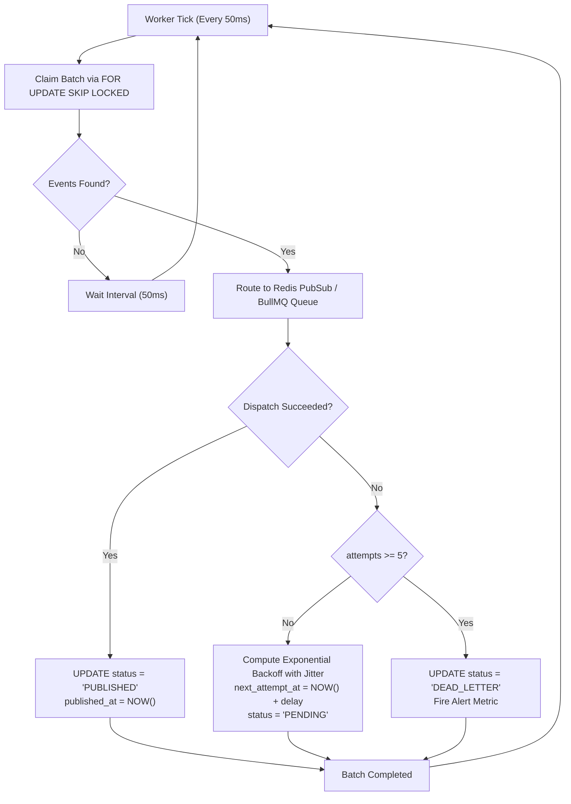

# CreatorConnect — Phase 5 Transactional Outbox Specification

## 1. The Dual-Write Problem & The Outbox Invariant

In distributed architectures, dual-write operations across disparate systems (e.g., PostgreSQL and Redis / BullMQ) suffer from unavoidable partial-failure modes:

```typescript
// ANTI-PATTERN: Prone to dual-write failure
await db.message.create({ ... }); // 1. DB write succeeds
await socket.emit('message:created', ...); // 2. If node crashes here, event is lost forever!
```

### The Transactional Outbox Invariant

$$\text{BusinessMutationCommitted} \implies \text{CorrespondingOutboxEventExists}$$

In CreatorConnect, **every** state mutation that must notify other services or clients writes an `OutboxEvent` within the exact same PostgreSQL ACID transaction as the business entity.

---

## 2. Outbox Table Specification

```sql
CREATE TABLE outbox_events (
    id UUID PRIMARY KEY,
    event_type VARCHAR(100) NOT NULL,
    aggregate_type VARCHAR(64) NOT NULL,
    aggregate_id UUID NOT NULL,
    payload JSONB NOT NULL,
    status VARCHAR(20) NOT NULL DEFAULT 'PENDING',
    attempts INT NOT NULL DEFAULT 0,
    next_attempt_at TIMESTAMPTZ NOT NULL DEFAULT NOW(),
    last_error TEXT,
    published_at TIMESTAMPTZ,
    created_at TIMESTAMPTZ NOT NULL DEFAULT NOW()
);

-- Partial index for high-performance worker polling
CREATE INDEX idx_outbox_unprocessed
ON outbox_events (status, next_attempt_at)
WHERE status IN ('PENDING', 'PROCESSING');
```

---

## 3. High-Concurrency Polling Engine (`SKIP LOCKED`)

To enable multiple worker replicas to poll the outbox concurrently without race conditions or table contention, workers employ PostgreSQL's row-level `SKIP LOCKED`:

```typescript
export async function claimOutboxBatch(batchSize = 100): Promise<OutboxEvent[]> {
  return prisma.$transaction(async (tx) => {
    // 1. Lock and claim available pending records without blocking other workers
    const events = await tx.$queryRaw<OutboxEvent[]>`
      SELECT * FROM outbox_events
      WHERE status = 'PENDING'
        AND next_attempt_at <= NOW()
      ORDER BY created_at ASC
      LIMIT ${batchSize}
      FOR UPDATE SKIP LOCKED
    `;

    if (events.length === 0) return [];

    const eventIds = events.map((e) => e.id);

    // 2. Transition claimed records to PROCESSING
    await tx.$executeRaw`
      UPDATE outbox_events
      SET status = 'PROCESSING',
          attempts = attempts + 1
      WHERE id = ANY(${eventIds}::uuid[])
    `;

    return events;
  });
}
```

---

## 4. Worker Dispatch Loop & Backoff Strategy



### Exponential Backoff with Jitter Formula

When event dispatch fails (e.g., Redis cluster is temporarily unreachable):
$$\text{delay}_n = \min\left(\text{maxDelay}, \text{baseDelay} \times 2^n\right) + \text{random}(0, \text{jitter})$$

- $\text{baseDelay} = 100\text{ms}$
- $\text{maxDelay} = 30\text{s}$
- $\text{jitter} = 50\text{ms}$

---

## 5. Consumer Idempotency Pattern (`processed_events`)

Because network partitions or crashes during worker dispatch can result in at-least-once delivery, every consumer must be strictly idempotent.

```sql
CREATE TABLE processed_events (
    event_id UUID NOT NULL,
    consumer_name VARCHAR(64) NOT NULL,
    processed_at TIMESTAMPTZ NOT NULL DEFAULT NOW(),
    PRIMARY KEY (event_id, consumer_name)
);
```

### Idempotent Consumer Algorithm

```typescript
export async function processEventIdempotently(
  eventId: string,
  consumerName: string,
  handler: () => Promise<void>,
): Promise<void> {
  await prisma.$transaction(async (tx) => {
    // 1. Attempt to insert into processed_events
    try {
      await tx.processedEvent.create({
        data: { eventId, consumerName },
      });
    } catch (err: any) {
      if (err.code === 'P2002') {
        // Unique constraint violation: Event already executed by this consumer
        return; // Early return, safe no-op
      }
      throw err;
    }

    // 2. Execute business mutation within the same transaction
    await handler();
  });
}
```

---

## 6. Poison Pill Handling & Dead-Letter Queue (DLQ)

If an outbox event encounters a fatal serialization bug or non-recoverable schema defect:

1. After 5 failed attempts, the status transitions to `DEAD_LETTER`.
2. The `outbox_dead_letter_total` Prometheus counter increments.
3. An alert fires to platform on-call via Sentry / PagerDuty.
4. An operator CLI allows inspecting and safely re-queuing corrected events:
   ```bash
   pnpm --filter @creatorconnect/worker outbox:retry --event-id=<UUID>
   ```
