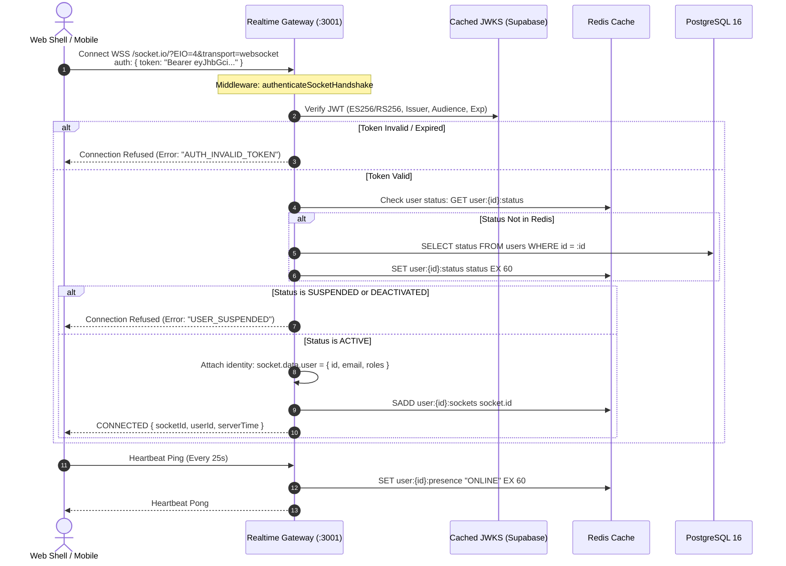
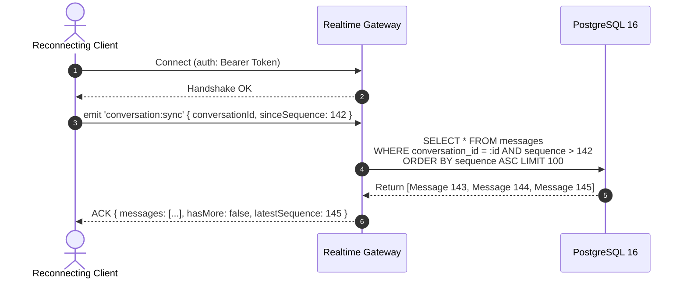

# CreatorConnect — Phase 5 Realtime Engine Specification

## 1. Realtime Infrastructure Overview

The CreatorConnect Realtime Engine (`apps/realtime`) is a horizontally scalable, distributed WebSocket cluster powered by **Socket.IO 4.7.5**, **Fastify 4**, and **`@socket.io/redis-adapter` 8.3.0**.

It delivers sub-50ms message delivery, room presence, typing indicators, and read receipts across multi-user web and mobile sessions.

---

## 2. Authentication & Connection Lifecycle



### 2.1 Token Expiry & Revocation Synchronization

1. **JWT Expiration Strategy**: Sockets maintain an internal timer set to `token.exp - Date.now()`. When the token is within 60 seconds of expiration:
   - Server emits `auth:token_expiring` to client.
   - Client fetches a refreshed token from Supabase Auth and sends `auth:refresh { token }`.
   - If unrefreshed when `exp` passes, server forces a graceful disconnect: `socket.disconnect(true)`.
2. **Instant Revocation via Redis Pub/Sub**: When an administrator suspends a user or changes credentials in `apps/api`:
   - API publishes to Redis channel `platform:user_revoked { userId }`.
   - All Realtime nodes listen on this channel and immediately execute:
     ```typescript
     const socketIds = await redis.smembers(`user:${userId}:sockets`);
     for (const sid of socketIds) {
       io.sockets.sockets.get(sid)?.disconnect(true);
     }
     ```

---

## 3. Room Authorization & Join Protocol

Clients cannot arbitrarily join socket rooms. Eavesdropping is architecturally blocked by server-side database checks.

```typescript
export async function handleJoinConversation(
  socket: AuthenticatedSocket,
  conversationId: string,
  callback: (res: JoinRoomResponse) => void,
) {
  const userId = socket.data.user.id;

  // 1. Verify membership in database (or cached Redis set)
  const isParticipant = await db.conversationParticipant.findFirst({
    where: {
      conversationId,
      userId,
      leftAt: null,
    },
    select: { id: true, lastReadSequence: true },
  });

  if (!isParticipant) {
    return callback({
      success: false,
      error: { code: 'FORBIDDEN', message: 'Not an active participant in this conversation' },
    });
  }

  // 2. Authorize and join room
  await socket.join(`conversation:${conversationId}`);

  callback({
    success: true,
    data: {
      conversationId,
      lastReadSequence: isParticipant.lastReadSequence.toString(),
    },
  });
}
```

---

## 4. Reconnect & Replay Protocol (Catch-Up Synchronization)

When mobile or web clients experience network partitions or switch Wi-Fi/cellular networks, they reconnect and sync state using the **Monotonic Sequence Protocol**:



This guarantees that clients never drop messages even during prolonged disconnections, while avoiding reliance on memory-bound socket buffers.

---

## 5. Ephemeral Presence & Typing Architecture

### 5.1 Presence Key Lifecycle

- Presence is tracked via ephemeral Redis keys:
  $$\text{Key: } \texttt{user:\{userId\}:presence} \quad \text{Value: } \texttt{"ONLINE"} \quad \text{TTL: } 60\text{ seconds}$$
- Sockets send a heartbeat ping every 25 seconds, which refreshes the TTL to 60 seconds.
- Upon clean disconnect, the socket checks if any remaining sockets exist in `user:{userId}:sockets`. If empty, the presence key is deleted and an `offline` event is emitted.
- If the node or client crashes abruptly, Redis automatically expires the key after 60 seconds.

### 5.2 Typing Indicators

- Typing indicators are ephemeral and purely broadcast via Redis pub/sub.
- **Rate Limit**: Maximum 1 typing event per 3 seconds per user per conversation.
- Server validates that the sender is in the room, then emits to `conversation:${conversationId}` excluding sender.
- Clients apply an automatic 4-second timeout to reset typing state if no subsequent `typing:stop` is received.

---

## 6. Realtime Event Contracts (Shared TypeScript Interfaces)

All realtime events are strongly typed and shared across backend and frontend through `@creatorconnect/contracts`:

```typescript
export interface ServerToClientEvents {
  'message:created': (payload: MessageCreatedPayload) => void;
  'message:updated': (payload: MessageUpdatedPayload) => void;
  'message:deleted': (payload: MessageDeletedPayload) => void;
  'message:read': (payload: MessageReadReceiptPayload) => void;
  'typing:start': (payload: TypingIndicatorPayload) => void;
  'typing:stop': (payload: TypingIndicatorPayload) => void;
  'presence:update': (payload: PresenceUpdatePayload) => void;
  'auth:token_expiring': () => void;
}

export interface ClientToServerEvents {
  'message:send': (
    payload: SendMessagePayload,
    ack: (res: ApiResponse<MessageAckData>) => void,
  ) => void;
  'conversation:join': (
    payload: { conversationId: string },
    ack: (res: ApiResponse<{ conversationId: string }>) => void,
  ) => void;
  'conversation:leave': (payload: { conversationId: string }) => void;
  'conversation:sync': (
    payload: { conversationId: string; sinceSequence: string },
    ack: (res: ApiResponse<MessageSyncData>) => void,
  ) => void;
  'message:read': (payload: { conversationId: string; sequence: string }) => void;
  'typing:start': (payload: { conversationId: string }) => void;
  'typing:stop': (payload: { conversationId: string }) => void;
  'auth:refresh': (
    payload: { token: string },
    ack: (res: ApiResponse<{ success: boolean }>) => void,
  ) => void;
}
```
