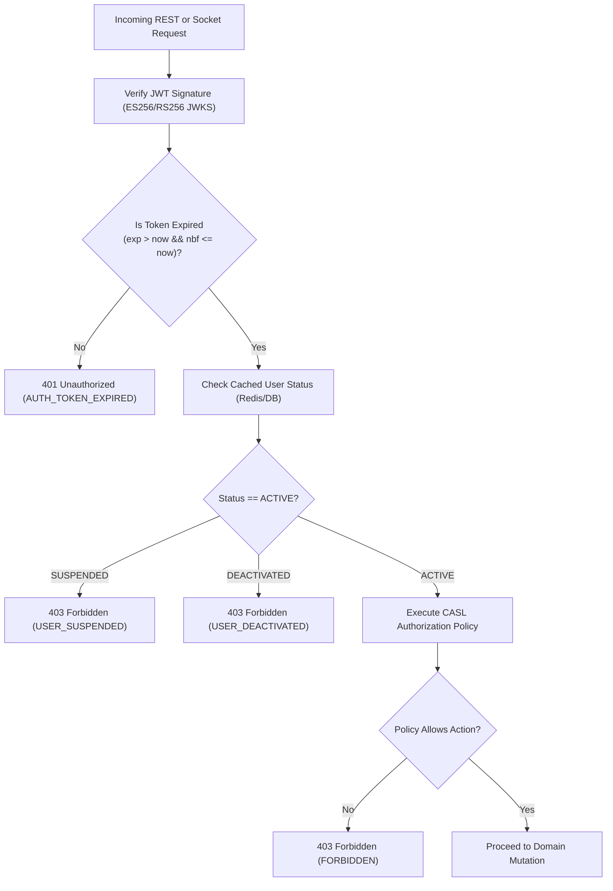

# CreatorConnect — Phase 5 Security Model & Boundary Policy

## 1. Security Philosophy & Principles

The CreatorConnect Phase 5 Security Model is engineered under the principle of **Defense in Depth** and **Zero Trust Architecture**.

Every network hop, API endpoint, and WebSocket event operates under the following mandatory constraints:

1. **Never Trust Client Claims**: Client-supplied `senderId`, `userId`, `role`, `tenantId`, `sequenceNumber`, or `attachmentOwnership` are discarded. All actor identities and permissions are derived strictly from cryptographically verified tokens and database authoritative state.
2. **Fail Closed**: If authorization, identity, account active status, or virus scan verdicts cannot be conclusively verified, the system defaults immediately to `DENY`.
3. **Least Privilege**: Sockets and HTTP requests are restricted to accessing the specific resources for which explicit active membership is proven.

---

## 2. Security Boundaries & Trust Zones

```mermaid
flowchart TD
    subgraph PublicZone["Zone 0: Public Internet (Untrusted)"]
        Browser["Web Browser (Next.js SPA)"]
        MobileApp["Mobile Client"]
        Attacker["Potential Adversary"]
    end

    subgraph EdgeZone["Zone 1: Perimeter / DMZ"]
        WAF["Cloudflare WAF / DDoS Mitigation"]
        TLS["TLS 1.3 Termination (ALB)"]
    end

    subgraph AppZone["Zone 2: Application Compute (Isolated VPC)"]
        APISvc["Core REST API (Fastify 4)"]
        RTSvc["Realtime Service (Socket.IO)"]
        WorkerSvc["Worker Service (BullMQ)"]
    end

    subgraph DataZone["Zone 3: Data Tier (Private Subnets)"]
        Postgres[("PostgreSQL 16 (Encrypted at Rest)")]
        RedisCluster[("Redis 7 (Auth Protected)")]
        R2Store[("Object Storage (Encrypted S3 API)")]
        ClamAVDaemon["ClamAV Daemon (:3310 Isolated)"]
    end

    PublicZone -->|HTTPS / WSS| EdgeZone
    EdgeZone -->|Forwarded Headers (RFC 1918)| AppZone
    AppZone -->|TLS Database Connections| DataZone
```

---

## 3. Server-Derived Identity Enforcement

Under no circumstances may an API route or Socket.IO event handler permit a client to declare their identity in the request body.

### Anti-Pattern vs Enforced Pattern

```typescript
// VULNERABLE TO IDENTITY SPOOFING (REJECTED)
app.post('/messages', async (req) => {
  const { senderId, content } = req.body; // CLIENT SPOOFABLE!
  return db.message.create({ data: { senderId, content } });
});

// ENFORCED SERVER-DERIVED IDENTITY (MANDATORY)
app.post('/messages', async (req) => {
  const actorId = req.user.id; // STRICTLY DERIVED FROM VALIDATED JWT
  const { content } = req.body;
  return messageService.sendMessage(actorId, content);
});
```

---

## 4. Token Expiry, Revocation & Account Status Gates



---

## 5. Message Content & Attachment Ingestion Limits

To prevent Denial of Service (DoS), buffer exhaustion, and storage abuse, the following hard limits are enforced at the server validation layer (`@sinclair/typebox`):

| Parameter                          | Enforced Limit           | Failure Behavior                              |
| :--------------------------------- | :----------------------- | :-------------------------------------------- |
| **Max Message Length**             | 4,000 characters (UTF-8) | 400 Bad Request (`MESSAGE_LENGTH_EXCEEDED`)   |
| **Max Attachments per Message**    | 5 files                  | 400 Bad Request (`ATTACHMENT_COUNT_EXCEEDED`) |
| **Max Individual Attachment Size** | 25 MB                    | 400 Bad Request (`ATTACHMENT_SIZE_EXCEEDED`)  |
| **Max Metadata JSON Size**         | 4 KB                     | 400 Bad Request (`METADATA_SIZE_EXCEEDED`)    |
| **Max Reactions per Message**      | 50 reactions total       | 400 Bad Request (`REACTION_LIMIT_EXCEEDED`)   |
| **Max Message Send Rate**          | 5 messages / second      | 429 Too Many Requests                         |
| **Max Typing Indicator Rate**      | 1 event / 3 seconds      | Dropped silently on socket server             |
| **Max Room Joins**                 | 10 joins / minute        | 429 Too Many Requests on socket               |

---

## 6. Private Media Authorization Boundary

Message attachments are confidential between conversation participants.

- Storage keys for message attachments follow the convention:
  $$\texttt{attachments/\{conversationId\}/\{assetId\}.\{ext\}}$$
- Cloudflare R2 bucket access is private with public list/get blocked.
- Direct object URLs are never served to the client.
- When an authorized participant fetches an attachment, `apps/api` dynamically verifies that `req.user.id` is an active participant in `conversationId`, then issues an AWS S3 presigned URL with an expiry time of **900 seconds (15 minutes)**.
