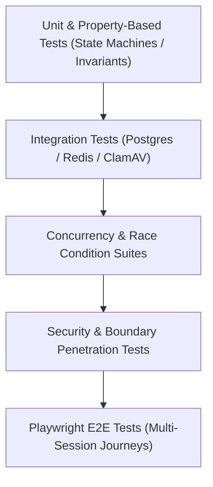

# CreatorConnect — Phase 5 Test Strategy & Quality Gates

## 1. The Quality Pyramid Architecture

Phase 5 enforces a multi-tier testing pyramid using **Vitest 2.1** for unit, integration, and concurrency suites, and **Playwright 1.46** for multi-session end-to-end browser workflows.



---

## 2. Testing Levels & Specifications

### 2.1 Unit & Invariant Tests

- **Message State Machine**: Asserts all legal transitions pass (`CLIENT_CREATED` $\to$ `ACCEPTED` $\to$ `PERSISTED` $\to$ `PUBLISHED` $\to$ `DELIVERED` $\to$ `READ`); asserts illegal jumps throw `InvalidStateTransitionError`.
- **CASL Abilities**: Verifies `defineAbilitiesFor(user)` strictly denies non-participants from reading or sending messages.
- **Jittered Exponential Backoff**: Mathematical unit tests proving delays fall strictly within $[0, \min(\text{maxDelay}, \text{baseDelay} \times 2^n)]$ and follow uniform distribution.
- **Cursor Keyset Encoding**: Tests opaque cursor base64 encoding/decoding and validates edge cases (null cursors, empty lists, reverse pagination).

### 2.2 Integration Tests

- **PostgreSQL Row-Locking**: Verifies `SELECT FOR UPDATE` serializes sequence assignment on the `conversations` table.
- **Outbox Polling (`SKIP LOCKED`)**: Spawns 3 concurrent worker loops querying a mocked or test database with 500 queued events; asserts every event is claimed exactly once with zero deadlocks.
- **ClamAV Antivirus TCP Ingestion**: Tests `ClamAvDaemonScanner` against a mock TCP server returning clean, infected (`stream: Eicar-Test-Signature FOUND`), and timeout responses.
- **Redis Pub/Sub Realtime Fanout**: Tests `@socket.io/redis-adapter` propagation across two isolated Socket.IO server instances.

### 2.3 Concurrency & Race Condition Suites

- **Simultaneous Send Race**: Launches 25 concurrent `Promise.all` message sends targeting the same conversation. Asserts sequence numbers are strictly consecutive ($1, 2, 3, \dots, 25$) with zero duplicates or gaps.
- **Duplicate Send Deduplication**: Issues 10 concurrent requests with identical `(actorId, conversationId, clientMessageId)`. Asserts exactly 1 database row is created and all 10 calls return the same message ID.
- **Concurrent Block and Send**: Fires a block request and message send simultaneously; asserts that if the block transaction commits first, the message send fails closed with 403 Forbidden.

### 2.4 Security & Penetration Suites

- **Room Eavesdropping Barrier**: Authenticates as User C; attempts to join `conversation:{id_of_A_and_B}`. Asserts server rejects join with 403 error ACK.
- **Server-Derived Identity Override**: Sends `{ senderId: "spoofed-user-id" }` in message payload; asserts server persists the message under `req.user.id` and ignores the spoofed field.
- **Private Attachment Isolation**: Queries signed download URL for an attachment belonging to another user's conversation; asserts 403 Forbidden.
- **Suspended User Realtime Eviction**: Connects socket as active user; simulates administrative suspension; asserts socket is terminated within 100ms via Redis revocation channel.

### 2.5 End-to-End (E2E) Multi-User Browser Tests (Playwright)

Playwright spins up two isolated browser contexts simulating User A (Brand) and User B (Creator):

1. User A logs in and navigates to Messages.
2. User A opens direct conversation with User B and sends: "Hello Creator!".
3. User B (in Context 2) receives the message over WebSocket without refreshing.
4. User B opens the conversation; read receipt is sent.
5. User A's browser displays the double-checkmark read indicator.
6. User B attaches a clean image; image uploads, passes scan, and renders in User A's feed.

---

## 3. Mandatory CI / CD Quality Gates

Before any Phase 5 pull request can merge to `dev` or promote to `main`, all automated gates must pass:

```bash
pnpm format:check                 # Zero Prettier formatting violations
pnpm lint                         # Zero ESLint warnings or errors
pnpm typecheck                    # Strict TypeScript compilation across all packages
pnpm test:unit                    # 100% unit and invariant tests pass
pnpm test:e2e                     # All multi-user Playwright E2E tests pass
pnpm audit --audit-level high     # Zero high/critical supply chain vulnerabilities
gitleaks git --log-opts="-n 20"   # Zero leaked secrets or credentials
```
