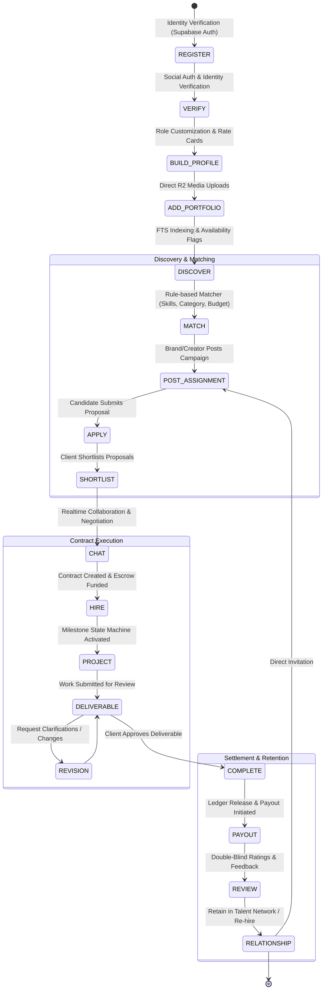

# CreatorConnect — Product Architecture Specification

## 1. Executive Summary & Vision

**CreatorConnect** is an enterprise-grade, multi-sided creator economy platform engineered to orchestrate collaborations, assignments, hiring, deliverables, and financial settlements among five core ecosystem participants:

1. **Creators / Influencers** (Content creators across YouTube, Instagram, TikTok, LinkedIn, podcasts, etc.)
2. **Production Professionals** (Videographers, video editors, sound designers, scriptwriters, thumbnail artists, creative directors)
3. **Brands / Companies** (Direct-to-consumer brands, B2B enterprises, agencies, marketing managers)
4. **Podcasters** (Show hosts, producers, podcast networks looking for guests, sponsors, and audio engineers)
5. **Platform Administrators** (Operations, trust & safety officers, financial auditors, dispute resolvers)

The platform eliminates high transaction friction, opaque pricing, unreliable delivery timelines, and payment vulnerability across the creator economy supply chain through a unified, contract-first, and escrow-backed marketplace.

---

## 2. Core Personas & Roles

```mermaid
graph TD
    subgraph Ecosystem Participants
        C[Creator / Influencer]
        P[Production Professional]
        B[Brand / Enterprise]
        POD[Podcaster]
    end

    subgraph Platform Governance
        A[Platform Administrator]
        MOD[Trust & Safety / Moderator]
        FIN[Financial Auditor]
    end

    C <-->|Hires for Post-Production| P
    B <-->|Sponsors / Campaigns| C
    B <-->|Hires Creative Talent| P
    POD <-->|Cross-Promotions / Guests| C
    POD <-->|Production & Editing| P
    B <-->|Show Sponsorships| POD

    A --- MOD
    A --- FIN
    MOD -.->|Monitors & Enforces| Ecosystem Participants
    FIN -.->|Audits & Reconciles| Ecosystem Participants
```

### 2.1 Persona Definitions & Capabilities

| Persona                     | Primary Needs & Motivations                                                                | Core Platform Capabilities                                                                                    | Key Metrics for Value                                                         |
| :-------------------------- | :----------------------------------------------------------------------------------------- | :------------------------------------------------------------------------------------------------------------ | :---------------------------------------------------------------------------- |
| **Creator / Influencer**    | Monetization, reliable production crew, authentic brand sponsorships, secure escrow.       | Profile showcases, verified metrics, rate cards, job applications, hiring crew, deliverable approval.         | Deals secured, earnings growth, turnaround time, crew satisfaction.           |
| **Production Professional** | Steady deal pipeline, transparent project scope, guaranteed payouts, reputation building.  | Rich portfolio (video/audio/design), custom quotes, milestone submissions, direct client messaging.           | Completed contracts, repeat hire rate, average contract value, client rating. |
| **Brand / Company**         | Verified creator ROI, compliance tracking, risk-free payments, unified campaign workflows. | Campaign posting, creator discovery & filtering, applicant shortlisting, contract escrow, deliverable review. | Campaign reach, milestone adherence, hiring velocity, dispute incidence.      |
| **Podcaster**               | Guest booking, sponsorship monetization, professional sound engineering, audience growth.  | Dual-sided profiles (show host & producer), guest sourcing, audio portfolio, sponsor pitches.                 | Sponsorship fill rate, production consistency, listener reach.                |
| **Platform Administrator**  | Platform integrity, regulatory compliance, dispute resolution, financial reconciliation.   | User verification approval, campaign/review moderation, dispute arbitration, ledger audit, fee management.    | Resolution turnaround, fraud prevention rate, platform liquidity.             |

---

## 3. End-to-End Core Marketplace Lifecycle

Every engagement traverses a deterministic, state-driven workflow designed to guarantee clarity and minimize disputes:



### Detailed Lifecycle Phases:

1. **REGISTER**: Email/OAuth onboarding via Supabase Auth. Issue of global identity UUIDv7.
2. **VERIFY**: Submission of official credentials, automated social media OAuth metrics check (YouTube API, Instagram Graph API) to prevent impersonation.
3. **BUILD PROFILE**: Deep personalization: creator genre, production specialty, equipment list, languages, hourly/package rate cards.
4. **ADD PORTFOLIO**: Multi-asset portfolio items (4K video reel, audio stems, graphic design) uploaded directly to Cloudflare R2 via presigned URLs with Sharp/FFmpeg background processing.
5. **DISCOVER**: High-performance querying via PostgreSQL Full Text Search (`tsvector`) and trigram similarity (`pg_trgm`).
6. **MATCH**: Deterministic recommendation engine ranking profiles against campaign requirements (skills, budget, verified metrics, location, availability).
7. **POST ASSIGNMENT / CAMPAIGN**: Structured briefs with deliverable specs, timeline, milestone breakdown, and escrow budget.
8. **APPLY**: Tailored proposals, custom rates, dynamic questionnaires, and portfolio item attachments.
9. **SHORTLIST**: Client filtering, interview queue management, and candidate status tracking.
10. **CHAT**: Realtime WebSocket (Socket.IO) communications with file attachments, typing indicators, and system state notifications.
11. **HIRE**: Contract locking, binding milestone agreements, and payment capture into platform escrow via Razorpay.
12. **PROJECT**: Active workspace holding deliverables, message logs, change requests, and timeline timers.
13. **DELIVERABLE**: Secure upload of work previews (watermarked if needed) and final assets.
14. **COMPLETE**: Formal acceptance triggering the double-entry accounting ledger release.
15. **REVIEW**: Double-blind feedback mechanism (neither party sees the other's review until both submit or 14 days lapse) to prevent retaliatory ratings.
16. **LONG-TERM RELATIONSHIP**: Contact archiving, favorite talent pools, and instant 1-click repeat re-hire workflows.

---

## 4. Multi-Platform Architectural Requirements

The platform capabilities are consumed across four primary client tiers:

- **Web App**: Responsive, rich microfrontend experience (Next.js, Radix UI, TanStack Query).
- **Mobile Apps (iOS & Android)**: React Native / Native client consumers consuming the exact same OpenAPI 3.1 REST contracts and WebSocket endpoints.
- **Web Admin Portal**: Dedicated operational dashboard with elevated RBAC, audit trails, and financial reconciliation tooling.

To ensure consistency, **no business logic or state machines reside in client code**. The backend acts as the sole orchestrator of validation, transitions, and business policies.
