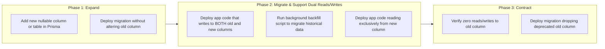
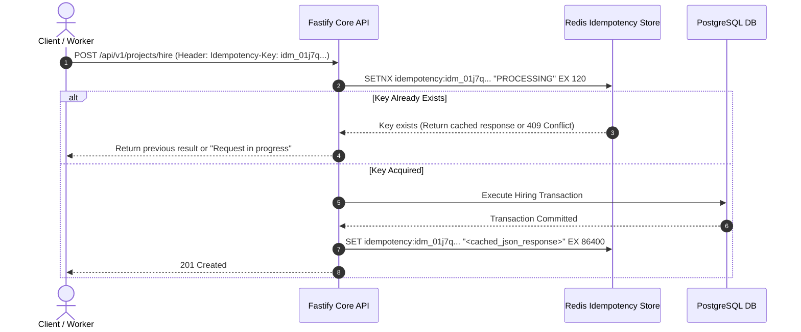
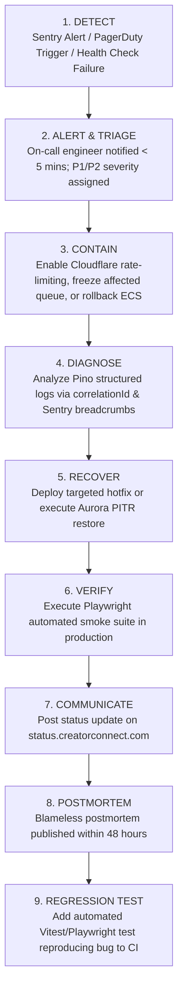

# CreatorConnect — Reliability Engineering & Fail-Safe Architecture

> **NON-NEGOTIABLE ARCHITECTURAL MANDATE**:  
> System failures, network drops, and concurrent operations must never leave inconsistent states, double-charge users, corrupt data, or crash core services.  
> The system operates under the principles of:  
> **Fail-Safe Design + Idempotent Processing + Expand-Migrate-Contract Evolution + Graceful Degradation**.

---

## 1. The "Code Should Not Break" Philosophy

CreatorConnect enforces strict change-impact discipline. Prior to modifying any existing production component, developers must execute an impact analysis across 8 dimensions:

1. **Existing Behavior**: What exact invariants does the current code guarantee?
2. **Dependent Services**: Does this change impact the Realtime Gateway or Background Workers?
3. **API Contracts**: Does this modify or omit any existing response fields?
4. **Client Compatibility**: Will older versions of Android or iOS apps crash or fail?
5. **Database Tables**: Does this migration alter column types or add non-nullable fields?
6. **Domain Events**: Does this change alter the JSON payload of Outbox events?
7. **Test Suites**: Are existing unit, integration, and Playwright suites maintained?
8. **Rollback Feasibility**: Can this change be reverted within 60 seconds without data loss?

---

## 2. Safe Database Migrations (Expand — Migrate — Contract)

Breaking database migrations (e.g. renaming columns, dropping columns, or changing types) cause instant downtime in rolling deployments. CreatorConnect strictly mandates the **Expand — Migrate — Contract** pattern:

- **Zero Immediate Drops**: No column or table may be dropped in the same release that introduces its replacement.
- **Backward Migration Rehearsal**: Every migration is tested for backward compatibility in staging using Testcontainers before production approval.

---

## 3. Concurrency Control & Race-Condition Defense

High-concurrency race conditions can corrupt escrow states, produce duplicate applications, or over-allocate campaign budgets. The system mitigates these at the database level:

| Operation Surface          | Potential Race Condition                                        | Architectural Defense & Concurrency Control                                                                                       |
| :------------------------- | :-------------------------------------------------------------- | :-------------------------------------------------------------------------------------------------------------------------------- |
| **Escrow Funding**         | Concurrent payment webhook deliveries attempt double crediting. | Unique constraint on `payment_events(event_id)` + atomic database transaction + double-entry ledger check.                        |
| **Candidate Shortlisting** | Two brand managers shortlist the same applicant simultaneously. | Optimistic concurrency locking via an integer `version` field incremented on update (`WHERE id = ? AND version = ?`).             |
| **Milestone Approvals**    | Client clicks approve repeatedly while network lags.            | Database transaction asserting `milestone.status === 'SUBMITTED'` before transition; subsequent calls rejected as `409 Conflict`. |
| **Proposal Submissions**   | User double-clicks submit proposal button.                      | Unique composite constraint on `applications(campaign_id, user_id)` rejecting duplicates at the SQL level.                        |
| **Campaign Budget Limits** | Multiple hires exceed `budget_max`.                             | Atomic `SELECT FOR UPDATE` on campaign row during hiring transaction before inserting project record.                             |

---

## 4. Failure Must Be Safe (Atomic Transactions & Outbox Pattern)

When unexpected failures occur, the system **NEVER** leaves partial state:

1. **ACID Transaction Boundaries**: Multi-table state mutations (e.g., approving a milestone, creating a ledger entry, and updating escrow status) execute inside a single `prisma.$transaction()` block. If any step fails, all mutations roll back completely.
2. **Guaranteed Event Delivery (Transactional Outbox)**: Domain events are written to `outbox_events` in the **exact same database transaction** as the business data change. Dual-write inconsistencies (updating DB but failing to publish to Redis) are mathematically impossible.
3. **Dead-Letter Queues (DLQ)**: BullMQ worker jobs that fail 5 retry attempts are routed to a persistent DLQ with automated PagerDuty notifications for developer intervention.

---

## 5. Network Failure & Dependency Resilience

External networks are inherently unreliable. CreatorConnect implements defensive resilience:

| External Dependency    | Potential Failure Mode                    | Defense & Fallback Behavior                                                                                                  |
| :--------------------- | :---------------------------------------- | :--------------------------------------------------------------------------------------------------------------------------- |
| **Supabase Auth**      | JWKS endpoint unreachable or token issue. | Gateway caches public keys locally for 24h; active sessions continue validating with zero outbound network calls.            |
| **Razorpay API**       | Order creation timeouts or 5xx errors.    | Return clean RFC 7807 `PAYMENT_GATEWAY_UNAVAILABLE` error; client prompts retry without creating orphan orders.              |
| **Firebase FCM**       | Push notification delivery timeouts.      | Worker retries with exponential backoff and jitter; failing push alerts do not block milestone or project workflows.         |
| **Cloudflare R2**      | Temporary upload failure.                 | Client directly retries upload using resumable multi-part upload or presigned URL retry.                                     |
| **Redis Cache Outage** | Cache node crash or failover.             | Realtime Gateway buffers messages in memory; BullMQ re-establishes connection; API queries fall back directly to PostgreSQL. |

---

## 6. Retry Safety & Idempotency Architecture

All retried operations must be completely safe from duplicate side effects:

- **HTTP Idempotency Keys**: Supported on all state-altering endpoints via `Idempotency-Key: <uuidv7>` header.
- **Worker Job Idempotency**: Every BullMQ task enforces a deterministic job ID (`jobId: {aggregate_id}:{version}`), preventing duplicate queue execution.

---

## 7. Production Data Isolation & Synthetic Testing

> **STRICT COMPLIANCE MANDATE**:  
> Non-production environments (Local, Dev, Staging) are **STRICTLY PROHIBITED** from using production databases, real user credentials, or live payment credentials.

- **Synthetic Data Factories**: All integration and E2E tests generate deterministic, realistic mock data via `@creatorconnect/testing` factories (`UserFactory.create()`, `CampaignFactory.create()`).
- **Anonymized Staging Datasets**: If staging requires production-scale volume for load testing, data is processed through an automated anonymization pipeline that scrubs names, emails, phone numbers, tax IDs, and message bodies.

---

## 8. Incident Response Protocol

---

## 9. Reliability Definition of Done (DoD)

A feature is **REJECTED** and cannot merge if it fails any of the following reliability criteria:

- [ ] Database mutations span multiple tables without an atomic `prisma.$transaction()` block.
- [ ] State mutations lack idempotency key handling or duplicate submission safeguards.
- [ ] Database schema changes drop or rename columns without adhering to the Expand-Migrate-Contract pattern.
- [ ] Background worker jobs lack exponential backoff retry configurations or dead-letter queue routing.
- [ ] Critical external network calls (payment, email, push) are executed synchronously inside HTTP request handlers.
- [ ] A bug fix is submitted without an accompanying automated regression test in CI.
- [ ] Rollback strategy for the feature is undefined or untested.
