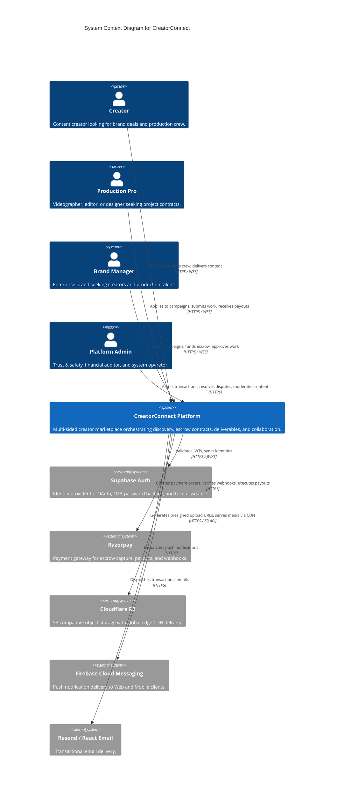
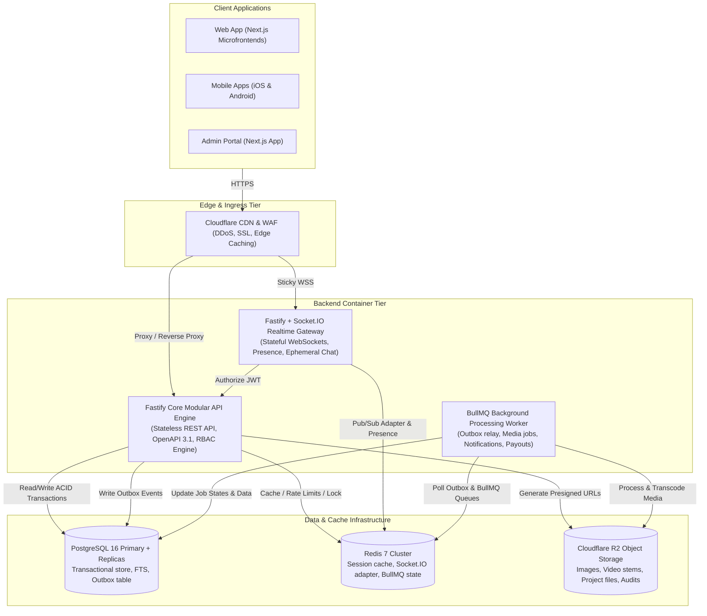
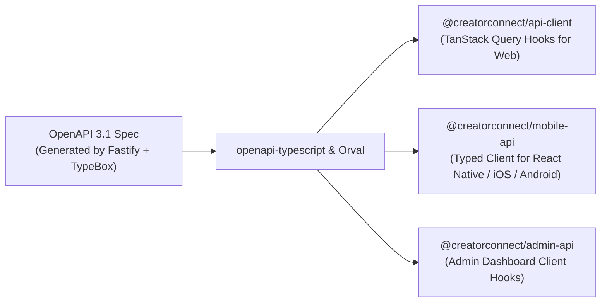

# CreatorConnect — System Architecture Specification

## 1. Architectural Philosophy: Pragmatic Enterprise Architecture

CreatorConnect adheres to the principle of:
> **"Enterprise architecture without unnecessary enterprise overengineering."**

Rather than introducing 20+ physically separated container services communicating across complex network meshes on Day 1, CreatorConnect organizes capabilities into **strict logical domains** hosted within a **Modular Monolithic API Engine** alongside physically isolated specialist runtimes where independent scaling or runtime persistence is non-negotiable (Realtime WebSocket Server, Background Workers).

---

## 2. C4 Model — System Architecture

### 2.1 C4 Level 1: System Context

---

### 2.2 C4 Level 2: Container Architecture

---

## 3. Communication Patterns & Service Protocols

The architecture strictly delineates between synchronous and asynchronous operations to preserve platform responsiveness:

| Communication Flow | Protocol | Mechanism | Failure Handling & Semantics |
| :--- | :--- | :--- | :--- |
| **Client to API Gateway** | HTTP/2 & HTTPS | REST with OpenAPI 3.1 contract validation | Fast failure (RFC 7807), client retries with exponential backoff on 5xx. |
| **Client to Realtime Gateway** | WSS (WebSocket) | Socket.IO binary & JSON events | Auto-reconnect, state sync on reconnection, persistent backplane via Redis. |
| **Core API to Database** | TCP / SSL | Prisma ORM with connection pooling | Optimistic locking, 5-second query timeouts, read replica offloading. |
| **API to Outbox (Event Generation)** | Internal SQL | Same ACID database transaction as domain entity | Guaranteed persistence; 0% chance of event loss or dual-write failure. |
| **Outbox Relay to BullMQ** | TCP / Redis | Polling / notify daemon publishing to BullMQ | At-least-once delivery; consumer idempotency keys enforced. |
| **Worker to External Providers** | HTTPS | Provider SDK with timeout (Razorpay, FCM, Resend) | Exponential backoff retries, dead-letter queue (DLQ) after 5 attempts. |

---

## 4. Cross-Platform Unified API Consumer Pattern

The same backend API serves all client platforms without custom forks:

1. **Deterministic Single Source of Truth**: The Fastify schema definitions (`TypeBox` / `Zod`) automatically emit an unambiguous OpenAPI 3.1 specification at build time.
2. **Zero Hand-Written DTOs**: Frontend and mobile engineers consume automatically generated TypeScript client packages containing full endpoint typings, payload validation, and TanStack Query hooks.
3. **No Drift**: Changes to backend contracts break client builds immediately during CI, preventing runtime regression.
