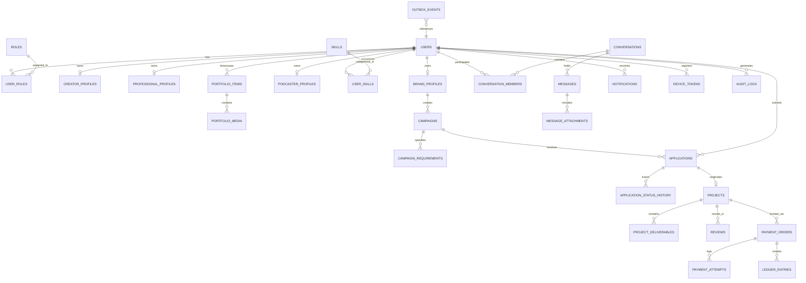

# CreatorConnect — Database Architecture Specification

## 1. Core Database Design Principles

The database architecture for CreatorConnect is built on PostgreSQL 16 using Prisma ORM, engineered for strict data integrity, zero loss in financial operations, high-performance search, and backward-compatible evolution.

### Core Non-Negotiables:

1. **Primary Keys**: Use **UUIDv7** (time-ordered UUIDs) across all entities to ensure chronological indexing, eliminate B-tree index fragmentation, and allow safe client-side ID generation.
2. **Timestamps**: All timestamps stored strictly in **UTC (`timestamptz`)**.
3. **Monetary Values**: All currency stored as **integers in the lowest currency denomination** (e.g., cents or paise) paired with an ISO 4217 currency code (e.g., `amount: 150000`, `currency: 'INR'`). Floating-point money fields are strictly prohibited.
4. **Financial Immutability**: `payments`, `payment_events`, `refunds`, `payouts`, and `ledger_entries` are strictly **append-only**. Updates and deletes are disallowed at the database level. Corrections require balancing credit/debit entries.
5. **Soft Deletion Policy**: Applied **only** to user-facing content entities (`campaigns`, `portfolio_items`, `community_posts`). Hard deletions are reserved for regulatory compliance (GDPR/Right-to-be-forgotten) via explicit administrative workflows. Financial, audit, and contract state rows are **never soft deleted**.
6. **Optimistic Concurrency**: Financial and contract entities implement an integer `version` field incremented on each mutation to detect and reject concurrent conflicting updates.
7. **Foreign Key Integrity**: All inter-entity relationships enforce relational integrity (`ON DELETE RESTRICT` for transactional records; `ON DELETE CASCADE` only for child owned records like `portfolio_media` or `campaign_requirements`).

---

## 2. Conceptual Entity Relationship Model

---

## 3. Comprehensive Entity Taxonomy (42 Canonical Entities)

### 3.1 Identity & User Profiles Domain

- **`users`**: Root platform account. (`id: uuidv7`, `supabase_auth_id`, `email`, `phone`, `status: active|suspended|banned`, `created_at`, `updated_at`, `version`)
- **`roles`**: System roles (`CREATOR`, `PROFESSIONAL`, `BRAND`, `PODCASTER`, `ADMIN`, `MODERATOR`, `AUDITOR`).
- **`user_roles`**: Many-to-many role binding with activation state.
- **`creator_profiles`**: Bio, main platform handles, primary categories, audience demographics, rate cards, verification tier.
- **`professional_profiles`**: Title, technical specialties, years experience, equipment inventory, day rates, availability status.
- **`brand_profiles`**: Legal entity name, tax ID (GST/VAT), company website, industry, annual creator budget range.
- **`podcaster_profiles`**: Podcast name, RSS feed URL, host bio, listener numbers, guest prerequisites, sponsorship packages.
- **`skills`**: Standardized skill catalog (e.g., "Color Grading", "DaVinci Resolve", "Viral Scriptwriting").
- **`categories`**: Top-level verticals (e.g., "Tech", "Beauty & Lifestyle", "Finance & Crypto").
- **`user_skills`**: Composite link mapping users to skills with self-assessed proficiency.
- **`social_accounts`**: Connected OAuth channels (YouTube, Instagram, TikTok, Twitch).
- **`social_verifications`**: Snapshot of verified subscriber counts, view counts, and engagement rates verified via official APIs.

### 3.2 Portfolio & Showcase Domain

- **`portfolio_items`**: Case studies and projects (`id`, `user_id`, `title`, `description`, `external_link`, `created_at`).
- **`portfolio_media`**: Media assets hosted on Cloudflare R2 (`id`, `portfolio_item_id`, `storage_key`, `mime_type`, `width`, `height`, `duration_seconds`, `thumbnail_key`).

### 3.3 Campaigns & Applications Domain

- **`campaigns`**: Brand briefs or job assignments (`id`, `brand_profile_id`, `title`, `description`, `budget_min`, `budget_max`, `currency`, `escrow_type`, `status: draft|open|in_progress|completed|cancelled`).
- **`campaign_requirements`**: Structured rules (e.g., minimum follower count, geographic location, deliverable formats).
- **`campaign_attachments`**: Reference briefs, brand guidelines, and mood boards stored in R2.
- **`applications`**: Freelancer/creator proposals (`id`, `campaign_id`, `user_id`, `cover_letter`, `proposed_rate`, `status: pending|shortlisted|rejected|hired`).
- **`application_status_history`**: Audit trail of every application status change with timestamp and actor ID.

### 3.4 Projects & Deliverables Domain

- **`projects`**: Active legal & escrow agreement between client and hired talent (`id`, `campaign_id`, `application_id`, `client_user_id`, `talent_user_id`, `total_amount`, `currency`, `status: funded|in_progress|submitted|revision_requested|approved|disputed|closed`).
- **`project_deliverables`**: Milestones and assets submitted for review (`id`, `project_id`, `title`, `due_date`, `storage_key`, `version_number`, `status: pending|approved|rejected`, `feedback`).

### 3.5 Realtime Collaboration & Messaging Domain

- **`conversations`**: Chat thread container (`id`, `project_id_nullable`, `type: direct|project|support`, `created_at`).
- **`conversation_members`**: Membership link (`conversation_id`, `user_id`, `last_read_message_id`, `joined_at`).
- **`messages`**: Individual messages (`id`, `conversation_id`, `sender_user_id`, `content`, `message_type: text|attachment|system`, `created_at`).
- **`message_attachments`**: Secure file attachments sent inside conversations (`id`, `message_id`, `storage_key`, `mime_type`, `file_size`).

### 3.6 Communities & Social Engagement Domain

- **`communities`**: Creator forums and topic circles.
- **`community_posts`**: Discussion posts, questions, and showcases.
- **`comments`**: Threaded replies to community posts.

### 3.7 Reviews & Reputation Domain

- **`reviews`**: Double-blind feedback submissions (`id`, `project_id`, `reviewer_id`, `reviewee_id`, `rating: 1-5`, `feedback_text`, `is_revealed: boolean`, `created_at`).

### 3.8 Financial Ledger & Escrow Domain (Strictly Append-Only)

- **`subscriptions`**: Active user SaaS subscription tier.
- **`subscription_plans`**: Pricing tiers and platform feature limits.
- **`payments`**: High-level payment records.
- **`payment_orders`**: Razorpay gateway orders created before checkout (`id`, `project_id`, `razorpay_order_id`, `amount`, `currency`, `status`).
- **`payment_attempts`**: Individual checkout attempts, signatures, and card/UPI gateways.
- **`payment_events`**: Immutable webhook payloads received from Razorpay for auditing and replay protection.
- **`refunds`**: Documented refunds processed back to client source payment.
- **`payouts`**: Bank transfer disbursements made to creators/freelancers.
- **`ledger_entries`**: Double-entry ledger (`id`, `transaction_ref`, `account_type: escrow|platform_fee|talent_payable`, `entry_type: debit|credit`, `amount`, `currency`, `created_at`).

### 3.9 Notifications & Device Domain

- **`notifications`**: User notification inbox items.
- **`notification_preferences`**: User opt-in/opt-out toggles per channel (Push, Email, SMS).
- **`device_tokens`**: FCM registration tokens for mobile and web push with invalidation tracking.
- **`notification_deliveries`**: Log of external delivery status from FCM/Resend.

### 3.10 Referrals & Growth Domain

- **`referrals`**: Attribution mapping of who invited whom (`referrer_id`, `referee_id`, `code`, `status`).
- **`referral_rewards`**: Credits and discount vouchers awarded upon qualifying milestone.

### 3.11 Trust, Safety & Governance Domain

- **`reports`**: User-submitted flags on spam, harassment, or contract fraud.
- **`disputes`**: Formal arbitration cases opened on escrowed projects.
- **`audit_logs`**: Tamper-proof append-only ledger of sensitive user actions and authentication events.
- **`admin_actions`**: Administrative overrides (e.g., account bans, manual escrow unlocks, dispute resolutions) with required justification notes.

### 3.12 Asynchronous Event Relay Domain

- **`outbox_events`**: Transactional outbox table (`id: uuidv7`, `aggregate_type`, `aggregate_id`, `event_type`, `payload: jsonb`, `status: pending|processing|published|failed`, `retry_count`, `created_at`, `published_at`).

---

## 4. Indexing & Query Optimization Strategy

1. **Full-Text Search (FTS)**:
   - `creator_profiles` and `professional_profiles` maintain generated `tsvector` columns indexing `(bio || ' ' || headline || ' ' || equipment)`.
   - **GIN Index**: `CREATE INDEX idx_creator_search ON creator_profiles USING GIN (search_vector);`
2. **Fuzzy Name & Skill Search**:
   - Trigram indexing via PostgreSQL extension `pg_trgm`.
   - `CREATE INDEX idx_skills_name_trgm ON skills USING GIN (name gin_trgm_ops);`
3. **High-Frequency Lookups**:
   - `users(supabase_auth_id)`: Unique B-tree index.
   - `applications(campaign_id, status)`: Composite index for brand applicant review dashboards.
   - `messages(conversation_id, created_at DESC)`: Composite index for paginated chat history loading.
   - `outbox_events(status, created_at)`: Partial index `WHERE status = 'pending'` for lightning-fast outbox worker polling.
