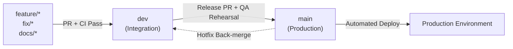

# CreatorConnect — CI/CD Pipeline & Deployment Strategy

## 1. Pipeline Architecture Overview

CreatorConnect enforces a zero-tolerance continuous delivery pipeline across three environments: **Pull Request Preview**, **Staging**, and **Production**.

```mermaid
flowchart TD
    subgraph PR_Pipeline ["Pull Request Validation Pipeline (Automated on PR)"]
        direction TB
        PR1[Checkout & Cache Restore]
        PR2[Typecheck - tsc --noEmit]
        PR3[Lint & Format - ESLint / Prettier]
        PR4[Unit Tests - Vitest]
        PR5[Integration Tests - Testcontainers Postgres/Redis]
        PR6[OpenAPI Contract Validation - Fastify Swagger Diff]
        PR7[Security Scanners - Gitleaks, Semgrep, CodeQL]
        PR8[Docker Multi-Stage Build & Trivy Vulnerability Scan]
        PR1 --> PR2 --> PR3 --> PR4 --> PR5 --> PR6 --> PR7 --> PR8
    end

    subgraph Staging_Pipeline ["Staging Pipeline (Automated on Merge to main)"]
        direction TB
        ST1[Database Migration Rehearsal & Validation]
        ST2[Deploy to Staging ECS / Fargate Cluster]
        ST3[Run Full Playwright E2E Suite (21 Journeys)]
        ST4[Run k6 Load Test Baseline]
        ST5[Run OWASP ZAP DAST Security Scan]
        ST1 --> ST2 --> ST3 --> ST4 --> ST5
    end

    subgraph Production_Pipeline ["Production Pipeline (Gated by Approval)"]
        direction TB
        PD1[Manual Human Approval Gate - Tech Lead / Release Mgr]
        PD2[Zero-Downtime Blue/Green Deploy & Backward Migration]
        PD3[Automated Smoke Tests & Health Check Polling]
        PD4{Health Check Passed?}
        PD5[Promote Traffic 100% to Green]
        PD6[AUTOMATIC ROLLBACK to Blue & Alert PagerDuty]
        PD1 --> PD2 --> PD3 --> PD4
        PD4 -- Yes --> PD5
        PD4 -- No --> PD6
    end

    PR8 -->|Merge PR to main| Staging_Pipeline
    ST5 -->|Staging Tests Green| Production_Pipeline
```

---

## 2. Pipeline Stage Specifications

### 2.1 Pull Request Pipeline (Fast Feedback < 8 mins)

- **Concurrency Control**: Cancel in-progress runs on new commits to the same branch.
- **Security Scanners**:
  - **Gitleaks**: Blocks any commit containing API keys, private keys, or passwords.
  - **Semgrep & CodeQL**: Analyzes code for SQL injection, prototype pollution, and IDOR vulnerabilities.
  - **Trivy**: Scans generated Docker base images for CVEs; fails build on any `HIGH` or `CRITICAL` vulnerability without a documented exception.
- **Contract Integrity**: Compares PR OpenAPI output with `@creatorconnect/contracts`. Breaking changes require explicit major version bumping.

### 2.2 Staging Pipeline (Automated Continuous Delivery)

- **Migration Rehearsal**: Applies Prisma migrations against a sanitized copy of staging DB. Validates that no tables are locked for > 2 seconds.
- **Playwright Full Pass**: Executes the 21 critical customer journeys against the running staging web applications and backend API.
- **k6 Performance Gate**: Tests search and booking endpoints to ensure p95 latency remains under 200ms.

### 2.3 Production Pipeline (Zero-Downtime Blue/Green)

- **Approval Gate**: Requires sign-off from designated Tech Lead / DevOps Architect in GitHub Environments.
- **Blue/Green Switch**: Deploys new containers alongside existing instances; routes 5% canary traffic for 2 minutes; monitors Sentry 5xx error rates and HTTP response latency.
- **Automatic Rollback**: If error rate exceeds 0.5% or health checks fail, the load balancer automatically reverts 100% traffic to the Blue cluster and alerts on-call engineers.

---

## 3. Branch Protection & Repository Governance

### 3.1 Branching Strategy & Lifecycle Flow



| Branch          | Classification            | Access & Policy                                                                                                      | Promotion Path                                              |
| :-------------- | :------------------------ | :------------------------------------------------------------------------------------------------------------------- | :---------------------------------------------------------- |
| **`main`**      | Production / Release      | **Strictly Protected**: No direct pushes, PR required, CI pass required, min 1 review, no force pushes, no deletion. | Deploys directly to Staging rehearsal and gated Production. |
| **`dev`**       | Integration / Development | **Protected Integration**: Active development hub. All feature/fix branches branch off and merge into `dev`.         | Promoted to `main` via formal Release PR.                   |
| **`feature/*`** | Feature Workspaces        | Short-lived branch per bounded task. Branch off `dev`.                                                               | Merges to `dev` via Pull Request.                           |
| **`fix/*`**     | Defect Remediation        | Short-lived bugfix branch. Branch off `dev`.                                                                         | Merges to `dev` via Pull Request.                           |
| **`hotfix/*`**  | Critical Production Fix   | Urgent fix for live defects. Branch off `main`.                                                                      | Merges to `main` (with review) and back-merges to `dev`.    |
| **`docs/*`**    | Documentation             | Architectural ADRs and docs updates.                                                                                 | Merges to `dev` via Pull Request.                           |

### 3.2 Non-Negotiable Branch Rules

1. **Never Force Push**: `--force` and `--force-with-lease` are disabled on both `main` and `dev`.
2. **Never Commit Secrets**: Centralized environment variable management; Gitleaks automated scanning blocks PRs with detected credentials.
3. **Conventional Commits Enforced**: All commits must follow `feat(domain):`, `fix(domain):`, `docs(domain):`, `test(domain):`, `chore(tool):`.
4. **Linear History & PR Quality Gates**: PRs into `main` require linear history (Squash and Merge or Rebase), green CI checks, and peer approval.

### 3.3 Automated Dependency Updates

- **Renovate / Dependabot**: Weekly dependency vulnerability scans with automated PR creation.
- Minor/patch dependency updates automatically tested in CI; major versions require explicit architectural review.
