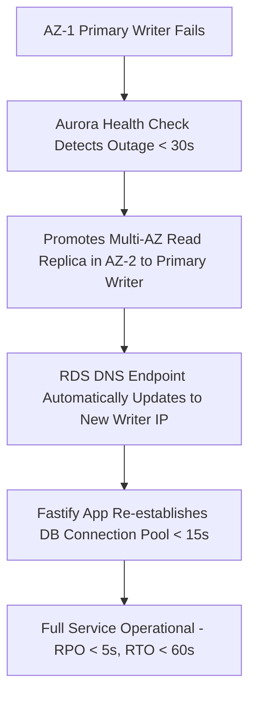

# CreatorConnect — Disaster Recovery & Business Continuity Specification

## 1. Executive Summary & Recovery Objectives

CreatorConnect is an enterprise-grade marketplace holding escrow funds, intellectual property assets, and creator livelihood data. Because budget is not a limiting constraint, the infrastructure is architected for **high availability, multi-AZ resilience, and zero data loss in financial ledgers**.

### Core Recovery Metrics:
- **Recovery Point Objective (RPO)**: The maximum acceptable age of data that can be lost in a disaster.
- **Recovery Time Objective (RTO)**: The maximum acceptable duration of system downtime before service is restored.

| System Tier | Proposed RPO | Proposed RTO | High-Availability Strategy | Backup & Redundancy Mechanism |
| :--- | :--- | :--- | :--- | :--- |
| **PostgreSQL 16 Database** | **< 5 seconds** (Near Zero) | **< 15 minutes** | AWS Aurora Multi-AZ with automated failover across 3 Availability Zones. | Continuous WAL archiving + automated daily snapshot with 35-day retention + Point-In-Time Recovery (PITR) to any second. |
| **Financial Ledger Table** | **0 seconds (Zero Loss)** | **< 15 minutes** | Append-only double-entry ledger enforced at DB level. | Synchronously replicated to Aurora Multi-AZ read replicas. |
| **Redis 7 Cluster** | **< 1 minute** | **< 5 minutes** | AWS ElastiCache Multi-AZ with Auto-Failover. | Append-Only File (AOF) persistence enabled; daily automated RDB snapshots. |
| **Cloudflare R2 Storage** | **0 seconds** | **< 1 minute** | Distributed edge storage across Cloudflare global network. | Cross-region automatic bucket replication enabled; object versioning enabled with 90-day delete protection. |
| **Application Containers** | **N/A (Stateless)** | **< 3 minutes** | ECS Fargate Multi-AZ service auto-scaling across 2+ Availability Zones. | Docker container images stored in Amazon ECR with immutable image tags; Git-driven redeployment. |
| **Background Job Queues** | **< 30 seconds** | **< 10 minutes** | BullMQ queue state stored in Redis AOF persistence. | Worker tasks are idempotent; unacknowledged tasks re-enqueued automatically upon worker restart. |
| **Secrets & Credentials** | **0 seconds** | **< 5 minutes** | AWS Secrets Manager / KMS Multi-Region replication. | Version-controlled secret history with automated rollback capability. |

---

## 2. Component Disaster Recovery Procedures

### 2.1 Database Failure & Aurora Failover


### 2.2 Catastrophic Data Corruption / Accidental Purge Procedure
In the event of malicious or accidental data alteration:
1. **Freeze Traffic**: Enable Cloudflare Edge maintenance mode to halt incoming writes.
2. **Point-In-Time Restore (PITR)**: Launch Aurora restore wizard targeting the exact timestamp (e.g. `2026-09-13T21:40:00.000Z`) immediately preceding the corruption event.
3. **Verify Ledger Invariants**: Execute automated ledger integrity check:
   ```sql
   SELECT SUM(amount) FROM ledger_entries WHERE entry_type = 'DEBIT' 
   UNION ALL 
   SELECT SUM(amount) FROM ledger_entries WHERE entry_type = 'CREDIT';
   -- Must mathematically balance to zero
   ```
4. **Repoint Application**: Update ECS `DATABASE_URL` to restored cluster endpoint and resume traffic.

---

## 3. Mandatory Restore Drill Procedures

> **NON-NEGOTIABLE POLICY**:  
> **"A backup is not considered valid until restoration has been empirically tested."**

1. **Quarterly Restoration Drills**: Every 90 days, DevOps executes a scheduled restore rehearsal in the isolated Staging environment:
   - Aurora PostgreSQL snapshot restored to an ephemeral test database.
   - Cloudflare R2 bucket backup restored and validated against media hash checksums.
   - Playwright test suite executed against the restored dataset to verify data integrity.
2. **Drill Sign-off**: The Technical Lead and Security Architect must sign off on the drill report documenting actual RTO and RPO achieved.
