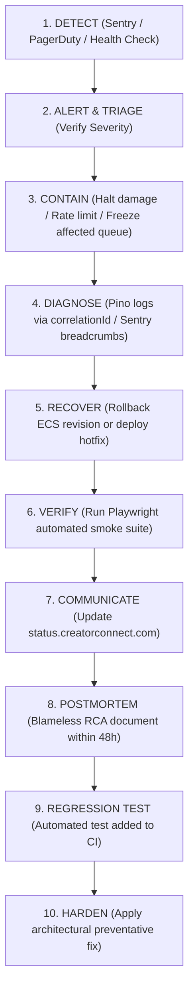

# CreatorConnect — Operational Incident Response & Security Runbook

## 1. Severity Classification & Escalation Matrix

| Severity Level | Definition | Target Response (MTTD) | Target Mitigation (MTTR) | Notification & Escalation |
| :--- | :--- | :--- | :--- | :--- |
| **P1 — Critical** | Financial escrow loss, active IDOR / data breach, database writer outage, 5xx error rate > 5%. | **< 5 minutes** | **< 30 minutes** | PagerDuty automated phone call to On-Call Tech Lead, Security Architect, and DevOps. `#incident-critical` Slack alert. |
| **P2 — High** | Background worker queue stuck (> 2,000 jobs), payment webhook processing delayed, WebSocket disconnect surge. | **< 15 minutes** | **< 2 hours** | PagerDuty mobile push to on-call engineer; `#ops-alerts` Slack notification. |
| **P3 — Medium** | Slow database query (> 300ms), single third-party notification retry backlog (e.g. Resend rate limit). | **< 1 hour** | **< 8 hours** | `#ops-warnings` Slack notification. Jira ticket created automatically. |
| **P4 — Low** | Minor cosmetic UI error, non-blocking telemetry discrepancy. | **Next business day**| Scheduled Sprint | GitHub issue created. |

---

## 2. The 10-Step Incident Response Protocol

---

## 3. Targeted Emergency Containment Playbooks

### 3.1 Playbook A: Suspected Data Leak / Active IDOR Attack
1. **Isolate Affected Endpoint**: Enable Cloudflare Edge WAF rule blocking URI path (e.g., block `/api/v1/projects/*/deliverables/*`).
2. **Identify Compromised Sessions**: Query `audit_logs` for IP address and `user_id` performing unusual enumeration.
3. **Revoke Sessions**: Execute Redis session purge: `redis-cli KEYS "session:<compromised_user_id>*" | xargs redis-cli DEL`.
4. **Invalidate Storage Tokens**: Rotate Cloudflare R2 presigned URL signing secret.

### 3.2 Playbook B: Payment Webhook Replay or Escrow Discrepancy
1. **Freeze Payout Queue**: Pause BullMQ `payout-processing` queue via Redis CLI: `bullmq:pause:payout-processing`.
2. **Run Ledger Audit Script**: Execute `pnpm tsx scripts/reconcile-ledger.ts`.
3. **Verify Discrepancies**: Review matching debit and credit entries in `ledger_entries`.
4. **Resume Processing**: Resume payout queue once ledger balance math balances to zero.

---

## 4. Postmortem & Continuous Hardening
- **Zero-Blame Standard**: Focus on process, system, and automated testing gaps rather than individual human error.
- **Mandatory Regression Gate**: An incident cannot be marked "CLOSED" until an automated Vitest, Testcontainers, or Playwright test reproducing the failure is committed and passing in the CI pipeline.
