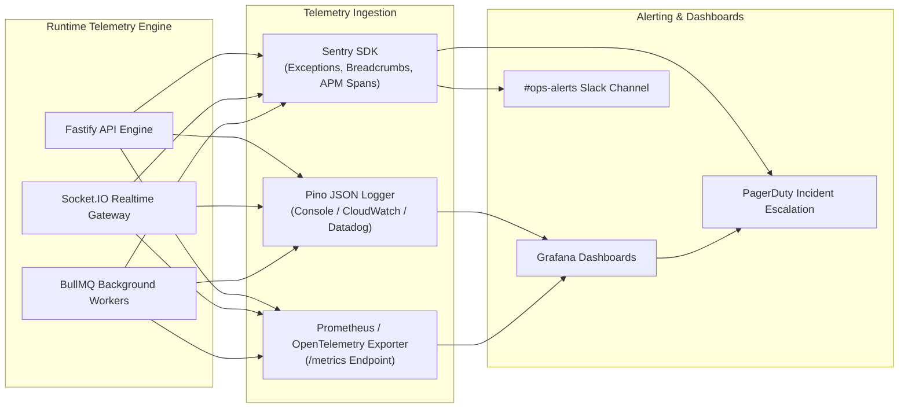

# CreatorConnect — Observability & Telemetry Specification

## 1. Observability Pillars Overview

CreatorConnect implements the four pillars of modern system observability: **Structured Logging**, **Application Metrics**, **Distributed Tracing**, and **Error Tracking**.



---

## 2. Distributed Context & Trace Propagation

To trace requests that initiate in a Web client, pass through Fastify REST endpoints, emit an Outbox database event, and execute asynchronously in a BullMQ worker:

```
[Web Client] 
  │  x-request-id: req_01j7q9k2...
  │  x-correlation-id: cor_01j7q9k2...
  ▼
[Fastify Core API] 
  │  Logs with { reqId, correlationId, userId }
  │  Stores outbox row with { correlation_id }
  ▼
[PostgreSQL Database (Outbox Table)]
  │
  ▼
[BullMQ Worker Job]
  │  Reads job.data.correlationId
  │  Logs with { correlationId, jobId }
  ▼
[External API (Razorpay / FCM)]
```

### Context Header Standards:
- `x-request-id`: Unique identifier generated for the single HTTP hop.
- `x-correlation-id`: Stable end-to-end identifier that persists across distributed background queues and microservices.

---

## 3. Core Golden Signals & Metrics Taxonomy

The platform tracks the following system and business metrics:

| Metric Name | Type | Target SLA / Threshold | Alerting Condition |
| :--- | :--- | :--- | :--- |
| `http_request_duration_seconds` | Histogram | p95 < 200ms; p99 < 500ms | p95 > 500ms for 3 consecutive minutes |
| `http_requests_total{status=~"5.."}` | Counter | Error rate < 0.1% | 5xx error rate > 1.0% in 5-minute window |
| `db_query_duration_seconds` | Histogram | p95 < 50ms | p95 > 150ms (Investigate missing DB index) |
| `queue_job_waiting_count` | Gauge | Queue backlog < 500 jobs | Backlog > 2,000 jobs (Worker scaling required) |
| `queue_job_failed_total` | Counter | Failure rate < 0.5% | > 10 failed jobs in 5 minutes (DLQ alert) |
| `payment_success_rate` | Gauge | Success rate > 92% | Success rate < 85% in 15 minutes (Gateway issue) |
| `websocket_active_connections` | Gauge | Monitored for capacity | Sudden drop of > 30% connections (Gateway restart) |
| `websocket_message_latency_seconds` | Histogram | p95 < 80ms | p95 > 250ms (Redis backplane latency) |
| `media_processing_duration_seconds` | Histogram | 95% videos transcoded < 60s | Processing time > 180s (Worker CPU throttled) |
| `search_query_duration_seconds` | Histogram | p95 < 100ms | p95 > 250ms (GIN index rebuild / cache check) |

---

## 4. Error Tracking & Incident Response

1. **Sentry Configuration**:
   - Initialized across Fastify backend, Next.js frontend apps, and BullMQ worker runtimes.
   - Sentry automatically captures unhandled exceptions with full stack traces, user context (anonymized ID), and query breadcrumbs.
   - Transaction sampling: 100% of errors; 10% of standard API traces in production (to manage APM overhead).
2. **Alerting Routing**:
   - **P1 (Critical - Payment Gateway Down, Database Primary Unreachable)**: PagerDuty automated phone call & SMS to on-call engineer.
   - **P2 (High - Queue Backlog Spike, 5xx Surge > 2%)**: PagerDuty push notification and `#ops-critical` Slack notification.
   - **P3 (Warning - Slow query detected, non-critical notification retry)**: Post to `#ops-warnings` Slack channel.
