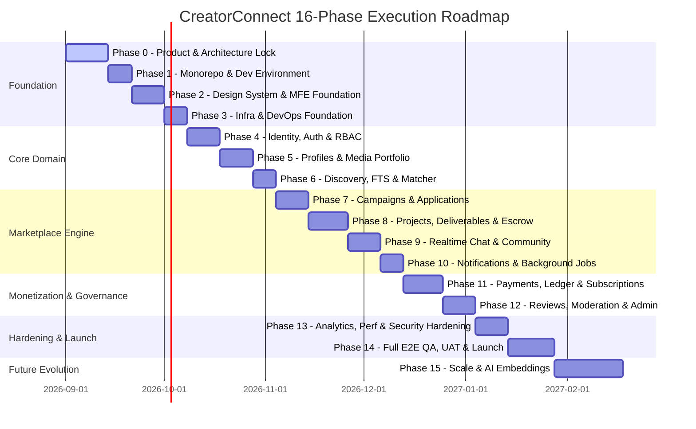

# CreatorConnect — Multi-Phase Engineering Roadmap (Phases 0 to 15)

## 1. Roadmap Architecture & Execution Philosophy

CreatorConnect executes in 16 structured, incremental phases. Each phase builds upon the verified foundation of preceding phases, enforcing strict entry prerequisites and exit criteria.

---

## 2. Detailed Phase Specifications

### Phase 0: Product + Architecture Lock (Current Phase)

- **Objective**: Establish all system boundaries, API-first contracts, database architecture, testing strategy, risk register, and ADRs before writing any feature code.
- **Dependencies**: None.
- **Deliverables**: Comprehensive architecture docs in `docs/`, 20 ADRs, Risk Register, and Phase 0 Final Report.
- **Exit Criteria**: Human review and formal approval of Phase 0 Architecture Report. Zero architectural ambiguity remaining.

---

### Phase 1: Development Environment + Monorepo Scaffolding

- **Objective**: Initialize the pnpm / Turborepo workspace, root configurations, linting, formatting, and Docker Compose local stacks.
- **Dependencies**: Phase 0.
- **Deliverables**: Root `package.json`, `pnpm-workspace.yaml`, `turbo.json`, `docker-compose.yml` (Postgres, Redis, MinIO), shared TypeScript bases in `packages/config`.
- **Exit Criteria**: `pnpm install`, `pnpm build`, and `pnpm test` run cleanly in CI; local Docker containers spin up with single command.

---

### Phase 2: Design System + Microfrontend Foundation

- **Objective**: Establish the unified UI component library, Tailwind tokens, and shell layouts across microfrontends.
- **Dependencies**: Phase 1.
- **Deliverables**: `packages/design-system`, `packages/ui` (Radix primitives, buttons, dialogs, form controls), Storybook setup with Chromatic visual regression.
- **Exit Criteria**: All primitive components documented in Storybook with zero accessibility violations (`axe-core`).

---

### Phase 3: Infrastructure + DevOps Foundation

- **Objective**: Provision baseline CI/CD pipelines, containerization scripts, and AWS/Cloudflare infrastructure as code.
- **Dependencies**: Phase 2.
- **Deliverables**: GitHub Actions workflows (`pr-validation.yml`, `staging-deploy.yml`), multi-stage Dockerfiles, Cloudflare DNS/R2 buckets.
- **Exit Criteria**: Pull request pipeline executes under 8 minutes; Trivy container scan yields 0 High/Critical CVEs.

---

### Phase 4: Identity + Authentication + Authorization

- **Objective**: Implement Supabase Auth integration, session verification middleware, and backend RBAC guards.
- **Dependencies**: Phase 3.
- **Deliverables**: Supabase Auth client in `packages/auth`, Fastify auth plugin, RBAC route guards, `users`, `roles`, and `user_roles` database schema.
- **Exit Criteria**: Playwright tests for TC-01 (Registration) and TC-02 (Login) pass; unauthorized API access returns 401/403 RFC 7807 problem details.

---

### Phase 5: Profiles + Portfolio

- **Objective**: Build multi-persona profiles (Creator, Pro, Brand, Podcaster) and Cloudflare R2 direct media upload pipeline.
- **Dependencies**: Phase 4.
- **Deliverables**: Profile schemas, presigned R2 upload endpoints, Sharp/FFmpeg background thumbnail generator, portfolio showcase UI.
- **Exit Criteria**: Playwright TC-03, TC-04, TC-05, TC-06 pass; 4K media uploads successfully processed and served via CDN.

---

### Phase 6: Discovery + Search + Matching

- **Objective**: Implement PostgreSQL full-text search (`tsvector`), trigram fuzzy search (`pg_trgm`), and explainable rule-based matching.
- **Dependencies**: Phase 5.
- **Deliverables**: Database FTS GIN indices, `/api/v1/search/creators` endpoints with cursor pagination, deterministic match score calculator.
- **Exit Criteria**: Playwright TC-07 and TC-08 pass; p95 search latency < 100ms under 50k seeded profile records.

---

### Phase 7: Assignments / Campaigns + Applications

- **Objective**: Implement the campaign creation workflow for brands and proposal submission engine for talent.
- **Dependencies**: Phase 6.
- **Deliverables**: `campaigns`, `campaign_requirements`, and `applications` tables; brand brief builder; talent proposal submission form.
- **Exit Criteria**: Playwright TC-09, TC-10, TC-11 pass; status state machine enforces valid transitions.

---

### Phase 8: Projects + Deliverables + Hiring

- **Objective**: Build active engagement workspaces, milestone deliverables, revision requests, and sign-offs.
- **Dependencies**: Phase 7.
- **Deliverables**: `projects` and `project_deliverables` schemas; milestone submission UI; watermarked asset previews.
- **Exit Criteria**: Playwright TC-12, TC-13, TC-14 pass; milestone state changes reliably emit Outbox events.

---

### Phase 9: Messaging + Community

- **Objective**: Deploy the dedicated Realtime Gateway (Fastify + Socket.IO) and community discussion forums.
- **Dependencies**: Phase 8.
- **Deliverables**: Realtime Gateway container, Redis socket adapter, chat UI with typing indicators and unread badges, community threads.
- **Exit Criteria**: Playwright TC-15 passes with dual browser contexts; WebSocket reconnects seamlessly without message loss.

---

### Phase 10: Notifications + Background Jobs

- **Objective**: Deploy the BullMQ worker tier and multi-channel notification engine (FCM, Resend).
- **Dependencies**: Phase 9.
- **Deliverables**: Outbox publisher daemon, BullMQ worker consumers, user notification preference center, FCM web/mobile push integration.
- **Exit Criteria**: Playwright TC-16 passes; asynchronous notification jobs execute with retry backoff and DLQ handling.

---

### Phase 11: Payments + Subscriptions

- **Objective**: Implement Razorpay escrow capture, webhook signature verification, double-entry ledger, and platform SaaS subscriptions.
- **Dependencies**: Phase 10.
- **Deliverables**: Razorpay provider adapter, `payment_orders`, `ledger_entries`, webhook signature validator, financial reconciliation script.
- **Exit Criteria**: Playwright TC-17 and TC-18 pass; zero duplicate transactions under simulated webhook replays; ledger mathematically balances to zero.

---

### Phase 12: Reviews + Referrals + Moderation + Admin

- **Objective**: Implement double-blind review revelation, referral attribution, trust & safety reporting, and the operational Admin cockpit.
- **Dependencies**: Phase 11.
- **Deliverables**: Double-blind review scheduler, referral reward ledger credits, `app-admin` dashboard with dispute arbitration and audit logs.
- **Exit Criteria**: Playwright TC-19, TC-20, TC-21 pass; admin actions require reason notes and emit tamper-proof audit log entries.

---

### Phase 13: Analytics + Performance + Security Hardening

- **Objective**: Platform-wide optimization, rate-limiting hardening, k6 stress testing, and third-party security audits.
- **Dependencies**: Phase 12.
- **Deliverables**: Redis rate limit tiers, database query optimization (zero N+1 queries), OWASP ZAP DAST scan remediation.
- **Exit Criteria**: k6 load test sustains 5,000 concurrent VUs with 0% error rate; zero High/Critical security findings.

---

### Phase 14: Full QA + UAT + Production Launch

- **Objective**: End-to-end regression validation, staging rehearsal, zero-downtime blue/green production deployment.
- **Dependencies**: Phase 13.
- **Deliverables**: Production multi-AZ cluster deployment, smoke tests pass, live DNS switch, Sentry alerting active.
- **Exit Criteria**: All 21 Playwright journeys pass in production smoke pass; platform operational at 99.9% availability.

---

### Phase 15: Scaling + AI Features (Post-Launch Evolution)

- **Objective**: Introduce AI-assisted creator-brand matching (vector embeddings via pgvector), automated contract brief parsing, and dedicated search engine extraction if metrics warrant it.
- **Dependencies**: Phase 14.
- **Deliverables**: `pgvector` extension or OpenSearch integration; LLM-assisted proposal drafting.
- **Exit Criteria**: Match quality improves measured by interview conversion rate; core marketplace remains fully functional without AI dependency.
