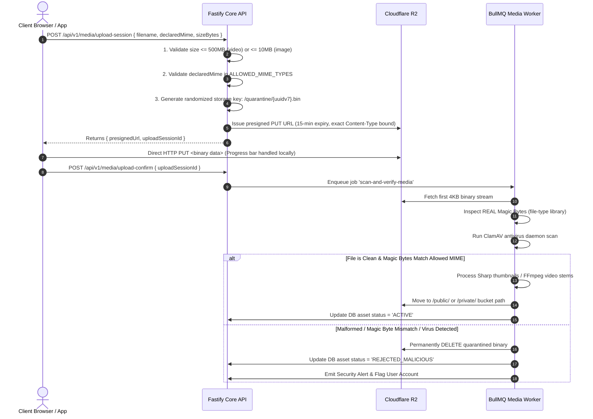

# CreatorConnect — Security Architecture, Information Isolation & Threat Model

> **NON-NEGOTIABLE ARCHITECTURAL MANDATE**:  
> Security and Information Isolation are first-class, uncompromisable system requirements.  
> CreatorConnect operates under the principles of:  
> **Security by Design + Privacy by Design + Fail-Safe Defaults + Defense in Depth + Zero Trust Between Components + Least Privilege**.

---

## 1. Threat Modeling (STRIDE Analysis)

| STRIDE Category | Potential Platform Threat | Architectural Defense & Defense-in-Depth Mitigation |
| :--- | :--- | :--- |
| **Spoofing (Identity)** | Attacker counterfeits JWT, replays expired tokens, or impersonates another creator/brand. | Managed Supabase Auth; RS256 JWTs verified against official JWKS public keys; 15-minute access token expiry; HTTP-only refresh cookies; cryptographic token rotation; MFA for admin and financial actions. |
| **Tampering (Data Integrity)** | Malicious client alters escrow payment amount, tampers with milestone status, or forges webhooks. | All state transitions backend-orchestrated; Razorpay webhooks verified via HMAC-SHA256 on raw request byte buffers; database optimistic concurrency locking (`version`); append-only double-entry ledger. |
| **Repudiation** | User denies posting content, approving a contract, submitting a deliverable, or releasing escrow. | Tamper-proof, append-only `audit_logs` and `admin_actions` tables recording `user_id`, `ip_address`, `user_agent`, `action`, `resource_id`, and `timestamp`. |
| **Information Disclosure** | IDOR vulnerability allows unauthorized users to access private contracts, chat messages, or video stems. | Private Cloudflare R2 buckets; repository-level ownership enforcement (`findOwnedResource`); strict backend authorization guards before issuing 15-minute presigned URLs; explicit response DTO allowlists. |
| **Denial of Service (DoS)** | Botnets exhaust Fastify worker event loop via auth endpoints, search, or large file uploads. | Redis-backed sliding window rate limiters (`@fastify/rate-limit`); tiered rate limits (5 req/min on auth, 30 req/min on search); direct-to-storage R2 uploads bypassing API memory; Cloudflare WAF DDoS mitigation at edge. |
| **Elevation of Privilege** | Normal creator tampers with request payload to assign themselves `ADMIN` role or access another brand's campaign. | Roles decoupled from client-modifiable profile payloads; tenant context derived exclusively from authenticated server session; RBAC and CASL authorization verified at route and repository layers. |

---

## 2. Resource Access Policy & Information Isolation Matrix

Information is **NEVER** exposed merely because it exists in the database. Every resource has an explicit access policy:

| Resource Entity | Resource Owner | Who Can Read? | Who Can Modify? | Who Can Delete? | Who Can Administer? | Access Conditions & Boundaries |
| :--- | :--- | :--- | :--- | :--- | :--- | :--- |
| **Creator / Pro Profile** | Creator User | Public / Anyone | Profile Owner | Profile Owner (Soft) | Admin | Public showcase visible to all; internal tax & contact info private to owner & admin. |
| **Brand Profile** | Brand Org | Authenticated Users | Brand Org Members | Brand Org Admin (Soft) | Admin | Basic company bio visible to talent; billing & tax IDs strictly private to brand org. |
| **Campaign Brief** | Brand Org | Authenticated Talent | Brand Org Members | Brand Org (before escrow) | Admin | Public/Open campaigns searchable; private invite-only campaigns restricted to invitees. |
| **Proposals / Applications** | Applicant User | Applicant & Brand Org | Applicant (while PENDING)| Applicant (withdraw) | Admin | Brand A **CANNOT** see applicants for Brand B. Other creators **CANNOT** see competitor bids. |
| **Project Workspace** | Client + Talent | Contract Parties Only | Contract Parties | Prohibited (Immutable) | Admin / Arbitrator | Strict IDOR boundary. Non-participants receive 403 Forbidden regardless of URL tampering. |
| **Project Deliverables** | Talent User | Contract Parties Only | Talent (before sign-off) | Prohibited | Admin / Arbitrator | Raw video stems in private R2 bucket; access via short-lived signed URLs only. |
| **Chat Conversations** | Room Members | Active Conversation Members | Message Sender (Edit) | Prohibited | Admin (Dispute Audit) | Sockets and REST queries enforce `conversation_members` check before returning history. |
| **Financial Ledger / Escrow** | System / Platform | Contract Parties (Summary) | Backend System Only | Strictly Prohibited | Admin Auditor | Append-only double-entry records. Talent only sees their payout; Client only sees their deposit. |
| **Identity / KYC Proofs** | User | User & Compliance Admin | User (re-upload) | Prohibited (Audit trail) | Compliance Admin | Quarantined private storage. Normal platform staff and other users have zero access. |
| **Admin Action Logs** | Platform Admin | Admin Auditors Only | Prohibited (Append-only) | Prohibited (Append-only) | Lead Security Auditor | Immutable system audit log. |

---

## 3. Database Access Control & Repository-Level Ownership

Relying solely on API endpoint middleware is insufficient ("Defense in Depth"). Every database query must enforce ownership boundaries:

### Insecure Anti-Pattern (PROHIBITED):
```typescript
// INSECURE: Naive findById vulnerable to IDOR if caller fails to verify ownership
async function getProject(projectId: string) {
  return prisma.project.findUnique({ where: { id: projectId } });
}
```

### Mandatory Secure Pattern:
```typescript
// SECURE: Enforces tenant/user ownership within the database query itself
async function getOwnedProject(userId: string, projectId: string) {
  const project = await prisma.project.findFirst({
    where: {
      id: projectId,
      OR: [
        { client_user_id: userId },
        { talent_user_id: userId }
      ]
    }
  });
  
  if (!project) {
    // Return 404 instead of 403 to prevent resource enumeration
    throw new NotFoundError('Project not found or access denied');
  }
  return project;
}
```

---

## 4. Response Data Leak Prevention (Explicit DTO Allowlists)

Backend services must **NEVER** return raw database entities to HTTP clients. All route handlers must serialize responses through explicit, strict **TypeBox Response Schemas**:

### Insecure Anti-Pattern (PROHIBITED):
```typescript
// INSECURE: Returns internal hashes, moderation flags, and private metadata
fastify.get('/users/:id', async (req, reply) => {
  const user = await userRepository.findById(req.params.id);
  return user; // LEAKS PRIVATE DB FIELDS!
});
```

### Mandatory Secure Pattern (DTO Allowlists):
```typescript
// SECURE: Strict allowlist response contract
export const PublicCreatorProfileResponseSchema = Type.Object({
  id: Type.String({ format: 'uuid' }),
  displayName: Type.String(),
  headline: Type.String(),
  bio: Type.String(),
  verifiedBadge: Type.Boolean(),
  rateCards: Type.Array(Type.Object({
    serviceTitle: Type.String(),
    startingPrice: Type.Integer()
  }))
  // Intentionally excludes: email, phone, pan_number, supabase_auth_id, internal_notes
});
```

---

## 5. Error Message Information Leak Prevention

Internal infrastructure details must **NEVER** reach the client:
- **Zero Raw Stack Traces in Production**: Fastify global error handler catches all unhandled exceptions and returns a generic RFC 7807 payload.
- **Zero SQL / Prisma Leakage**: Database constraint violation errors are translated into clean domain errors (`ConflictError`, `ValidationError`).

### Production Error Response:
```json
{
  "type": "https://errors.creatorconnect.com/errors/INTERNAL_ERROR",
  "title": "An unexpected error occurred",
  "status": 500,
  "detail": "Something went wrong on our end. Please reference the request ID when contacting support.",
  "code": "INTERNAL_ERROR",
  "timestamp": "2026-09-13T21:50:00.000Z",
  "requestId": "req_01j7q9k2..."
}
```

---

## 6. Multi-Tenant & Brand Organization Isolation

Brands operate as corporate organizations with multiple team members:
1. **Tenant Context from Session**: Tenant ID (`brand_profile_id`) is derived strictly from the authenticated user's verified organization membership table, **never trusted from client query params or request bodies**.
2. **Query Scoping**: All brand operations automatically append `where: { brand_profile_id: userOrgId }` to every query.
3. **Cross-Tenant Guard**: Attempting to view campaigns, candidates, or financial summaries of another organization results in an immediate `404 Not Found` (to avoid leaking existence) and triggers a security audit event.

---

## 7. Direct Media Upload & File Security



---

## 8. Payment & Financial Escrow Security

1. **Client Never Confirms Payment**: Frontend payment success callbacks are treated purely as UI hints.
2. **Raw Byte Webhook Verification**: Fastify captures the raw request byte buffer before any JSON parsing to compute `crypto.createHmac('sha256', RAZORPAY_WEBHOOK_SECRET).update(rawBuffer).digest('hex')`.
3. **Constant-Time Comparison**: Signatures are verified using `crypto.timingSafeEqual()` to eliminate timing attack vectors.
4. **Idempotency & Replay Defense**:
   - `payment_events` table enforces a database `UNIQUE` constraint on `event_id`.
   - Replayed webhooks hit the unique constraint and return `200 OK` immediately without re-executing transactions.
5. **Double-Entry Ledger Integrity**: Every escrow lock, release, or refund executes as an atomic database transaction with matching Debit and Credit entries.

---

## 9. Data Minimization & Privacy Classification

Every data point in the system is classified under one of six privacy tiers:

| Privacy Tier | Data Elements Included | Storage & Encryption Standard | Exposure Rules |
| :--- | :--- | :--- | :--- |
| **1. PUBLIC** | Creator display name, bio, public portfolio reels, categories, verified skills. | Cloudflare R2 Public CDN / Postgres | Unrestricted; indexed by search engines. |
| **2. AUTHENTICATED** | Open brand briefs, rate card starting prices, general community forum posts. | Postgres (Prisma) | Requires valid Supabase JWT Bearer token. |
| **3. PRIVATE** | Direct chat messages, contract deliverables, draft proposals, user email & phone. | Private R2 bucket (AES-256) / Postgres | Restricted strictly to the 2 verified contract parties. |
| **4. ROLE-RESTRICTED** | Brand applicant review queue, candidate comparison matrices, dispute filings. | Postgres | Restricted by RBAC (`BRAND` or assigned arbitrator). |
| **5. ADMIN-ONLY** | KYC identity proofs (passport/gov ID), tax identification numbers (PAN/GST), fraud flags. | Private R2 Quarantine / Encrypted DB | Strict MFA-protected Admin roles with immutable audit logs. |
| **6. SYSTEM-INTERNAL** | Password hashes (in Supabase), API secrets, webhook signing keys, outbox relays. | AWS Secrets Manager / KMS | Zero human or client access; injected at runtime only. |

---

## 10. Security Definition of Done (DoD)

A feature is **REJECTED** and cannot merge if it fails any of the following gates:
- [ ] Any endpoint returns raw database entities without an explicit TypeBox allowlist response DTO.
- [ ] Any query uses naive `findById` for user-owned resources instead of `findOwnedResource(userId, id)`.
- [ ] Tenant or organization context is accepted from client request parameters rather than authenticated session.
- [ ] Passwords, tokens, bank accounts, or PII are logged in Pino (verified via automated redaction tests).
- [ ] Production error responses leak SQL syntax, Prisma models, or stack traces.
- [ ] Any file upload bypasses magic-byte verification or ClamAV antivirus scanning.
- [ ] Payment transactions rely on frontend client callbacks rather than verified webhook signatures.
- [ ] Any PR introduces a known vulnerability reported by Semgrep, CodeQL, Gitleaks, or Trivy.

---

## 11. Final 20-Question Security Review Audit

| # | Audit Question | Architectural Answer & Verification Mechanism |
| :--- | :--- | :--- |
| **1** | Can User A access User B's private data? | **NO**. Repository methods enforce `findOwnedResource(userId, resourceId)`. All private data requires explicit membership verification. |
| **2** | Can User A access another organization's data? | **NO**. Multi-tenant scoping derives `brand_profile_id` exclusively from server-side authenticated session context. |
| **3** | Can a user manipulate an ID in the URL to access another resource (IDOR)? | **NO**. Route preHandlers and repository queries reject foreign resource IDs and return `404 Not Found`. |
| **4** | Can a client escalate privileges? | **NO**. RBAC roles are stored in backend database tables and verified on every request; client-provided role fields are ignored. |
| **5** | Can a normal user reach admin operations? | **NO**. Admin routes reside behind dedicated Fastify plugins asserting `ADMIN` role and are hosted on an isolated subdomain (`admin.creatorconnect.com`). |
| **6** | Can API responses accidentally expose sensitive fields? | **NO**. All Fastify route responses are serialized through strict TypeBox allowlists that filter unmodeled fields. |
| **7** | Can logs expose secrets? | **NO**. Pino configuration includes mandatory redaction paths for headers, tokens, passwords, and banking details. |
| **8** | Can errors expose infrastructure details? | **NO**. Fastify global error handler transforms internal exceptions into RFC 7807 problem details with generic 500 messages in production. |
| **9** | Can malicious files reach permanent storage? | **NO**. All uploads are quarantined in temporary storage until real magic bytes are validated and ClamAV scans clean. |
| **10**| Can payment callbacks be forged? | **NO**. Razorpay webhooks are verified using cryptographic HMAC-SHA256 signatures computed on raw request byte buffers. |
| **11**| Can payment webhooks be replayed? | **NO**. Webhook event IDs are recorded in the `payment_events` table with a unique database constraint, rejecting replays. |
| **12**| Can retries cause duplicate side effects? | **NO**. All write endpoints support `Idempotency-Key` headers, and BullMQ worker jobs enforce deterministic idempotency keys. |
| **13**| Can old mobile versions continue working? | **NO BREAKING CHANGES**. API versioning (`/api/v1/`) and Expand-Migrate-Contract database schema evolution protect older clients. |
| **14**| Can a failed deployment be rolled back? | **YES**. Blue/Green ECS deployments with automated rollback on health check failure or 5xx error spikes (< 60s rollback). |
| **15**| Can a database migration be safely rolled back/recovered? | **YES**. Zero-destructive migrations; all forward migrations are tested against staging replicas prior to release. |
| **16**| Can we restore production data? | **YES**. Aurora continuous WAL archiving + automated daily snapshots + tested quarterly point-in-time recovery drills. |
| **17**| Can we detect abnormal behavior? | **YES**. Sentry real-time exception tracking + OpenTelemetry metric alerts on 5xx surges, rate-limit hits, and failed auth attempts. |
| **18**| Can we identify who performed a sensitive operation? | **YES**. Tamper-proof, append-only `audit_logs` and `admin_actions` tables capture `actor_id`, `ip_address`, `action`, and `reason`. |
| **19**| Can we reproduce and test a security bug? | **YES**. Ephemeral Testcontainers enable running automated regression tests against real PostgreSQL and Redis in CI. |
| **20**| Can an external service fail without corrupting our system? | **YES**. Transactional Outbox pattern guarantees eventual consistency; external failures are isolated in BullMQ retry queues. |
