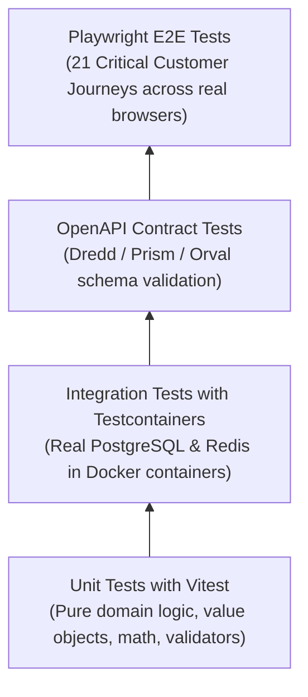

# CreatorConnect — Quality Engineering & Testing Strategy

## 1. The Quality Pyramid Architecture

Quality assurance for CreatorConnect is designed as a continuous, automated verification pipeline rather than an afterthought.



---

## 2. Test Layer Allocation & Responsibilities

| Test Tier                | Scope & Focus                                                                                                             | Primary Tools                                   | Execution Target                                                                                | Target Coverage                                        |
| :----------------------- | :------------------------------------------------------------------------------------------------------------------------ | :---------------------------------------------- | :---------------------------------------------------------------------------------------------- | :----------------------------------------------------- |
| **Unit Tests**           | Domain entities, pure calculation logic (platform fees, ledger balance math), Zod/TypeBox validators, utility formatters. | **Vitest**                                      | In-memory, mocked dependencies, runs on pre-commit and every PR.                                | **> 85% branch coverage** on core domains              |
| **Integration Tests**    | Application services, Prisma repositories, database transactions, Outbox event generation, BullMQ worker consumers.       | **Vitest + Testcontainers**                     | Spawns real ephemeral PostgreSQL and Redis Docker containers during test run.                   | **100% of repository and transactional workflows**     |
| **Contract Tests**       | Fastify OpenAPI specification matches actual payload responses; generated client types match backend schemas.             | **OpenAPI Validator + Prism**                   | Verifies 0 schema drift between backend route definitions and `@creatorconnect/contracts`.      | **100% of exposed API endpoints**                      |
| **End-to-End (E2E)**     | Full browser-based verification of critical user journeys (Registration, Escrow Payment, Milestone Delivery, Chat).       | **Playwright**                                  | Chromium, Firefox, WebKit; runs against staging / preview environments.                         | **All 21 critical customer journeys covered**          |
| **Visual Regression**    | Design system token rendering, component states (hover, focus, disabled, dark mode), UI layouts.                          | **Storybook + Chromatic**                       | Automated screenshot diffing on shared UI components in `@creatorconnect/ui`.                   | All primitive UI components in design system           |
| **Accessibility (a11y)** | Keyboard navigation, ARIA attributes, color contrast, screen reader compatibility.                                        | **axe-core + Playwright**                       | Runs automatically during Playwright test passes.                                               | **WCAG 2.1 AA compliance**                             |
| **Load & Stress Tests**  | High-throughput endpoints: search, campaign list, realtime message broadcasts, webhook spikes.                            | **k6**                                          | Simulates 5,000 concurrent virtual users (VUs) against staging infrastructure.                  | p95 latency < 200ms; zero error rate under target load |
| **Security Scans**       | Static code analysis, secret detection, container vulnerabilities, dynamic DAST scans.                                    | **CodeQL, Semgrep, Gitleaks, Trivy, OWASP ZAP** | Runs in GitHub Actions CI prior to staging deployment.                                          | **Zero High or Critical vulnerabilities**              |
| **Migration Testing**    | Database migration rollback and forward compatibility tests.                                                              | **Prisma Migrate CLI + Testcontainers**         | Validates that applying and reverting migrations causes zero data corruption or locking issues. | All database schema changes                            |
| **Smoke Tests**          | Post-deployment verification of production health endpoints, DB connectivity, and CDN asset delivery.                     | **Playwright / curl scripts**                   | Automated execution immediately following deployment to verify cluster health.                  | Platform health endpoints return 200 OK                |

---

## 3. Testcontainers Integration Strategy

Unit tests with in-memory mocks fail to catch real-world database locking issues, constraint violations, and complex SQL joins.

CreatorConnect mandates **Testcontainers** for all integration testing:

```typescript
import { PostgreSqlContainer } from '@testcontainers/postgresql';
import { RedisContainer } from '@testcontainers/redis';

// Ephemeral container initialized per test suite
const postgres = await new PostgreSqlContainer('postgres:16-alpine').start();
const redis = await new RedisContainer('redis:7-alpine').start();

// Prisma migrations automatically applied to clean database
await runMigrations(postgres.getConnectionUri());
```

This guarantees that queries, GIN full-text indexes, and atomic transactions are validated against an authentic PostgreSQL 16 engine in CI.
